背景我就不介绍了，能看这篇文章，说明你不是凡人。

实验环境如下：

- 服务器系统：`Windows Server 2016 Standard`
- Exchange 版本：`Microsoft Exchange Server 2016`
- 开发环境：`Windows 11 Pro + 宇宙第一IDE 👉 Visual Studio 2019`

## 准备

`Exchange Transport Agent`的开发需要依赖两个`dll`：

- `Microsoft.Exchange.Data.Common.dll`
- `Microsoft.Exchange.Data.Transport.dll`

可从`Exchange Server`的安装目录中获取，具体位置为`C:\Program Files\Microsoft\Exchange Server\V15\Public`（假设安装在 C 盘）。

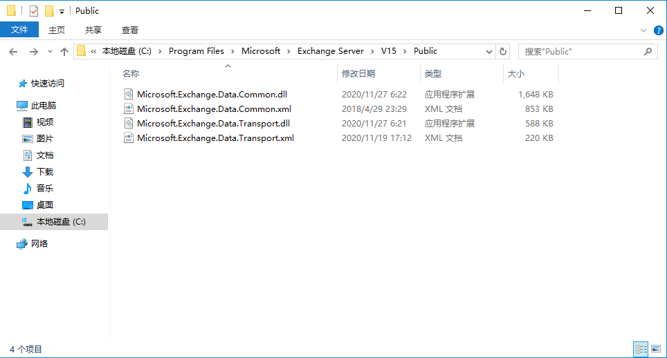

## 创建项目

打开 Visual Studio，按如下步骤创建`C#类库`项目。

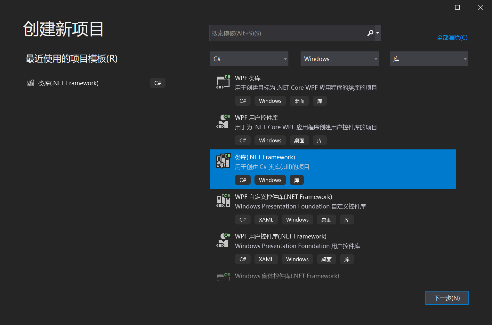
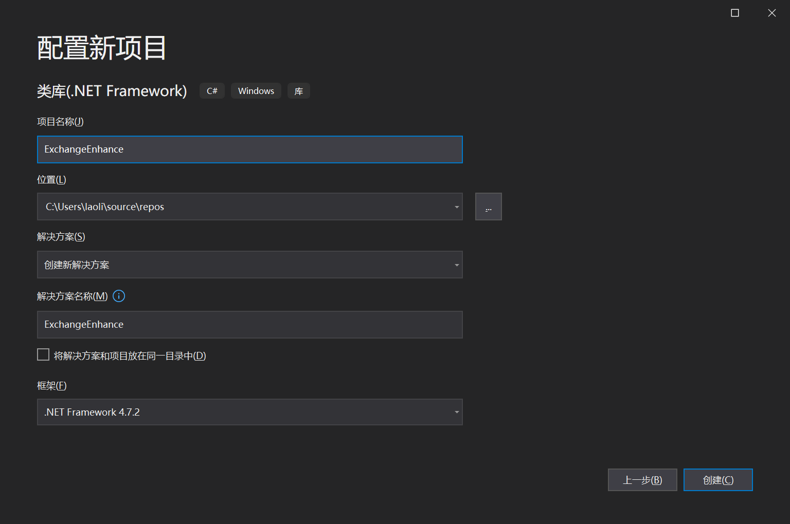

完成之后你会得到如下项目：

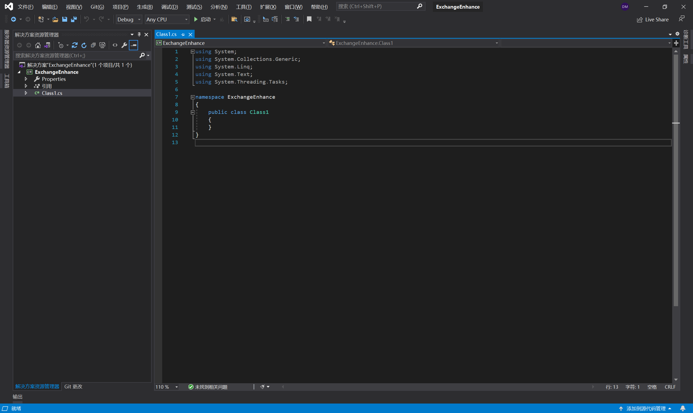

## 引入依赖

在刚才创建的解决方案根目录下创建`lib`目录，存放依赖库。

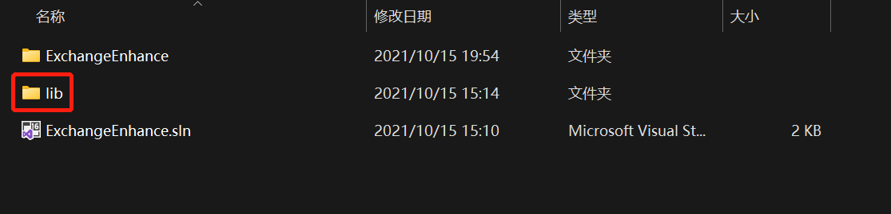
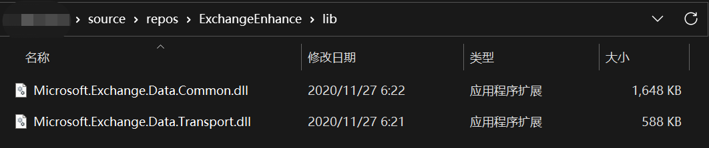

依赖库存放的位置没有固定要求，只是这样做会规范一点。

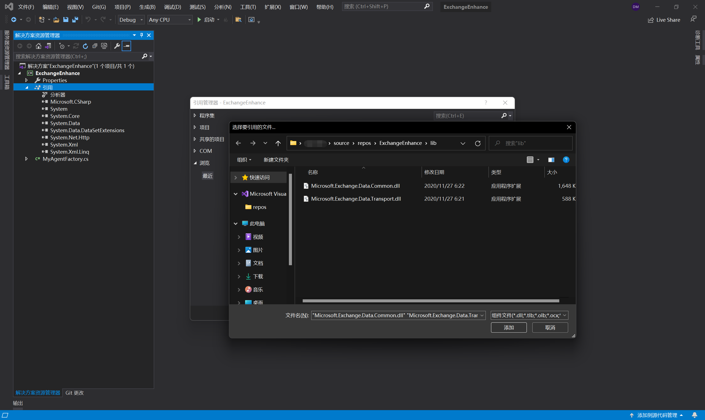
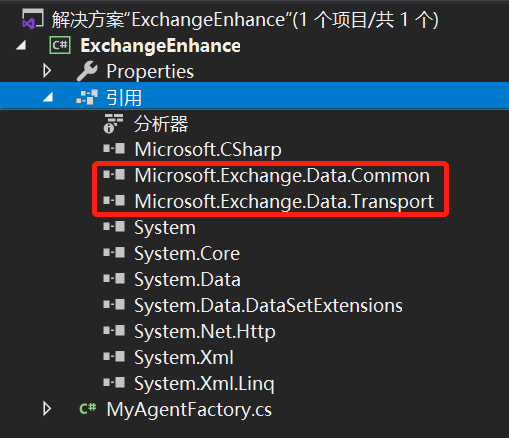

这样依赖就添加好了。

## 编写代码

删除默认的源文件`Class1.cs`，创建源文件`MyAgentFactory.cs`，或者重命名也行，内容如下：

```csharp
using Microsoft.Exchange.Data.Transport;
using Microsoft.Exchange.Data.Transport.Smtp;

namespace ExchangeEnhance
{
    public sealed class MyAgentFactory : SmtpReceiveAgentFactory
    {
        public override SmtpReceiveAgent CreateAgent(SmtpServer server)
        {
            return new MyAgent();
        }
    }

    public class MyAgent : SmtpReceiveAgent
    {
        public MyAgent()
        {
            this.OnEndOfData += new EndOfDataEventHandler(MyEndOfDataHandler);
        }

        private void MyEndOfDataHandler(ReceiveMessageEventSource source, EndOfDataEventArgs e)
        {
            e.MailItem.Message.Subject += " - 我在标题里动了手脚！";
        }
    }
}
```

我们的传输代理只做了一件事，就是在邮件的标题里动了手脚。（本文只讲开发流程，不关注代码细节，况且代码很简单，没什么要讲的）

## 生成 DLL

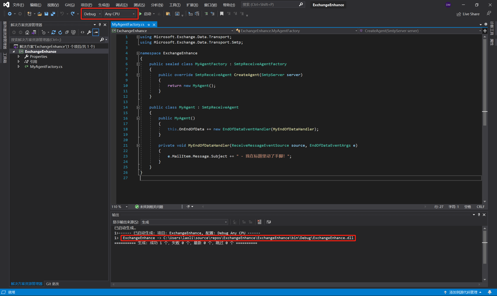

这里我们选择生成用于`debug`的 DLL。

## 安装传输代理

### 复制 DLL 到目标机器

将生成的`DLL`及调试文件复制到`Exchange Server`。

开发环境下生成的文件：
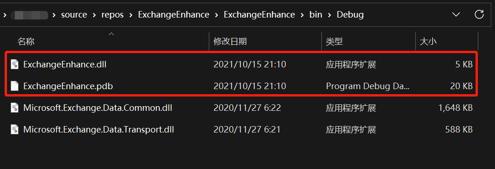

复制到`Exchange Server`后的文件：
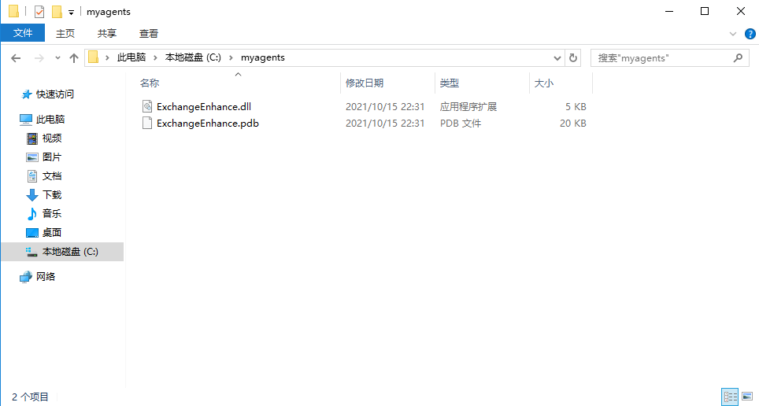

这里我在 C 盘根目录下创建了文件夹`myagents`，并将文件放在了该文件夹下。（理论上讲文件位置应该是没有限制的，但是当我把文件放在桌面的时候程序无法正常运行）

### 安装传输代理并启用

安装传输代理需要使用`Exchange`提供的命令行管理程序及命令。注意，不是普通的`PowerShell`。

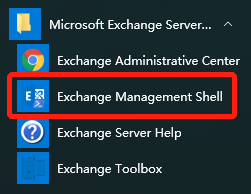
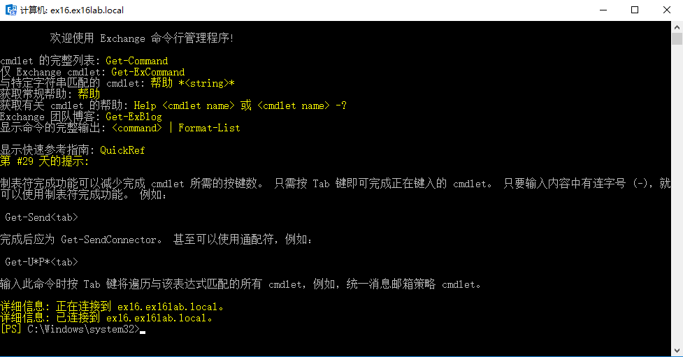

查看默认的传输代理：

```powershell
[PS] C:\Windows\system32>Get-TransportAgent

Identity                                           Enabled         Priority
--------                                           -------         --------
Transport Rule Agent                               True            1
DLP Policy Agent                                   True            2
Retention Policy Agent                             True            3
Supervisory Review Agent                           True            4
Malware Agent                                      True            5
Text Messaging Routing Agent                       True            6
Text Messaging Delivery Agent                      True            7
System Probe Drop Smtp Agent                       True            8
System Probe Drop Routing Agent                    True            9
```

安装传输代理：

```powershell
[PS] C:\Windows\system32>Install-TransportAgent -Name "MyAgent" -TransportAgentFactory "ExchangeEnhance.MyAgentFactory" -AssemblyPath "C:\myagents\ExchangeEnhance.dll"

Identity                                           Enabled         Priority
--------                                           -------         --------
MyAgent                                            False           10
```

设置优先级：

```powershell
[PS] C:\Windows\system32>Set-TransportAgent MyAgent -Priority 2
```

启用传输代理：

```powershell
[PS] C:\Windows\system32>Enable-TransportAgent MyAgent
```

重启服务：

```powershell
[PS] C:\Windows\system32>Restart-Service MSExchangeTransport
```

重启 IIS：

```powershell
[PS] C:\Windows\system32>iisreset
```

重启 IIS 又是一个玄学问题，有时候传输代理需要在 IIS 重启后才能生效。

查看传输代理的安装情况：

```powershell{6}
[PS] C:\Windows\system32>Get-TransportAgent

Identity                                           Enabled         Priority
--------                                           -------         --------
Transport Rule Agent                               True            1
MyAgent                                            True            2
DLP Policy Agent                                   True            3
Retention Policy Agent                             True            4
Supervisory Review Agent                           True            5
Malware Agent                                      True            6
Text Messaging Routing Agent                       True            7
Text Messaging Delivery Agent                      True            8
System Probe Drop Smtp Agent                       True            9
System Probe Drop Routing Agent                    True            10
```

## 测试传输代理是否生效

先发一封邮件：

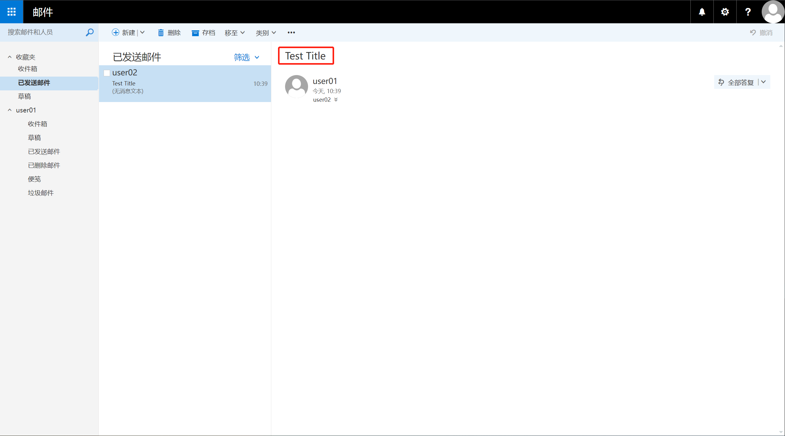

查看接收到的邮件：

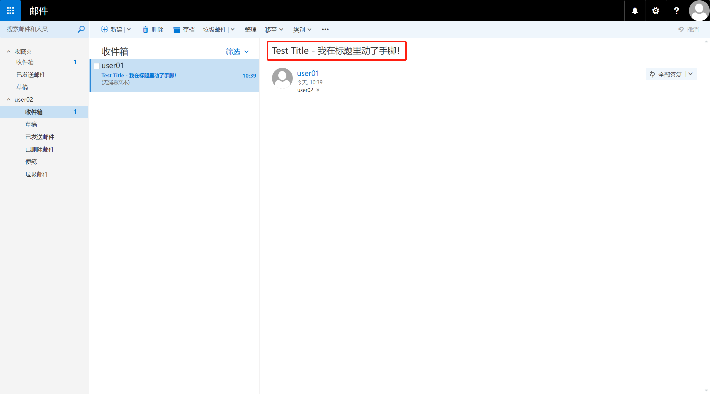

ok，成功！

## 调试

因为`DLL`是加载到`Exchange Server`中运行的，所以需要远程调试。

1. 在`Exchange Server`上安装`Visual Studio 远程调试工具`，版本需要与 IDE 的版本相同，另外还需要注意对应的处理器架构。这里使用的是`Visual Studio 2019 远程工具 x64`

2. 以`管理员`身份运行`Visual Studio 2019 远程调试器`
  
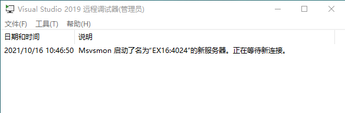

3. 在`Visual Studio`菜单栏中选择`调试->附加到进程`

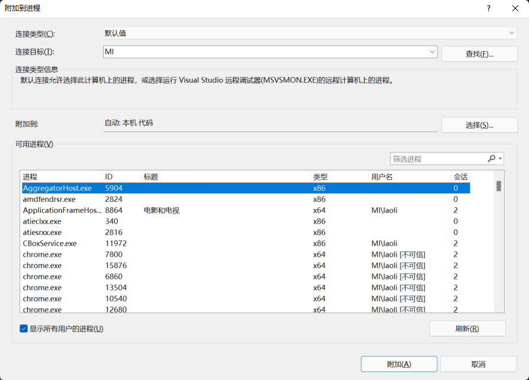

4. 选择目标服务器

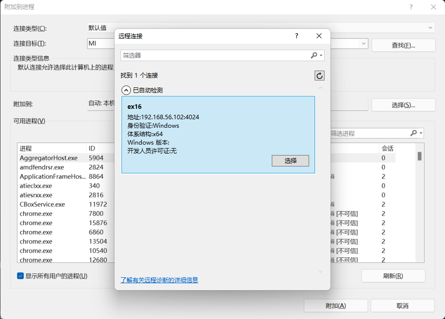

5. 选择要附加到的进程`EdgeTransport.exe`，注意要勾选“显示所有用户的进程”，点击“附加”按钮完成选择

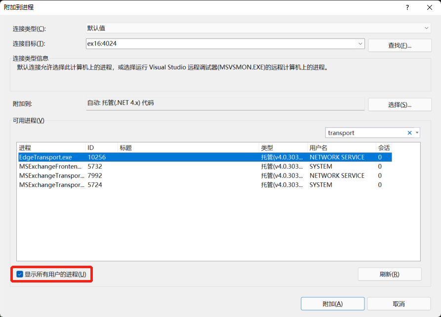

6. 打个断点

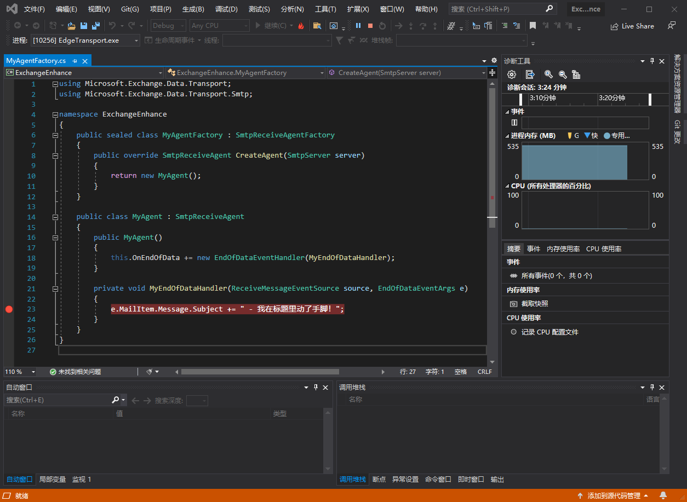

7. 发一封邮件

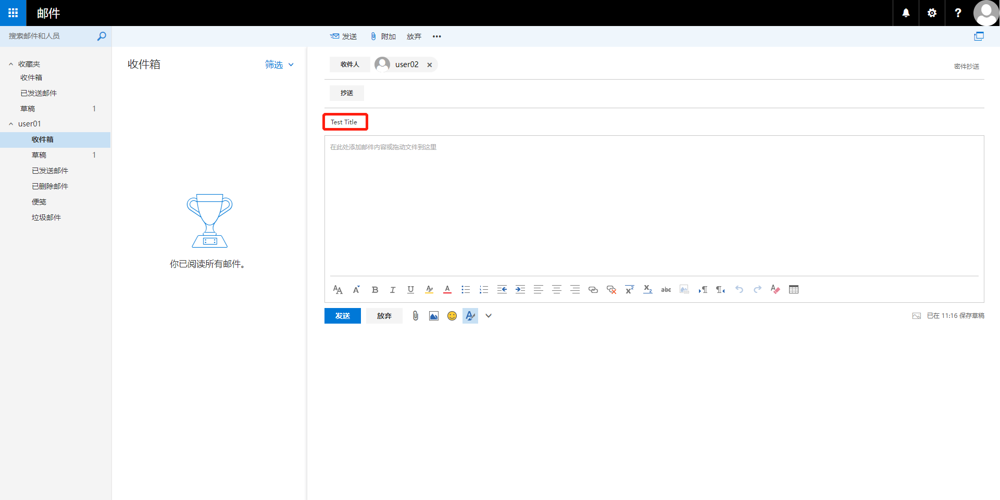

8. 点击发送后程序执行到断点处，我们在标题中增加“远程调试”几个字，完成后点击“继续”

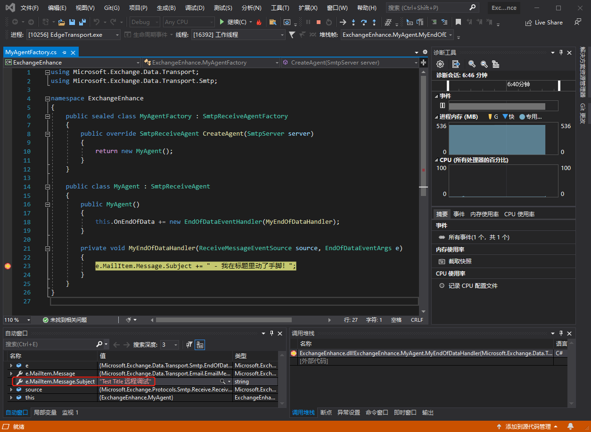

9. 接收邮件，验证调试

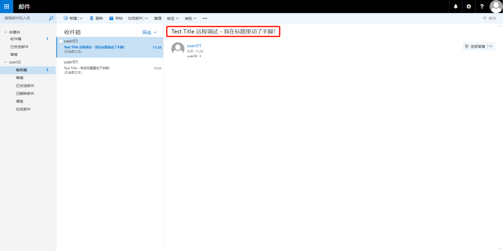

## 其他

最后跟大家介绍一个工具，`Exchange`提供的工具箱`Exchange Toolbox`。其中的`Queue Viewer`可以跟踪到邮件的当前状态，调试的时候可以用得到。

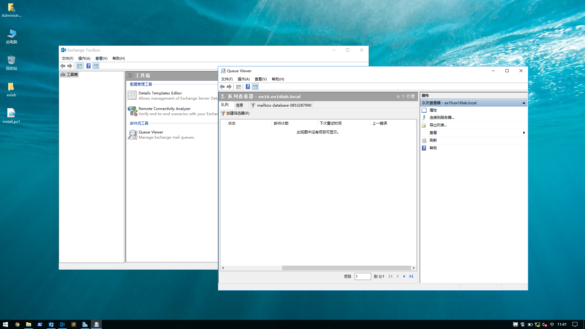

## 总结

`Exchange 传输代理`的开发是一件玄而又玄的事情，不是说代码有多难写，而是你不知道会在哪个莫名其妙的地方卡住，然后不知道做了什么就又成功了。所以最重要的是保持信心，坚信自己能解决每一个玄学问题，祝好运！
