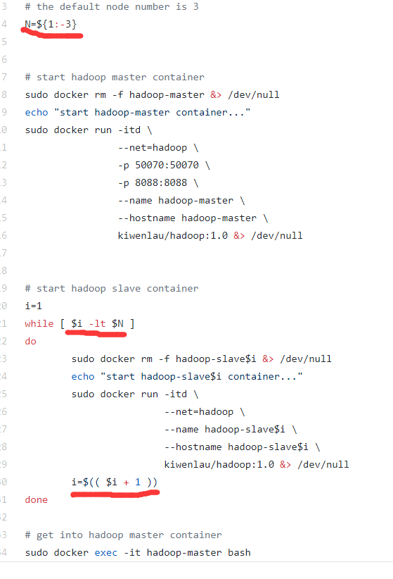

今日惊闻 🐏🐻 被`shell`欺负了！

下午 🐏🐻 在群里发了一段`shell`，如下：



🐏🐻 被欺负之处如三条红线所划，俺梳理了一番，此三处分为两大招，三小式：

1. [Bash Conditional Expressions](https://www.gnu.org/savannah-checkouts/gnu/bash/manual/bash.html#Bash-Conditional-Expressions)
   `$i -lt $N`
2. [Shell Expansions](https://www.gnu.org/savannah-checkouts/gnu/bash/manual/bash.html#Shell-Expansions)
   - [Shell Parameter Expansion](https://www.gnu.org/savannah-checkouts/gnu/bash/manual/bash.html#Shell-Parameter-Expansion)
     `N=${1:-3}`
   - [Arithmetic Expansion](https://www.gnu.org/savannah-checkouts/gnu/bash/manual/bash.html#Arithmetic-Expansion)
     `i=$(($i + 1))`

首先，🐏🐻 你要知道在`shell`中使用变量的方式是在变量前加一个`$`符，然后我们分析一下这三个问题。

第一个问题就是简单的条件判断。`lt`就是`less than`的缩写，`shell`中诸如此类的操作符还有`-eq -ne -le -gt -ge`，相信聪明的 🐏🐻 一定知道是什么意思。

第二个是给变量赋默认值的问题。表达式形式是这样的`${parameter:-word}`，如果`parameter`有值的话则表达式的值为`parameter`，否则表达式的值为`word`，即默认值为`word`。

这里还有个小知识点，`shell`的参数。执行`shell`时可以向脚本传递参数，脚本内获取参数的格式为：`$n`。`n`代表一个数字，`1`为执行脚本的第一个参数，`2`为执行脚本的第二个参数，以此类推……

`N=${1:-3}`中的`1`即代表`shell`的第一个参数。所以这条语句是什么意思，🐏🐻 你懂了没？

第三个问题其实就是想做个`i = i + 1`的操作，但是原生`bash`不支持简单的数学运算，所以要曲线救国。🐏🐻 发的这段`shell`中采用了`Arithmetic Expansion`，形如`$(( expression ))`。对应`$(($i + 1))`就是取变量`i`的值加一在取表达式整体的值。🐏🐻 你懂了没？

即然是曲线救国，那肯定不只有一条。🐏🐻，俺在多告诉你几条。

1. `let`，该命令用于执行一个或多个表达式，变量计算中不需要加上`$`来表示变量。如果表达式中包含了空格或其他特殊字符，则必须引起来，如`let i++`。

2. `expr`，该命令也用于执行表达式。不同之处在于`expr`命令要和待求值的表达式一起被反引号`` ` ``包起来，如`` `expr $i + 1` ``。

🐏🐻，俺还给你写了个小 demo，你拿去康康：

```shell
#!/bin/bash

message="🐏🐻枣🦆"

N=${1:-3}

i=0
while [ $i -lt $N ]
do
  echo $message
  # let i++
  # i=`expr $i + 1`
  # i=$(($i + 1))
  i=$((i + 1))
done
```

执行结果如下：

1. 不给参数，给`N`赋默认值`3`

```bash
$ ./demo.sh
🐏🐻枣🦆
🐏🐻枣🦆
🐏🐻枣🦆
```

2. 给个参数`1`

```bash
$ ./demo.sh 1
🐏🐻枣🦆
```

3. 给个参数`5`

```bash
$ ./demo.sh 5
🐏🐻枣🦆
🐏🐻枣🦆
🐏🐻枣🦆
🐏🐻枣🦆
🐏🐻枣🦆
```

🐏🐻，你学废了吗？
