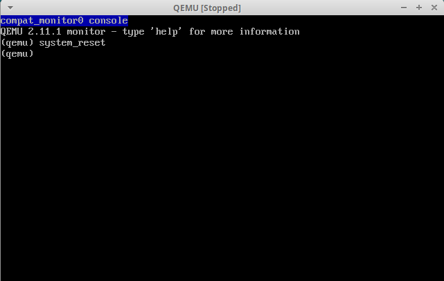

调试是软件开发过程中重要的一个环节。通常我们开发的软件是运行在操作系统之上的，调试器也运行在操作系统之上，加之大多数集成开发环境对调试器的集成非常完美，所以我们调试软件的时候非常轻松。但是如果是开发操作系统呢？操作系统该如何调试？今天老李结合代码教大家操作系统启动过程中的第一个步骤 -- 引导扇区的调试。

开发环境如下：

+ 系统：`Ubuntu 18.04.4 LTS`
+ 汇编器：`GNU as (GNU Binutils for Ubuntu) 2.30`
+ 调试器：`GNU gdb (Ubuntu 8.1-0ubuntu3.2) 8.1.0.20180409-git`
+ 虚拟机：`QEMU emulator version 2.11.1(Debian 1:2.11+dfsg-1ubuntu7.21)`
+ 引导扇区代码：[boot.s](https://github.com/kviccn/asm-boooom/blob/master/0x02/boot.s)

在操作系统的开发过程中我们通常使用`QEMU`虚拟机来运行我们开发的操作系统，使用`GDB`作为调试工具。`GDB`支持`远程调试`，这是通过一个简单的协议来实现的。`QEMU`支持该协议，所以我们可以配合这两者来完成我们的调试工作。

先编译生成引导扇区文件：
```bash
$ as --32 boot.s -o boot.o
$ objcopy -O binary -j .text boot.o boot.bin
```

通过如下命令启动虚拟机：
```bash
$ qemu-system-i386 boot.bin -S -s
```

`-S`参数告诉虚拟机启动后先不运行。
`-s`参数告诉虚拟机开启一个`GDB`服务器等待客户端的连接，服务默认监听`TCP`端口`1234`。

启动`GDB`：
```bash
$ gdb -q
(gdb)
```
`-q`参数表示静默启动，不显示版本信息。

连接到目标服务器：
```bash
(gdb) target remote localhost:1234
Remote debugging using localhost:1234
warning: No executable has been specified and target does not support
determining executable automatically.  Try using the "file" command.
0x0000fff0 in ?? ()
(gdb)
```

设置`CPU`架构为`i8086`，因为最开始的这段代码运行在`16`位实地址模式：
```bash
(gdb) set architecture i8086
The target architecture is assumed to be i8086
(gdb)
```

*这个设置可能不会生效，这是`gdb`新版本中的一个`bug`，之前的版本是没有这个问题的。关于这个`bug`的讨论在[这里](https://sourceware.org/bugzilla/show_bug.cgi?id=22869)。解决方案是手动设置一个[描述文件](https://github.com/kviccn/asm-boooom/blob/master/gdb/target.xml)。*

```bash
(gdb) set tdesc filename target.xml
(gdb)
```

设置当程序停住或单步调试时自动显示指令：
```bash
(gdb) display/i $cs*16+$pc
1: x/i $cs*16+$pc
   0xffff0:     ljmp   $0xf000,$0xe05b
(gdb)
```

*`16`位实地址模式下物理地址计算方式为段寄存器左移`4`位，即乘以十进制的`16`，再加上偏移地址。*

因为`BIOS`会将引导扇区加载到`0x7c00`处开始执行，所以我们在这里打个断点：
```bash
(gdb) b *0x7c00
Breakpoint 1 at 0x7c00
(gdb)
```

输入`c`使虚拟机恢复运行：
```bash
(gdb) c
Continuing.

Breakpoint 1, 0x00007c00 in ?? ()
1: x/i $cs*16+$pc
=> 0x7c00:      mov    $0x7c0,%ax
(gdb)
```

观察第`6`行，正是我们的引导扇区的第一条指令。

查看寄存器内容：
```bash
(gdb) info registers
eax            0xaa55   43605
ecx            0x0      0
edx            0x80     128
ebx            0x0      0
esp            0x6f04   0x6f04
ebp            0x0      0x0
esi            0x0      0
edi            0x0      0
eip            0x7c00   0x7c00
eflags         0x202    [ IF ]
cs             0x0      0
ss             0x0      0
ds             0x0      0
es             0x0      0
fs             0x0      0
gs             0x0      0
```

此时`eax`寄存器的内容为`0xaa55`。单步执行下一条指令再查看寄存器内容：

```bash
(gdb) si
0x00007c03 in ?? ()
1: x/i $cs*16+$pc
=> 0x7c03:      mov    %ax,%ds
(gdb) info registers
eax            0x7c0    1984
ecx            0x0      0
edx            0x80     128
ebx            0x0      0
esp            0x6f04   0x6f04
ebp            0x0      0x0
esi            0x0      0
edi            0x0      0
eip            0x7c03   0x7c03
eflags         0x202    [ IF ]
cs             0x0      0
ss             0x0      0
ds             0x0      0
es             0x0      0
fs             0x0      0
gs             0x0      0
```

此时`eax`寄存器的内容为`0x7c0`。继续调试：

```bash
(gdb) si
0x00007c05 in ?? ()
1: x/i $cs*16+$pc
=> 0x7c05:      mov    $0xb800,%ax
(gdb) info registers
eax            0x7c0    1984
ecx            0x0      0
edx            0x80     128
ebx            0x0      0
esp            0x6f04   0x6f04
ebp            0x0      0x0
esi            0x0      0
edi            0x0      0
eip            0x7c05   0x7c05
eflags         0x202    [ IF ]
cs             0x0      0
ss             0x0      0
ds             0x7c0    1984
es             0x0      0
fs             0x0      0
gs             0x0      0
```

此时数据段寄存器`ds`的内容已经是`0x7c0`了。再向后执行两条指令并查看寄存器内容：

```bash
(gdb) si 2
0x00007c0a in ?? ()
1: x/i $cs*16+$pc
=> 0x7c0a:      xor    %si,%si
(gdb) info registers
eax            0xb800   47104
ecx            0x0      0
edx            0x80     128
ebx            0x0      0
esp            0x6f04   0x6f04
ebp            0x0      0x0
esi            0x0      0
edi            0x0      0
eip            0x7c0a   0x7c0a
eflags         0x202    [ IF ]
cs             0x0      0
ss             0x0      0
ds             0x7c0    1984
es             0xb800   47104
fs             0x0      0
gs             0x0      0
```

此时附加数据段寄存器`es`的内容为`0xb800`。

引导扇区调试的基本过程就是这样了。在调试过程中可能会需要重启虚拟机，如果重新手动执行`qemu`和`gdb`，再重新走一遍上面的流程多少是有点麻烦的。下面教大家两种直接重启虚拟机的方法。

1. 切换到`QEMU`窗口并按`Ctrl-Alt-2`以获取`QEMU`监视器，键入命令`system_reset`并使用`Ctrl-Alt-1`切换回去。如下所示：



2. 跳转到`BIOS`重置指令的地址`0xf000:0xfff0`处。

    ```bash
    (gdb) set $cs = 0xf000
    (gdb) set $pc = 0xfff0
    (gdb) c
    Continuing.

    Breakpoint 1, 0x00007c00 in ?? ()
    1: x/i $cs*16+$pc
    => 0x7c00:      mov    $0x7c0,%ax
    (gdb)
    ```

命令摘要（使用前删除提示和注释）：
```bash
$ qemu-system-i386 boot.bin -S -s
(gdb) target remote localhost:1234
(gdb) set architecture i8086  # 16-bit mode
(gdb) display/i $cs*16+$pc    # show next instruction
(gdb) b *0x7c00               # breakpoint at boot sector
(gdb) set $cs = 0xf000
(gdb) set $pc = 0xfff0        # reboot
(gdb) c                       # continue execution
(gdb) si                      # step instruction
(gdb) x/5i $cs*16+$pc         # disassemble five instrs
(gdb) info registers          # show all registers
```

> 参考 [Debugging PC Boot Sectors](https://weinholt.se/articles/debugging-boot-sectors/)
