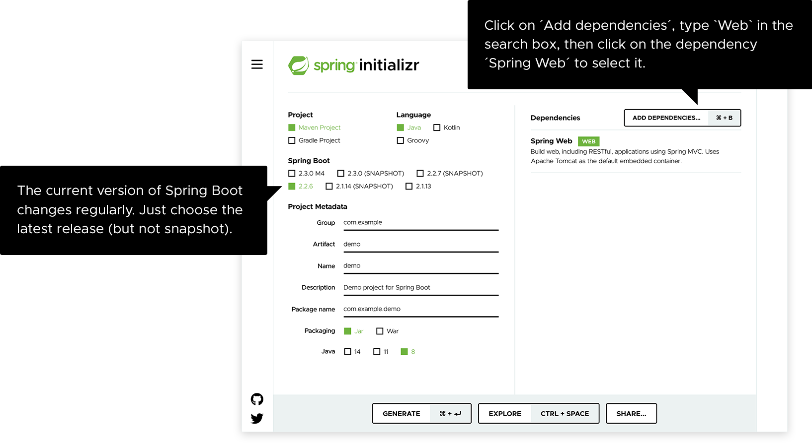

# 获取 Spring Boot 项目模板

在[https://start.spring.io/](https://start.spring.io/)上按下图指示生成项目：



# 写点代码

打开刚才生成的项目，在`src/main/java/com/example/demo`目录下找到`DemoApplication.java`文件，修改内容如下：

```java
package com.example.demo;

import org.springframework.boot.SpringApplication;
import org.springframework.boot.autoconfigure.SpringBootApplication;
import org.springframework.web.bind.annotation.GetMapping;
import org.springframework.web.bind.annotation.RequestParam;
import org.springframework.web.bind.annotation.RestController;

@SpringBootApplication
@RestController
public class DemoApplication {

    public static void main(String[] args) {
        SpringApplication.run(DemoApplication.class, args);
    }

    @GetMapping("/hello")
    public String hello(@RequestParam(value = "name", defaultValue = "World") String name) {
        return String.format("Hello %s!", name);
    }
}
```

相比于刚生成的代码我们在`class`上添加了`@RestController`注解，这个注解告诉`spring`这个`class`现在是一个`Controller`了，而且是`Rest`了的`Controller`。

停一下，我先简单的解释一下`Http`模型。`Http`规范的应用实际上拥有一个很简单的模型，那就是客户端发起请求，服务端返回响应，这种简单的，一个响应对应一个请求的模型。

基于这个模型来解释一下`Controller`，`Controller`就是用来将客户端的请求转发到对应的处理方法的，简而言之就是`路由`。理解了这个概念你也就知道了为什么不应该在`Controller`里写业务逻辑了。正是这个原因，在`WebFlux`中直接就没有了`Controller`这个东西，取而代之的是`Router`。

那`Controller`前面加了个`Rest`是啥意思呢？这题我会，在很久很久以前，那时候还没有前后端分离、微服务这些概念，网站的页面也是集成在后端的，以模板的形式出现。`Controller`需要将最终注入了数据的视图，也就是页面发送到客户端，所以`Controller`是配合视图解析器返回页面的。加了`Rest`就简单了，不用搞这些花里胡哨的了，业务逻辑处理完，数据直接`Json`处理一下返回给客户端。

接下来我们看这段代码：

```java
@GetMapping("/hello")
public String hello(@RequestParam(value = "name", defaultValue = "World") String name) {
    return String.format("Hello %s!", name);
}
```

这段代码穿的衣服太多了，我们先把她的衣服脱掉：

```java
public String hello(String name) {
    return String.format("Hello %s!", name);
}
```

这还用解释吗？既然代码这么简单，我们就看看她的衣服到底有什么不一样。

她穿的第一件衣服是`@GetMapping("/hello")`，简单，这衣服告诉`spring`，这个方法用来处理访问到`/hello`这个地址上的请求，且只处理访问到该地址的`GET`请求。

第二件衣服`@RequestParam(value = "name", defaultValue = "World")`，这是穿在`hello`方法的参数`name`上的。它说要把请求参数中的`name`参数`(value = "name")`和方法的`name`参数`(String name)`绑定在一起。如果`name`参数没有出现在请求中或者为空的话，那就取默认值`"World"`。

这里的请求参数指`Query Strings`，`Query Strings`就是请求行`?`后面跟的那一串用`&`和`=`连起来的字符串，示例如下：

```
http://www.example.com?search=ruby&results=10
```

## 启动项目

打开终端，进入项目根目录，执行如下命令：

MacOS/Linux:

```
./mvnw spring-boot:run
```

Windows:

```
mvnw spring-boot:run
```

看到如下输出：

```bash
$ ./mvnw spring-boot:run
[INFO] Scanning for projects...
[INFO]
[INFO] --------------------------< com.example:demo >--------------------------
[INFO] Building demo 0.0.1-SNAPSHOT
[INFO] --------------------------------[ jar ]---------------------------------
[INFO]
[INFO] >>> spring-boot-maven-plugin:2.5.4:run (default-cli) > test-compile @ demo >>>
[INFO]
...

  .   ____          _            __ _ _
 /\\ / ___'_ __ _ _(_)_ __  __ _ \ \ \ \
( ( )\___ | '_ | '_| | '_ \/ _` | \ \ \ \
 \\/  ___)| |_)| | | | | || (_| |  ) ) ) )
  '  |____| .__|_| |_|_| |_\__, | / / / /
 =========|_|==============|___/=/_/_/_/
 :: Spring Boot ::                (v2.5.4)

...
2021-08-26 12:42:46.810  INFO 4644 --- [           main] com.example.demo.DemoApplication         : No active profile set, falling back to default profiles: default
...
2021-08-26 12:42:47.774  INFO 4644 --- [           main] o.s.b.w.embedded.tomcat.TomcatWebServer  : Tomcat started on port(s): 8080 (http) with context path ''
...
2021-08-26 12:42:54.335  INFO 4644 --- [nio-8080-exec-1] o.s.web.servlet.DispatcherServlet        : Completed initialization in 0 ms
```

现在我们发个请求看看效果：

```bash
$ curl -s localhost:8080/hello
Hello World!
$ curl -s localhost:8080/hello?name=laoli
Hello laoli!
```

可以看到，当请求中没有`name`参数时，使用默认值`"World"`。

（完）
