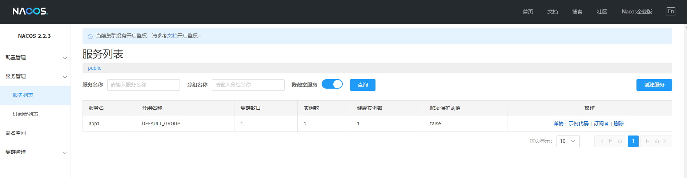

[Nacos](https://nacos.io/) 是一个更易于构建云原生应用的动态服务发现、配置管理和服务管理平台。

## 下载与启动

Nacos 作为一款开源软件我们可以选择使用构建好的安装包启动或者下载源码自行编译启动，下面分别演示两种方式。

### 通过构建好的安装包启动

构建好的安装包可以在 [Github Release 页面](https://github.com/alibaba/nacos/releases)下载，本文写作时最新版本为 `2.2.3`，下载地址如下：


我本机是 Windows 环境所以选择下载 `zip` 包，下载完成后解压到自定义目录。


进入命令行并启动：

```powershell{1,35}
$ .\bin\startup.cmd -m standalone
"nacos is starting with standalone"

         ,--.
       ,--.'|
   ,--,:  : |                                           Nacos 2.2.3
,`--.'`|  ' :                       ,---.               Running in stand alone mode, All function modules
|   :  :  | |                      '   ,'\   .--.--.    Port: 8848
:   |   \ | :  ,--.--.     ,---.  /   /   | /  /    '   Pid: 17884
|   : '  '; | /       \   /     \.   ; ,. :|  :  /`./   Console: http://192.168.56.1:8848/nacos/index.html
'   ' ;.    ;.--.  .-. | /    / ''   | |: :|  :  ;_
|   | | \   | \__\/: . ..    ' / '   | .; : \  \    `.      https://nacos.io
'   : |  ; .' ," .--.; |'   ; :__|   :    |  `----.   \
|   | '`--'  /  /  ,.  |'   | '.'|\   \  /  /  /`--'  /
'   : |     ;  :   .'   \   :    : `----'  '--'.     /
;   |.'     |  ,     .-./\   \  /            `--'---'
'---'        `--`---'     `----'

2023-06-25 15:47:26,177 INFO Tomcat initialized with port(s): 8848 (http)

2023-06-25 15:47:26,436 INFO Root WebApplicationContext: initialization completed in 4840 ms

2023-06-25 15:47:33,300 INFO Adding welcome page: class path resource [static/index.html]

2023-06-25 15:47:34,244 WARN You are asking Spring Security to ignore Ant [pattern='/**']. This is not recommended -- please use permitAll via HttpSecurity#authorizeHttpRequests instead.

2023-06-25 15:47:34,245 INFO Will not secure Ant [pattern='/**']

2023-06-25 15:47:34,294 INFO Will secure any request with [org.springframework.security.web.context.request.async.WebAsyncManagerIntegrationFilter@1c52552f, org.springframework.security.web.context.SecurityContextPersistenceFilter@7645f03e, org.springframework.security.web.header.HeaderWriterFilter@2bc7db89, org.springframework.security.web.csrf.CsrfFilter@20999517, org.springframework.security.web.authentication.logout.LogoutFilter@671ea6ff, org.springframework.security.web.savedrequest.RequestCacheAwareFilter@7a6ea47d, org.springframework.security.web.servletapi.SecurityContextHolderAwareRequestFilter@6cbbb9c4, org.springframework.security.web.authentication.AnonymousAuthenticationFilter@5dc769f9, org.springframework.security.web.session.SessionManagementFilter@173f1614, org.springframework.security.web.access.ExceptionTranslationFilter@6ec63f8]

2023-06-25 15:47:34,376 INFO Exposing 1 endpoint(s) beneath base path '/actuator'

2023-06-25 15:47:34,488 INFO Tomcat started on port(s): 8848 (http) with context path '/nacos'

2023-06-25 15:47:34,543 INFO Nacos started successfully in stand alone mode. use embedded storage
```

观察程序输出日志中出现 `successfully` 则说明启动成功。

:::tip
单机启动需要添加参数 ` -m standalone`。
:::

此时可通过浏览器打开 [http://localhost:8848/nacos](http://localhost:8848/nacos) 进入 Nacos 控制台。

刚启动的 Nacos 中是没有任何配置和服务的：


让我们通过 [Nacos Open API](https://nacos.io/zh-cn/docs/v2/guide/user/open-api.html) 发布一个配置，通过 `curl` 调用如下接口发布配置：

```bash
$ curl -X POST 'http://127.0.0.1:8848/nacos/v1/cs/configs?dataId=app1.cfg&group=test&content=HelloWorld'
```

请求方式为 `POST`，并且传入了三个参数 `dataId`、`group` 和 `content`，值分别为 `app1.cfg`、`test` 和 `HelloWorld`，Nacos 本身便是通过 `dataId` 和 `group` 来定位一个配置的。

:::tip
这里的 cURL 命令是通过 `git-bash` 调用的，如果没有安装的话也可以通过 [Postman](https://www.postman.com/) 调用。
:::

如上所述，我们也可以通过 Nacos API 来获取一个配置：

```bash
$ curl -X GET "http://127.0.0.1:8848/nacos/v1/cs/configs?dataId=app1.cfg&group=test"
HelloWorld
```

同时也可以通过管理界面验证，再次查询可看到配置列表如下：


点击详情可以看到内容也与我们设置的一致：


### 通过源码启动

:::tip
此处我们选择通过 `idea` 启动 Nacos，以便调试和学习。
:::

通过 `git` 将 nacos 源码克隆到本地 `git clone https://github.com/alibaba/nacos.git` 并导入 `idea`，如下：


此时如果直接启动的话会提示有些类找不到，这需要先对项目进行编译，在 IDEA 中打开 Maven 工具栏，点击 `Toggle 'Skip Tests' Mode`，点击 `compile` 等待编译完成后在运行主类。

再次运行发现还是会报错：


这个问题很好解决，因为同样作为单机启动我们需要添加启动参数：


:::tip
添加启动参数 `-Dnacos.standalone=true`
:::


再次运行：


启动成功，通过源码和控制台输出我们也很容易看出来 Nacos 本身也是基于 spring boot 构建的。

## 配置管理

### 通过 Java SDK 管理配置

我们的示例项目将通过 Gradle 构建，所以请先正确安装 [Gradle](https://gradle.org/)。

#### 获取配置

创建并进入项目根目录 `nacos-playground`，依次创建 settings 文件和 build 文件，内容分别如下：

```kotlin
// filename: settings.gradle.kts
rootProject.name = "nacos-playground"
```

```kotlin
// filename: build.gradle.kts
plugins {
    java
}

repositories {
    mavenCentral()
}

dependencies {
    implementation("com.alibaba.nacos:nacos-client:2.2.3")
    implementation("org.slf4j:slf4j-api:2.0.7")
}
```

此时项目结构如下：

```bash
$ find .
.
./build.gradle.kts
./settings.gradle.kts
```

将项目导入 IDEA 并编写主类，内容如下：

```java{12-14,20}
package example;

import com.alibaba.nacos.api.NacosFactory;
import com.alibaba.nacos.api.config.ConfigService;
import com.alibaba.nacos.api.exception.NacosException;

import java.util.Properties;

public class NacosPlayground {

    public static void main(String[] args) throws NacosException {
        String serverAddr = "localhost:8848";   // 指定服务器地址
        String dataId = "app1.cfg";             // 指定配置 dataId
        String group = "test";                  // 指定配置 group

        Properties properties = new Properties();
        properties.put("serverAddr", serverAddr);

        ConfigService configService = NacosFactory.createConfigService(properties);
        String content = configService.getConfig(dataId, group, 5000); // 获取配置内容
        System.out.println(content);
    }
}
```

运行程序输出结果如下：


#### 监听配置

如果希望 Nacos 推送配置变更，可以使用 Nacos 动态监听配置接口来实现。

修改代码如下：

```java{27,34-37}
package example;

import com.alibaba.nacos.api.NacosFactory;
import com.alibaba.nacos.api.config.ConfigService;
import com.alibaba.nacos.api.config.listener.Listener;
import com.alibaba.nacos.api.exception.NacosException;

import java.util.Properties;
import java.util.concurrent.Executor;
import java.util.concurrent.TimeUnit;

public class NacosPlayground {

    public static void main(String[] args) throws NacosException {
        String serverAddr = "localhost:8848";   // 指定服务器地址
        String dataId = "app1.cfg";             // 指定配置 dataId
        String group = "test";                  // 指定配置 group

        Properties properties = new Properties();
        properties.put("serverAddr", serverAddr);

        ConfigService configService = NacosFactory.createConfigService(properties);
        String content = configService.getConfig(dataId, group, 5000); // 获取配置内容
        System.out.println("初始内容: " + content);

        // 为配置添加监听器
        configService.addListener(dataId, group, new Listener() {
            @Override
            public Executor getExecutor() {
                return null;
            }

            @Override
            public void receiveConfigInfo(String configInfo) {
                // 实现配置更新后的回调方法
                System.out.println("当前内容: " + configInfo);
            }
        });

        // 死循环使主线程不退出，正式代码中无需下面代码
        while (true) {
            try {
                TimeUnit.SECONDS.sleep(1);
            } catch (InterruptedException e) {
                e.printStackTrace();
            }
        }
    }
}
```

运行结果如下：


可以看到在获取到初始配置内容后程序并没有退出。

在管理界面修改并发布配置：


回到程序控制台，发现程序已打印出最新配置：


更多关于 Java SDK 的操作请查阅[官方文档](https://nacos.io/zh-cn/docs/v2/guide/user/sdk.html)。

### 整合 Spring Boot

修改 Gradle 构建脚本：

```kotlin
// filename: build.gradle.kts
plugins {
    java
    id("org.springframework.boot") version "2.7.13"
}

apply(plugin = "io.spring.dependency-management")

repositories {
    mavenCentral()
}

dependencies {
    implementation("org.springframework.boot:spring-boot-starter-web")
    implementation("com.alibaba.boot:nacos-config-spring-boot-starter:0.2.12")
}
```

新增配置文件：

```properties
# filename: application.properties
nacos.config.server-addr=127.0.0.1:8848
```

修改主类，使用 `@NacosPropertySource` 加载 dataId 为 `nacos-playground` 的配置源，并开启自动更新：

```java{8}
package example;

import com.alibaba.nacos.spring.context.annotation.config.NacosPropertySource;
import org.springframework.boot.SpringApplication;
import org.springframework.boot.autoconfigure.SpringBootApplication;

@SpringBootApplication
@NacosPropertySource(dataId = "nacos-playground", autoRefreshed = true)
public class NacosPlayground {

    public static void main(String[] args) {
        SpringApplication.run(NacosPlayground.class, args);
    }
}
```

新增 Controller 类并通过 Nacos 的 `@NacosValue` 注解设置属性值：

```java{12}
package example;

import com.alibaba.nacos.api.config.annotation.NacosValue;
import org.springframework.web.bind.annotation.GetMapping;
import org.springframework.web.bind.annotation.RequestMapping;
import org.springframework.web.bind.annotation.RestController;

@RestController
@RequestMapping("config")
public class ConfigController {

    @NacosValue(value = "${name}", autoRefreshed = true)
    private String name;

    @GetMapping("name")
    public String getName() {
        return name;
    }
}
```

在 Nacos 管理界面新增配置 dataId 为 `nacos-playground`，group 为 `DEFAULT_GROUP`，配置内容为 `name=laoli`。

启动应用并访问新增的接口：

```bash
$ curl http://localhost:8080/config/name
laoli
```

进入配置管理界面修改配置内容为 `name=weiyang`，再次请求接口：

```bash
$ curl http://localhost:8080/config/name
weiyang
```

可以看到返回值已动态更新为配置中心的最新值。

### 整合 Spring Cloud

#### 项目结构调整

为方便后续演示，我们将项目调整为多项目结构。

1. 执行 `gradle clean` 清理项目

2. 删除 `src` 目录

3. 调整 gradle 脚本

    * 替换 `settings.gradle.kts` 内容如下：

    ```kotlin
    rootProject.name = "nacos-playground"

    include("app1")
    ```

    * 替换 `build.gradle.kts` 内容如下：

    ```kotlin
    plugins {
        id("org.springframework.boot") version "2.6.13" apply false
        id("io.spring.dependency-management") version "1.1.0"
    }

    val springCloudVersion by extra("2021.0.5")
    var springCloudAlibabaVersion by extra("2021.0.5.0")

    subprojects {

        apply(plugin = "java")
        apply(plugin = "org.springframework.boot")
        apply(plugin = "io.spring.dependency-management")

        repositories {
            mavenLocal()
            mavenCentral()
        }

        dependencyManagement {
            imports {
                mavenBom(org.springframework.boot.gradle.plugin.SpringBootPlugin.BOM_COORDINATES)
                mavenBom("org.springframework.cloud:spring-cloud-dependencies:${springCloudVersion}")
                mavenBom("com.alibaba.cloud:spring-cloud-alibaba-dependencies:${springCloudAlibabaVersion}")
            }
        }
    }
    ```
4. 新建 `app1` 目录作为子项目目录

5. 在 `app1` 目录下创建 `build.gradle.kts` 作为子项目的构建脚本，内容如下：

    ```kotlin{3,4}
    dependencies {
        implementation("org.springframework.boot:spring-boot-starter-web")
        implementation("org.springframework.cloud:spring-cloud-starter-bootstrap")
        implementation("com.alibaba.cloud:spring-cloud-starter-alibaba-nacos-config")
    }
    ```

#### 整合子项目

1. 调整服务端口

```properties
# application.properties
server.port=8090
```

2. 新增 `bootstrap.properties` 配置

```properties
# bootstrap.properties

# 设置 Nacos 配置管理服务地址
spring.cloud.nacos.config.server-addr=127.0.0.1:8848

# 设置服务名称
spring.application.name=app1
```

:::tip
在 Nacos Spring Cloud 中，dataId 的完整格式如下：
```
${prefix}-${spring.profiles.active}.${file-extension}
```
* `prefix` 默认为 `spring.application.name` 的值，也可以通过配置项 `spring.cloud.nacos.config.prefix` 来配置。
* `spring.profiles.active` 即为当前环境对应的 `profile`，详情可以参考 [Spring Boot文档](https://docs.spring.io/spring-boot/docs/current/reference/html/boot-features-profiles.html#boot-features-profiles)。 注意：当 `spring.profiles.active` 为空时，对应的连接符 - 也将不存在，dataId 的拼接格式变成 `${prefix}.${file-extension}`
* `file-exetension` 为配置内容的数据格式，可以通过配置项 `spring.cloud.nacos.config.file-extension` 来配置。目前只支持 `properties` 和 `yaml` 类型。
:::

3. 新建应用主类

```java
package example.app1;

import org.springframework.boot.SpringApplication;
import org.springframework.boot.autoconfigure.SpringBootApplication;

@SpringBootApplication
public class App1 {

    public static void main(String[] args) {
        SpringApplication.run(App1.class, args);
    }
}
```

4. 新建 Controller 类

```java{11,14}
package example.app1;

import org.springframework.beans.factory.annotation.Value;
import org.springframework.cloud.context.config.annotation.RefreshScope;
import org.springframework.web.bind.annotation.GetMapping;
import org.springframework.web.bind.annotation.RequestMapping;
import org.springframework.web.bind.annotation.RestController;

@RestController
@RequestMapping("config")
@RefreshScope
public class ConfigController {

    @Value("${name}")
    private String name;

    @GetMapping("name")
    public String getName() {
        return name;
    }
}
```

我们通过为类添加 Spring Cloud 原生注解 `@RefreshScope` 来实现配置自动更新。

5. 通过 [Nacos Open API](https://nacos.io/zh-cn/docs/v2/guide/user/open-api.html) 向 Nacos Server 发布配置：dataId 为 `app1.properties`，内容为 `name=app1-nacos`

```bash
$ curl -X POST "http://localhost:8848/nacos/v1/cs/configs?dataId=app1.properties&group=DEFAULT_GROUP&content=name=app1-nacos"
```

6. 启动服务并查看日志

```bash{3,4,13}
...
2023-06-27 16:34:14.375  WARN 30568 --- [           main] c.a.c.n.c.NacosPropertySourceBuilder     : Ignore the empty nacos configuration and get it based on dataId[app1] & group[DEFAULT_GROUP]
2023-06-27 16:34:14.388  INFO 30568 --- [           main] b.c.PropertySourceBootstrapConfiguration : Located property source: [BootstrapPropertySource {name='bootstrapProperties-app1.properties,DEFAULT_GROUP'}, BootstrapPropertySource {name='bootstrapProperties-app1,DEFAULT_GROUP'}]
2023-06-27 16:34:14.397  INFO 30568 --- [           main] example.app1.App1                        : No active profile set, falling back to 1 default profile: "default"
2023-06-27 16:34:14.821  INFO 30568 --- [           main] o.s.cloud.context.scope.GenericScope     : BeanFactory id=970ab93c-a20b-3ce3-aab5-db58140739ab
2023-06-27 16:34:15.017  INFO 30568 --- [           main] o.s.b.w.embedded.tomcat.TomcatWebServer  : Tomcat initialized with port(s): 8090 (http)
2023-06-27 16:34:15.026  INFO 30568 --- [           main] o.apache.catalina.core.StandardService   : Starting service [Tomcat]
2023-06-27 16:34:15.026  INFO 30568 --- [           main] org.apache.catalina.core.StandardEngine  : Starting Servlet engine: [Apache Tomcat/9.0.68]
2023-06-27 16:34:15.189  INFO 30568 --- [           main] o.a.c.c.C.[Tomcat].[localhost].[/]       : Initializing Spring embedded WebApplicationContext
2023-06-27 16:34:15.190  INFO 30568 --- [           main] w.s.c.ServletWebServerApplicationContext : Root WebApplicationContext: initialization completed in 784 ms
2023-06-27 16:34:16.210  INFO 30568 --- [           main] o.s.b.w.embedded.tomcat.TomcatWebServer  : Tomcat started on port(s): 8090 (http) with context path ''
2023-06-27 16:34:16.916  INFO 30568 --- [           main] example.app1.App1                        : Started App1 in 7.466 seconds (JVM running for 8.807)
2023-06-27 16:34:16.926  INFO 30568 --- [           main] c.a.c.n.refresh.NacosContextRefresher    : [Nacos Config] Listening config: dataId=app1.properties, group=DEFAULT_GROUP
2023-06-27 16:34:16.926  INFO 30568 --- [           main] c.a.c.n.refresh.NacosContextRefresher    : [Nacos Config] Listening config: dataId=app1, group=DEFAULT_GROUP
...
```

可以看到因为我们没有设置 `profile`，所以最终拼接得到的 `dataId` 为 `app1.properties`，日志中也显示已启动对 `app1.properties` 的监听。

7. 请求接口

```bash
$ curl -s http://localhost:8090/config/name
app1-nacos
```

8. 更新配置

```bash
$ curl -X POST "http://localhost:8848/nacos/v1/cs/configs?dataId=app1.properties&group=DEFAULT_GROUP&content=name=app1-alice"
```

9. 观察日志

```bash{13}
...
2023-06-27 16:34:16.210  INFO 30568 --- [           main] o.s.b.w.embedded.tomcat.TomcatWebServer  : Tomcat started on port(s): 8090 (http) with context path ''
2023-06-27 16:34:16.916  INFO 30568 --- [           main] example.app1.App1                        : Started App1 in 7.466 seconds (JVM running for 8.807)
2023-06-27 16:34:16.926  INFO 30568 --- [           main] c.a.c.n.refresh.NacosContextRefresher    : [Nacos Config] Listening config: dataId=app1.properties, group=DEFAULT_GROUP
2023-06-27 16:34:16.926  INFO 30568 --- [           main] c.a.c.n.refresh.NacosContextRefresher    : [Nacos Config] Listening config: dataId=app1, group=DEFAULT_GROUP
2023-06-27 16:41:28.615  INFO 30568 --- [nio-8090-exec-1] o.a.c.c.C.[Tomcat].[localhost].[/]       : Initializing Spring DispatcherServlet 'dispatcherServlet'
2023-06-27 16:41:28.615  INFO 30568 --- [nio-8090-exec-1] o.s.web.servlet.DispatcherServlet        : Initializing Servlet 'dispatcherServlet'
2023-06-27 16:41:28.616  INFO 30568 --- [nio-8090-exec-1] o.s.web.servlet.DispatcherServlet        : Completed initialization in 1 ms
2023-06-27 16:42:48.257  WARN 30568 --- [ternal.notifier] c.a.c.n.c.NacosPropertySourceBuilder     : Ignore the empty nacos configuration and get it based on dataId[app1] & group[DEFAULT_GROUP]
2023-06-27 16:42:48.263  INFO 30568 --- [ternal.notifier] b.c.PropertySourceBootstrapConfiguration : Located property source: [BootstrapPropertySource {name='bootstrapProperties-app1.properties,DEFAULT_GROUP'}, BootstrapPropertySource {name='bootstrapProperties-app1,DEFAULT_GROUP'}]
2023-06-27 16:42:48.268  INFO 30568 --- [ternal.notifier] o.s.boot.SpringApplication               : No active profile set, falling back to 1 default profile: "default"
2023-06-27 16:42:48.275  INFO 30568 --- [ternal.notifier] o.s.boot.SpringApplication               : Started application in 0.842 seconds (JVM running for 520.167)
2023-06-27 16:42:48.293  INFO 30568 --- [ternal.notifier] o.s.c.e.event.RefreshEventListener       : Refresh keys changed: [name]
...
```

可以看到应用已监听到配置变化。

10. 再次请求，验证结果。注意，此时不需要重启服务。

```bash
$ curl -s http://localhost:8090/config/name
app1-alice
```

## 服务发现

服务注册与发现最常用的地方是在 Spring Cloud，所以我们跳过使用 Nacos Open API 和 Java SDK 管理服务以及与 Spring Boot 整合的部分，关于这部分内容想了解的大佬可以自行查阅文档。

### 整合 Spring Cloud

1. 修改 `app1` 构建脚本，添加 Nacos 服务注册发现依赖

```kotlin{6}
// app1/build.gradle.kts
dependencies {
    implementation("org.springframework.boot:spring-boot-starter-web")
    implementation("org.springframework.cloud:spring-cloud-starter-bootstrap")
    implementation("com.alibaba.cloud:spring-cloud-starter-alibaba-nacos-config")
    implementation("com.alibaba.cloud:spring-cloud-starter-alibaba-nacos-discovery")
}
```

2. 修改配置，添加服务注册发现服务地址

```properties{3}
# bootstrap.properties
spring.cloud.nacos.config.server-addr=127.0.0.1:8848
spring.cloud.nacos.discovery.server-addr=127.0.0.1:8848
spring.application.name=app1
```

3. 通过 Spring Cloud 原生注解 `@EnableDiscoveryClient` 开启服务注册发现功能

```java{8}
package example.app1;

import org.springframework.boot.SpringApplication;
import org.springframework.boot.autoconfigure.SpringBootApplication;
import org.springframework.cloud.client.discovery.EnableDiscoveryClient;

@SpringBootApplication
@EnableDiscoveryClient
public class App1 {

    public static void main(String[] args) {
        SpringApplication.run(App1.class, args);
    }
}
```

4. 启动服务并通过 Nacos 管理界面验证服务注册情况



5. 新建子项目 `app2` 并修改根目录下的 `settings.gradle.kts` 文件

```kotlin{5}
// settings.gradle.kts
rootProject.name = "nacos-playground"

include("app1")
include("app2")
```

6. 编辑 `app2/build.gradle.kts`

```kotlin{4}
dependencies {
    implementation("org.springframework.boot:spring-boot-starter-web")
    implementation("org.springframework.cloud:spring-cloud-starter-bootstrap")
    implementation("org.springframework.cloud:spring-cloud-starter-loadbalancer")
    implementation("com.alibaba.cloud:spring-cloud-starter-alibaba-nacos-discovery")
}
```

7. 编辑 `app2` 配置文件

```properties
# application.properties
server.port=8091
```

```properties
# bootstrap.properties
spring.cloud.nacos.discovery.server-addr=127.0.0.1:8848
spring.application.name=app2
```

8. `app2` 子项目代码

```java
// example.app2.App2
package example.app2;

import org.springframework.boot.SpringApplication;
import org.springframework.boot.autoconfigure.SpringBootApplication;
import org.springframework.cloud.client.discovery.EnableDiscoveryClient;

@SpringBootApplication
@EnableDiscoveryClient
public class App2 {

    public static void main(String[] args) {
        SpringApplication.run(App2.class, args);
    }
}
```

```java{13}
// example.app2.RestTemplateConfig
package example.app2;

import org.springframework.cloud.client.loadbalancer.LoadBalanced;
import org.springframework.context.annotation.Bean;
import org.springframework.context.annotation.Configuration;
import org.springframework.web.client.RestTemplate;

@Configuration
public class RestTemplateConfig {

    @Bean
    @LoadBalanced
    public RestTemplate restTemplate() {
        return new RestTemplate();
    }
}
```

```java{21}
// example.app2.ConfigController
package example.app2;

import org.springframework.web.bind.annotation.GetMapping;
import org.springframework.web.bind.annotation.RequestMapping;
import org.springframework.web.bind.annotation.RestController;
import org.springframework.web.client.RestTemplate;

@RestController
@RequestMapping("config")
public class ConfigController {

    private final RestTemplate restTemplate;

    public ConfigController(RestTemplate restTemplate) {
        this.restTemplate = restTemplate;
    }

    @GetMapping("name")
    public String getName() {
        return this.restTemplate.getForObject("http://app1/config/name", String.class);
    }
}
```

:::tip
注意这里请求的 URL 中需要填写目标服务的名称，例如 `app1` 而不是真实的 IP 和端口。
:::

9. 启动 `app1`，`app2` 并请求 `app2` 验证服务发现及远程调用情况

```bash
$ curl -s http://localhost:8091/config/name
app1-alice
```

可以看到我们请求 `app2`，而 `app2` 去请求 `app1` 并向我们返回了结果。
