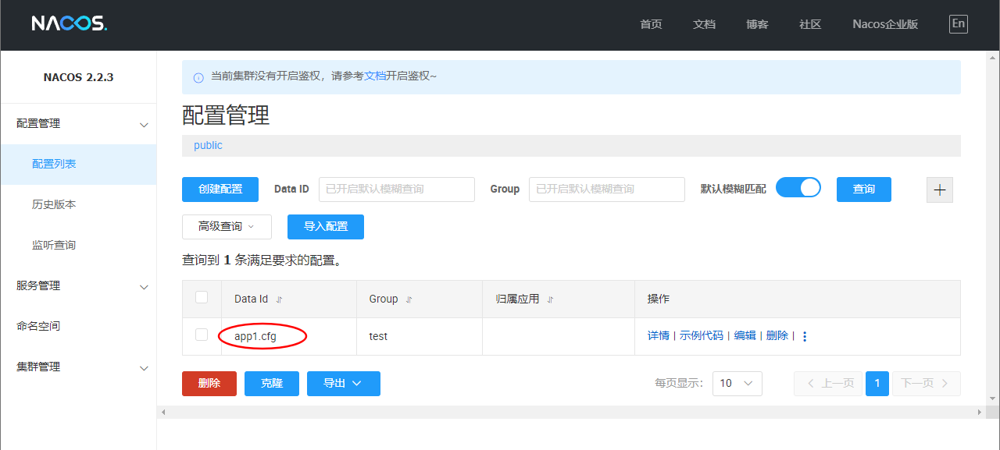

[Nacos](https://nacos.io/) 是一个更易于构建云原生应用的动态服务发现、配置管理和服务管理平台。

## 下载与启动

Nacos 作为一款开源软件我们可以选择使用构建好的安装包启动或者下载源码自行编译启动，下面分别演示两种方式。

### 通过构建好的安装包启动

构建好的安装包可以在 [Github Release 页面](https://github.com/alibaba/nacos/releases)下载，本文写作时最新版本为 `2.2.3`，下载地址如下：


我本机是 Windows 环境所以选择下载 `zip` 包，下载完成后解压到自定义目录。


进入命令行并启动：

```powershell{1,35}
$ .\bin\startup.cmd -m standalone
"nacos is starting with standalone"

         ,--.
       ,--.'|
   ,--,:  : |                                           Nacos 2.2.3
,`--.'`|  ' :                       ,---.               Running in stand alone mode, All function modules
|   :  :  | |                      '   ,'\   .--.--.    Port: 8848
:   |   \ | :  ,--.--.     ,---.  /   /   | /  /    '   Pid: 17884
|   : '  '; | /       \   /     \.   ; ,. :|  :  /`./   Console: http://192.168.56.1:8848/nacos/index.html
'   ' ;.    ;.--.  .-. | /    / ''   | |: :|  :  ;_
|   | | \   | \__\/: . ..    ' / '   | .; : \  \    `.      https://nacos.io
'   : |  ; .' ," .--.; |'   ; :__|   :    |  `----.   \
|   | '`--'  /  /  ,.  |'   | '.'|\   \  /  /  /`--'  /
'   : |     ;  :   .'   \   :    : `----'  '--'.     /
;   |.'     |  ,     .-./\   \  /            `--'---'
'---'        `--`---'     `----'

2023-06-25 15:47:26,177 INFO Tomcat initialized with port(s): 8848 (http)

2023-06-25 15:47:26,436 INFO Root WebApplicationContext: initialization completed in 4840 ms

2023-06-25 15:47:33,300 INFO Adding welcome page: class path resource [static/index.html]

2023-06-25 15:47:34,244 WARN You are asking Spring Security to ignore Ant [pattern='/**']. This is not recommended -- please use permitAll via HttpSecurity#authorizeHttpRequests instead.

2023-06-25 15:47:34,245 INFO Will not secure Ant [pattern='/**']

2023-06-25 15:47:34,294 INFO Will secure any request with [org.springframework.security.web.context.request.async.WebAsyncManagerIntegrationFilter@1c52552f, org.springframework.security.web.context.SecurityContextPersistenceFilter@7645f03e, org.springframework.security.web.header.HeaderWriterFilter@2bc7db89, org.springframework.security.web.csrf.CsrfFilter@20999517, org.springframework.security.web.authentication.logout.LogoutFilter@671ea6ff, org.springframework.security.web.savedrequest.RequestCacheAwareFilter@7a6ea47d, org.springframework.security.web.servletapi.SecurityContextHolderAwareRequestFilter@6cbbb9c4, org.springframework.security.web.authentication.AnonymousAuthenticationFilter@5dc769f9, org.springframework.security.web.session.SessionManagementFilter@173f1614, org.springframework.security.web.access.ExceptionTranslationFilter@6ec63f8]

2023-06-25 15:47:34,376 INFO Exposing 1 endpoint(s) beneath base path '/actuator'

2023-06-25 15:47:34,488 INFO Tomcat started on port(s): 8848 (http) with context path '/nacos'

2023-06-25 15:47:34,543 INFO Nacos started successfully in stand alone mode. use embedded storage
```

观察程序输出日志中出现 `successfully` 则说明启动成功。

:::tip
单机启动需要添加参数 ` -m standalone`。
:::

此时可通过浏览器打开 [http://localhost:8848/nacos](http://localhost:8848/nacos) 进入 Nacos 控制台。

刚启动的 Nacos 中是没有任何配置和服务的：


让我们通过 Nacos API 发布一个配置，通过 `curl` 调用如下接口发布配置：

```bash
$ curl -X POST 'http://127.0.0.1:8848/nacos/v1/cs/configs?dataId=app1.cfg&group=test&content=HelloWorld'
```

请求方式为 `POST`，并且传入了三个参数 `dataId`、`group` 和 `content`，值分别为 `app1.cfg`、`test` 和 `HelloWorld`，Nacos 本身便是通过 `dataId` 和 `group` 来定位一个配置的。

:::tip
这里的 cURL 命令是通过 `git-bash` 调用的，如果没有安装的话也可以通过 [Postman](https://www.postman.com/) 调用。
:::

如上所述，我们也可以通过 Nacos API 来获取一个配置：

```bash
$ curl -X GET "http://127.0.0.1:8848/nacos/v1/cs/configs?dataId=app1.cfg&group=test"
HelloWorld
```

同时也可以通过管理界面验证，再次查询可看到配置列表如下：



点击详情可以看到内容也与我们设置的一致：


### 通过源码启动

:::tip
此处我们选择通过 `idea` 启动 Nacos，以便调试和学习。
:::

通过 `git` 将 nacos 源码克隆到本地 `git clone https://github.com/alibaba/nacos.git` 并导入 `idea`，如下：


此时如果直接启动的话会提示有些类找不到，这需要先对项目进行编译，在 IDEA 中打开 Maven 工具栏，点击 `Toggle 'Skip Tests' Mode`，点击 `compile` 等待编译完成后在运行主类。

再次运行发现还是会报错：


这个问题很好解决，因为同样作为单机启动我们需要添加启动参数：


:::tip
添加启动参数 `-Dnacos.standalone=true`
:::


再次运行：


启动成功，通过源码和控制台输出我们也很容易看出来 Nacos 本身也是基于 spring boot 构建的。

## 通过 Java SDK 管理配置

我们的示例项目将通过 Gradle 构建，所以请先正确安装 [Gradle](https://gradle.org/)。

### 获取配置

创建并进入项目根目录 `nacos-playground`，依次创建 settings 文件和 build 文件，内容分别如下：

```kotlin
// filename: settings.gradle.kts
rootProject.name = "nacos-playground"
```

```kotlin
// filename: build.gradle.kts
plugins {
    java
}

repositories {
    mavenCentral()
}

dependencies {
    implementation("com.alibaba.nacos:nacos-client:2.2.3")
    implementation("org.slf4j:slf4j-api:2.0.7")
}
```

此时项目结构如下：

```bash
$ find .
.
./build.gradle.kts
./settings.gradle.kts
```

将项目导入 IDEA 并编写主类，内容如下：

```java{12-14,20}
package example;

import com.alibaba.nacos.api.NacosFactory;
import com.alibaba.nacos.api.config.ConfigService;
import com.alibaba.nacos.api.exception.NacosException;

import java.util.Properties;

public class NacosPlayground {

    public static void main(String[] args) throws NacosException {
        String serverAddr = "localhost:8848";   // 指定服务器地址
        String dataId = "app1.cfg";             // 指定配置 dataId
        String group = "test";                  // 指定配置 group

        Properties properties = new Properties();
        properties.put("serverAddr", serverAddr);

        ConfigService configService = NacosFactory.createConfigService(properties);
        String content = configService.getConfig(dataId, group, 5000); // 获取配置内容
        System.out.println(content);
    }
}
```

运行程序输出结果如下：


### 监听配置

如果希望 Nacos 推送配置变更，可以使用 Nacos 动态监听配置接口来实现。

修改代码如下：

```java{27,34-37}
package example;

import com.alibaba.nacos.api.NacosFactory;
import com.alibaba.nacos.api.config.ConfigService;
import com.alibaba.nacos.api.config.listener.Listener;
import com.alibaba.nacos.api.exception.NacosException;

import java.util.Properties;
import java.util.concurrent.Executor;
import java.util.concurrent.TimeUnit;

public class NacosPlayground {

    public static void main(String[] args) throws NacosException {
        String serverAddr = "localhost:8848";   // 指定服务器地址
        String dataId = "app1.cfg";             // 指定配置 dataId
        String group = "test";                  // 指定配置 group

        Properties properties = new Properties();
        properties.put("serverAddr", serverAddr);

        ConfigService configService = NacosFactory.createConfigService(properties);
        String content = configService.getConfig(dataId, group, 5000); // 获取配置内容
        System.out.println("初始内容: " + content);

        // 为配置添加监听器
        configService.addListener(dataId, group, new Listener() {
            @Override
            public Executor getExecutor() {
                return null;
            }

            @Override
            public void receiveConfigInfo(String configInfo) {
                // 实现配置更新后的回调方法
                System.out.println("当前内容: " + configInfo);
            }
        });

        // 死循环使主线程不退出，正式代码中无需下面代码
        while (true) {
            try {
                TimeUnit.SECONDS.sleep(1);
            } catch (InterruptedException e) {
                e.printStackTrace();
            }
        }
    }
}
```

运行结果如下：


可以看到在获取到初始配置内容后程序并没有退出。

在管理界面修改并发布配置：


回到程序控制台，发现程序已打印出最新配置：


更多关于 Java SDK 的操作请查阅[官方文档](https://nacos.io/zh-cn/docs/v2/guide/user/sdk.html)。

## 整合 Spring Boot

修改 Gradle 构建脚本：

```kotlin
// filename: build.gradle.kts
plugins {
    java
    id("org.springframework.boot") version "2.7.13"
}

apply(plugin = "io.spring.dependency-management")

repositories {
    mavenCentral()
}

dependencies {
    implementation("org.springframework.boot:spring-boot-starter-web")
    implementation("com.alibaba.boot:nacos-config-spring-boot-starter:0.2.12")
}
```

新增配置文件：

```properties
# filename: application.properties
nacos.config.server-addr=127.0.0.1:8848
```

修改主类，使用 `@NacosPropertySource` 加载 dataId 为 `nacos-playground` 的配置源，并开启自动更新：

```java{8}
package example;

import com.alibaba.nacos.spring.context.annotation.config.NacosPropertySource;
import org.springframework.boot.SpringApplication;
import org.springframework.boot.autoconfigure.SpringBootApplication;

@SpringBootApplication
@NacosPropertySource(dataId = "nacos-playground", autoRefreshed = true)
public class NacosPlayground {

    public static void main(String[] args) {
        SpringApplication.run(NacosPlayground.class, args);
    }
}
```

新增 Controller 类并通过 Nacos 的 `@NacosValue` 注解设置属性值：

```java{12}
package example;

import com.alibaba.nacos.api.config.annotation.NacosValue;
import org.springframework.web.bind.annotation.GetMapping;
import org.springframework.web.bind.annotation.RequestMapping;
import org.springframework.web.bind.annotation.RestController;

@RestController
@RequestMapping("config")
public class ConfigController {

    @NacosValue(value = "${name}", autoRefreshed = true)
    private String name;

    @GetMapping("name")
    public String getName() {
        return name;
    }
}
```

在 Nacos 管理界面新增配置 dataId 为 `nacos-playground`，group 为 `DEFAULT_GROUP`，配置内容为 `name=laoli`。

启动应用并访问新增的接口：

```bash
$ curl http://localhost:8080/config/name
laoli
```

进入配置管理界面修改配置内容为 `name=weiyang`，再次请求接口：

```bash
$ curl http://localhost:8080/config/name
weiyang
```

可以看到返回值已动态更新为配置中心的最新值。
