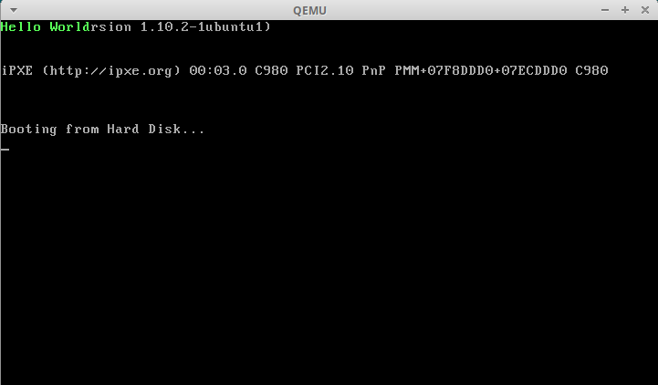

上篇文章中老李给大家教了怎么在屏幕上打印一个字符，还留了个课后作业，打印完整的`Hello World`。最简单的方法是按照打印`H`的方式依次打印其它字符就好了。当然，这种重复的工作还是交给计算机去做吧，毕竟我们的时间是很宝贵的。

这篇文章中我们用循环的方式让计算机自己把所有的字符都打印出来。并结合代码给大家讲解一下指令的寻址方式。下面给出代码：

## 代码

```asm
.code16

movw $0x07c0, %ax
movw %ax, %ds

movw $0xb800, %ax
movw %ax, %es

xorw %si, %si
movw message_length, %cx

l1:
  movb message(%si), %bl
  movb %bl, %es:(%si)
  incw %si
  loop l1

jmp .

message:
  .byte 'H', 0xa, 'e', 0xa, 'l', 0xa, 'l', 0xa, 'o', 0xa, ' ', 0xa, 'W', 0xa, 'o', 0xa, 'r', 0xa, 'l', 0xa, 'd', 0xa
message_length:
  .word . - message

.org 510
.word 0xAA55
```

## 解释

### 代码解释

第`3、4`行用于将数据段寄存器`ds`的值设置为`0x07c0`，这是为了访问数据的方便。这里的数据指的是`message`和`message_length`这两个符号所处位置的数据。为什么是`0x07c0`呢？还记得我们在[计算机是如何启动的](./00-%E8%AE%A1%E7%AE%97%E6%9C%BA%E6%98%AF%E5%A6%82%E4%BD%95%E5%90%AF%E5%8A%A8%E7%9A%84.md)这篇文章中说的吗。`BIOS`会把我们的程序，也就是磁盘`0`柱面`0`磁道的第`1`个扇区加载到内存`0x7c00`处执行。因为`ds`是段寄存器，所以在寻址的时候左移`4`位，`0x07c0`转换为`0x7c00`。具体有什么好处需要结合下面的代码，稍后说。

第`6, 7`行上一篇文章中讲过，将`es`设置为显存映射的内存段，方便操控屏幕。

第`9`行使用异或指令`xor`将源索引寄存器`si`内容清空，即设置为`0`。可以把源索引寄存器想象成数组的下标，结合`message`标号处的数据，大概就能明白我们要做什么了吧？我们要通过这个索引来访问`message`标号开始处的数据，`si`每次增加`1`，依次，我们就能通过循环的方式访问所有的数据。

第`10`行将内存地址`message_length`处的数据转移到`cx`寄存器。我们先来分析一下`message_length`，`message_length`定义在第`22`行，后面跟了一个冒号，是一个标号`(label)`。标号代表的就是所处行的位置，这个在稍后我们反编译的时候可以看到。我们在这个位置定义了一个`word`的数据，数据的内容是`message`内容的长度。计算的方式是用当前位置（用位置计数器`.`表示）减去标号`message`所表示的位置，中间的这一段数据就是我们要打印的字符及其显示属性。`cx`是一个通用寄存器，但是通用寄存器也有特殊的用途。例如`cx`，在串操作指令和`loop`指令中作计数器用；在移位、循环移位指令中作移位次数计数器用。其中`c`就是`count`的意思。下面我们要用到`loop`指令来依次打印每一个字符，所以在这里设置`cx`。

第`13`行采用了**寄存器相对寻址**的方式将`ds:(si + message)`处的一个字节的数据转移到`bx`寄存器的低字节处`bl`。寻址方式我们稍后解释，这里先说明一下`bl`。`8086`中的`4`个`16`位数据寄存器`ax、bx、cx、dx`可以用来存放数据或地址，也可以将每个数据寄存器拆成两个独立的`8`位寄存器使用。高`8`位寄存器分别是`ah、bh、ch、dh`，低`8`位寄存器分别是`al、bl、cl、dl`。因为这里我们要移动一个字节的数据，所以拆了一个`8`位寄存器使用。

第`14`行采用了**寄存器间接寻址**的方式将`bl`中的一字节数据转移到内存`es:si`处，这里我们显示的指明了要使用`es`作为段地址，因为在使用`si、di、bx`做偏移量时默认使用的是`ds`段寄存器。我们用`bl`做了一个中转，把`ds:(si + message)`处的一个字节的数据转移到了`es:si`处。为什么需要用寄存器做一次中转呢？答案是`8086`处理器不支持同时操作两个内存数。

第`15`行使用了加一指令`inc`将`si`的值加一，相当于高级语言中常用的`i++`。

第`16`行使用了`loop`指令来实现循环。`loop`指令的功能是重复执行一段相同的代码，处理器在执行它的时候会顺序做两件事：1. 将寄存器`cx`的内容减一；2. 如果`cx`的内容不为零，转移到指定的位置处执行，否则顺序执行后面的指令。

第`20`行定义了标号`message`，标号实际上表示一个位置，它的一个功能就是方便我们引用数据。例如这里，如果我们手动去数`'H'`这个字符在内存中的第几个字节处，那这代码就没法写了，太痛苦了。但是当我们使用了标号时，编译器就会帮我们计算出`'H'`所在的位置，并在我们的代码中把使用了`message`的地方替换成实际的位置。

第`21`行依次定义了每一个要显示的字符，每个数据的长度为一字节`(byte)`，每个字符由两个字节组成，`ASCII`码和显示属性`0xa`（浅绿色）。

第`22`行定义了标号`message_length`，作为我们对要打印数据长度的引用。

第`23`行定义了要打印的数据的长度，占用一个字`(word)`的存储空间，值为当前位置减去标号`message`所表示的位置，结果即`Hello World`及其显示属性所占据的内存空间的大小。

### 编译、反编译
```bash
$ as --32 boot.s -o boot.o
$ objdump -D -t -m i386 -Mi8086,suffix boot.o

boot.o：     文件格式 elf32-i386

SYMBOL TABLE:
00000000 l    d  .text  00000000 .text
00000000 l    d  .data  00000000 .data
00000000 l    d  .bss   00000000 .bss
00000032 l       .text  00000000 message_length
00000010 l       .text  00000000 l1
0000001c l       .text  00000000 message


Disassembly of section .text:

00000000 <l1-0x10>:
   0:   b8 c0 07                movw   $0x7c0,%ax
   3:   8e d8                   movw   %ax,%ds
   5:   b8 00 b8                movw   $0xb800,%ax
   8:   8e c0                   movw   %ax,%es
   a:   31 f6                   xorw   %si,%si
   c:   8b 0e 32 00             movw   0x32,%cx

00000010 <l1>:
  10:   8a 9c 1c 00             movb   0x1c(%si),%bl
  14:   26 88 1c                movb   %bl,%es:(%si)
  17:   46                      incw   %si
  18:   e2 f6                   loopw  10 <l1>
  1a:   eb fe                   jmp    1a <l1+0xa>

0000001c <message>:
  1c:   48                      decw   %ax
  1d:   0a 65 0a                orb    0xa(%di),%ah
  20:   6c                      insb   (%dx),%es:(%di)
  21:   0a 6c 0a                orb    0xa(%si),%ch
  24:   6f                      outsw  %ds:(%si),(%dx)
  25:   0a 20                   orb    (%bx,%si),%ah
  27:   0a 57 0a                orb    0xa(%bx),%dl
  2a:   6f                      outsw  %ds:(%si),(%dx)
  2b:   0a 72 0a                orb    0xa(%bp,%si),%dh
  2e:   6c                      insb   (%dx),%es:(%di)
  2f:   0a 64 0a                orb    0xa(%si),%ah

00000032 <message_length>:
  32:   16                      pushw  %ss
        ...
 1fb:   00 00                   addb   %al,(%bx,%si)
 1fd:   00 55 aa                addb   %dl,-0x56(%di)
```

第`2`行，这次我们在反编译的时候加上了`-t`参数，表示要打印`符号表`。就是第`6`行到第`12`行的内容。

第`10、11、12`行分别是我们在代码中定义的三个符号及其代表的值。`l1 -> 10、message -> 1c、message_length -> 32`。

第`24`行，`message_length`已经被替换成了`0x32`。

第`27`行，`message`替换成了`0x1c`。

第`30`行，`l1`替换成了`0x10`。

第`34 - 44`行是我们定义的数据，即`Hello World`及其显示属性，但是被`objdump`无情的当成了代码，不用在意了。

第`47`行是我们定义的数据的长度，是`. - message`计算的结果`0x16`，即十进制的`22`。我们可以数一数，或者计算一下，`Hello World`一共是`11`个字符（含空格），每一个字符包含显示属性的话占用两个字节，所以一共占用`22`个字节。

## 运行

```bash
$ qemu-system-i386 boot.bin
```

运行结果如下：



## 总结

### 代码总结

1. `xor`，异或指令，对源操作数和目的操作数做按位异或操作，结果保存在目的操作数中。
2. `inc`，加一指令，对操作数加一。
3. `loop`，循环指令，其功能是重复执行一段相同的代码，处理器在执行它的时候会顺序做两件事：
    * 将寄存器`cx`的内容减一。
    * 如果`cx`的内容不为零，转移到指定的位置处执行，否则顺序执行后面的指令。
4. `label`，即**标号**，如`l1、message、message_length`。它们表示当前所处行的位置，当编译完成之后，会被替换成实际的位置。
5. `.byte`，伪指令，用于定义一字节大小的数据，也可以同时指定一组一字节大小的数据，使用逗号分隔。

### 寻址方式总结

指令的寻址方式很重要，也很简单。下面解释一下寻址的含义。

汇编语言指令是由操作码和操作数两部分组成的。操作码是一组约定的二进制代码，用来指明所要执行的操作性质和方式，操作数字段除了可以是操作数本身外，还可以是操作数的地址或者地址的一部分。具体而言，可以是指向操作数地址的指针或其他有关操作数的信息。***操作数存放的位置不同，寻找的方法也不同，寻找操作数的过程称为寻址。***

在`8086`指令系统中，根据操作数的来源可将其分为`立即数操作数`、`寄存器操作数`和`存储器操作数`，相应的寻址方式分为`立即数寻址`、`寄存器寻址`和`存储器寻址`；此外，还有一种`端口寻址`。

#### 立即数寻址

立即就是立刻、马上的意思。立即数寻址就是说操作数就在指令后面，不需要再去寄存器或者内存中寻找。立即数是作为指令的一个部分置于指令代码的后部。

观察反编译结果的第`19、21`行，`movw $0x7c0,%ax`、`movw $0xb800,%ax`对应的二进制代码`b8 c0 07`、`b8 00 b8`，可以发现其中的立即数`$0x7c0`、`$0xb800`是直接跟在指令后面的。

#### 寄存器寻址
在寄存器寻址中，操作数是预先存放在`CPU`的内部寄存器中的，指令中的操作数部分只需给出寄存器的名称。

如代码中的第`4`行，`movw %ax, %ds`，在上一步中我们已经把`ax`寄存器的值设置成了`0x07c0`，这里我们直接从寄存器中取值。

#### 存储器寻址

存储器寻址方式中，寻找的操作数是放在存储器中的，可以在存储器的数据段、代码段或堆栈段等存储区；指令中的操作数代码主要是存储单元的地址或生成地址的相关信息。由于`8086 CPU`的内存采用分段管理方式，段基址由段寄存器提供，存储器操作数寻址还应提供段内偏移量。段内偏移量通常也称为有效地址`(EA)`，这是一个`16`位的无符号数，代表距离段基址的字节数。`16`位有效地址`EA`可以由以下`3`部分算的：

$$EA = \text{基址} + \text{变址} + \text{偏移量}$$

其中，基址由基址寄存器`bx`和基址指针`bp`提供，变址由变址寄存器`si、di`提供，偏移量是一个`8`位或`16`位二进制常数，即

$$
ea = 
\begin{Bmatrix}
bx\\\\
bp\\\\
\end{Bmatrix}
+
\begin{Bmatrix}
si\\\\
di\\\\
\end{Bmatrix}
+
\text{偏移量}
$$

以上`3`个分量的不同组合可以构成`5`种不同的有效地址形成方式，即存储器操作数有`5`种寻址方式。

有了有效地址`EA`和段寄存器提供的段基址，就可以计算出存储器单元的物理地址了，即 `物理地址（PA） = 段寄存器（左移4位） + 有效地址（EA）`

1. 直接寻址
  即操作数地址的`16`位偏移量直接包含在指令代码中。例如上一篇文章中的`movb $0xa, %es:1`指令，其编译后的结果是`26 c6 06 01 00 0a`。其中的`01 00`（小端序，转换成常规顺序后就是`00 01`）即偏移量`1`。因为使用了**段前缀**显示的指明了使用`es`段寄存器，所以最终的内存单元就是`es`左移`4`位加`1`。因为此时`es`内容为`0xb800`，所以物理地址为`0xb8001`。

2. 寄存器间接寻址
  即操作数地址的`16`位偏移量包含在寄存器`bx、bp、si或di`中，因为要通过寄存器`间接`获取到这个偏移量，所以叫寄存器间接寻址。因为每个寄存器除了通用功能外还有其特殊的用途，所以寄存器间接寻址还可以分为两种不同的类型。

    * 当使用`bx、si、di`做间接寻址时，段寄存器默认为`ds（数据段寄存器）`。例如`movb %bl, %es:(%si)`，因为我们加了段前缀`es`，所以目的操作数的物理地址为`es << 4 + si`。如果不加段前缀的话则为`ds << 4 + si`。
    * 当使用`bp`做间接寻址时，段寄存器默认为`ss（堆栈段寄存器）`。暂时没有涉及。

3. 寄存器相对寻址
  寄存器相对寻址是由**指定的寄存器内容**加上**指令中给出的偏移量**作为存储器中操作数的偏移地址的寻址方式。**用于相对寻址的寄存器必须是专用间接寻址寄存器`bx、bp、si或di`**。与寄存器间接寻址类似，寄存器相对寻址也可分两种类型。

    * 当使用`bx、si、di`作为变址寄存器时，段寄存器默认为`ds（数据段寄存器）`。例如`movb message(%si), %bl`中的源操作数`message(%si)`，标号`message`在编译后被替换成为`0x1c`，即源操作数为`0x1c(%si)`。因为默认使用`ds`寄存器，且此时`ds`寄存器的值为`0x07c0`，所以物理地址为`0x07c0 << 4 + si + 0x1c`。结合`loop`和`inc`指令，我们可以控制`si`每次加一，循环`cx`次，达到访问所有数据的目的。
    * 当使用`bp`作为变址寄存器时，段寄存器默认为`ss（堆栈段寄存器）`。暂时没有涉及。

4. 基址加变址寻址
  基址加变址的寻址方式是，操作数在存储器中，其偏移地址由**基址寄存器`（bx或bp）` + 变址寄存器`（si或di）`**形成。基址寄存器若为`bx`，则默认在段寄存器`ds`指定的数据段中寻址；若用`bp`为基地址，则默认在段寄存器`ss`指定的堆栈段中寻址。两种情况的变址寄存器都用`si`或`di`。即`ea = bx/bp + si/di`。暂时没有涉及。

5. 相对基址加变址寻址
  与基址加变址寻址类似，只是多加了偏移量。即`ea = bx/bp + si/di + 偏移量`。暂时没有涉及。

#### 端口寻址

在`8086`系统结构中，`I/O`端口的地址采用独立编址方法，即采用专门的输入/输出指令（`in`和`out`）对系统外围的`I/O`端口进行操作。指令系统中的输入/输出指令对`I/O`端口的寻址可采用直接寻址或间接寻址两种方式。

1. 直接寻址
  `I/O`端口地址以`8`位立即数方式在指令中直接给出，例如，输入指令：`in N, al`。由于只能使用`8`位立即数，所以该指令只能访问`（0~255）`范围内的端口。该指令的含义是从地址为`N`的端口读入一个`8`位的数据到`ax`寄存器的低`8`位`al`中。

2. 间接寻址
  `I/O`端口的间接寻址类似于寄存器间接寻址，`16`位的`I/O`端口地址放在`dx`寄存器中，即通过`dx`间接寻址，可寻址的端口范围为`（0x0000~0xffff）`。例如，输出指令：`out al, dx`。该指令的功能是将`al`的内容输出到由`dx`指定的端口中去。**注意，这里用`dx`作为间接寻址寄存器，在端口的间接寻址指令中是固定的。**

我们暂时还没有接触到端口寻址的例子，当以后需要控制光标，访问硬盘的时候就会碰到了，到时在结合代码具体说。
