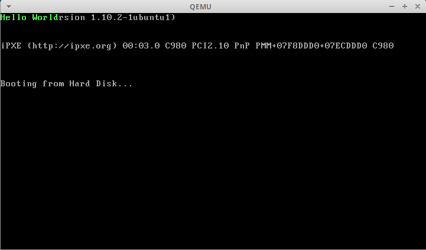

上一篇文章中我们学习了[指令的寻址方式](./02-%E6%8C%87%E4%BB%A4%E7%9A%84%E5%AF%BB%E5%9D%80%E6%96%B9%E5%BC%8F.md)，实际上是借具体的代码总结了一下寻址方式。这篇文章我们将学习更多的指令，通过实际代码的讲解，找到写汇编语言代码的感觉。下面先来讲一下串操作指令。

## 串操作指令

含义：通过执行一条字符串操作指令，对存储器中某一个连续的内存中存放的一串字或字节均进行同样的操作，称为串操作。字符串操作指令简称为串操作指令。

所有的基本串操作指令都用寄存器`si`间接寻址源操作数，且假定源操作数在当前的数据段中，即源操作数首地址的物理地址由`ds:si`提供；而用寄存器`di`间接寻址目的操作数，且假定目的操作数在当前的附加段中，即目的操作数首地址的物理地址由`es:di`提供。显然，串操作指令的源操作数和目的操作数都在存储器中。

这两个地址的指针在每一个操作以后要自动修改，但按增量还是减量修改，取决于方向标志`DF`（位于标志寄存器内）：若`DF=0`，则在每次操作后`si`和`di`作增量操作：字节操作加`1`，字符操作加`2`；若`DF=1`，则在每次操作后`si`和`di`作减量操作：字节操作减`1`，字符操作减`2`。因此对于串操作，需要预先设置`DF`的值。可以用`std`或`cld`指令分别置`DF`为`1`或`0`。

若源串和目的串在同一段中，可使`ds`和`es`指向相同数据段，即`ds=es`。

还可以在任一串操作指令前加一个指令前缀，构成重复前级指令，通过此指令来控制串操作指令的重复执行操作。下面结合代码来讲解一下。

### 代码

```asm
.code16

movw $0x07c0, %ax
movw %ax, %ds

movw $0xb800, %ax
movw %ax, %es

cld
movw $message, %si
xorw %di, %di
movw message_length, %cx
rep movsb

jmp .

message:
  .byte 'H', 0xa, 'e', 0xa, 'l', 0xa, 'l', 0xa, 'o', 0xa, ' ', 0xa, 'W', 0xa, 'o', 0xa, 'r', 0xa, 'l', 0xa, 'd', 0xa
message_length:
  .word . - message

.org 510
.word 0xAA55
```

### 解释

与上一篇给出的[代码](https://github.com/kviccn/asm-boooom/blob/master/0x02/boot.s)的主要区别在第`9~13`行。

第`9`行，使用`cld`指令将`DF`标志位置为`0`，表示每次操作后对`si`和`di`做增量操作。

第`10`行，将`message`的地址赋值给`si`。此时引导扇区整体被`BIOS`加载到`0x7c00`处，并且我们已经将数据段设置成了`0x07c0`。`message`代表数据的偏移量，该指令执行后`ds:si`就指向了我们的数据首地址。

第`11`行，将`di`置`0`。此时`es`内容为`0xb800`，`es:di`表示的物理地址为`0xb8000`，即显存映射在内存中的首地址。

第`12`行，设置循环次数，循环的次数为数据串的长度。

第`13`行使用串传送指令`movs`来完成数据传送的工作。该指令具体分为两条`movsb`和`movsw`，分别为把由`si`作为指针的源操作数串中的一个字节或字，传送至由`di`作为指针的目的操作数串中，且根据`DF`修改各自的指针，使其指向各串中的下一单元。这里是把`ds:si`处的一个字节传送到`es:di`，并且把`si`和`di`分别加一。指令前缀`rep`是重复前缀，其功能是重复执行`rep`后紧跟着的一个串操作指令，直到`cx`寄存器中的值为`0`。执行时先检查`cx`的值，若为`0`则退出重复操作，执行以下其他指令；若不为`0`，则将`cx`的值减一；然后执行`rep`右侧的串指令；重复上述操作。

通过组合`rep`和`movs`我们就可以批量的把数据从内存的一个区域转移到另一个区域。

### 运行

```bash
$ as --32 boot.s -o boot.o
$ objcopy -O binary -j .text boot.o boot.bin
$ qemu-system-i386 boot.bin
```



下面继续学习算术运算指令。

## 算数运算指令

之前我们学习过`inc`指令，该指令用于对操作数加一，并把结果放回到目的操作数中。此指令可以进行字节操作或字操作，其操作数可以是寄存器操作数或内存操作数。下面我们结合一个在屏幕上打印数字的程序来学习一下其他的算术运算指令。在该示例中，我们会将数字`9527`的每一位分解出来，并打印在屏幕上。

### 代码

```asm
.code16

.set DIVIDEND, 9527         # 被除数
.set DIVISOR, 10            # 除数
.set COUNT_OF_DIGITS, 4     # 位数 -- 分解需要的循环次数

movw $0x07c0, %ax
movw %ax, %ds

movw $0xb800, %ax
movw %ax, %es

# 设置 32位 被除数
# 高 16位 在 %dx 中, 低 16位 在 %ax 中
# 因为 %ax 足够保存 9527, 所以将高 16位(%dx) 清空
xorw %dx, %dx
movw $DIVIDEND, %ax
movw $DIVISOR, %cx
movw $store, %bx

# 初始化索引寄存器 (倒序保存各个数位)
movw $COUNT_OF_DIGITS - 1, %si
split:
  divw %cx
  # 除法指令执行后 商保存在 %ax 中, 余数保存在 %dx 中
  # 因为除数是 10, 所以余数小于 10, 即 %dl 中就是余数
  movb %dl, (%bx, %si)
  xorw %dx, %dx
  decw %si
  jns split

movw $COUNT_OF_DIGITS, %cx
xorw %si, %si
xorw %di, %di
putc:
  movb store(%si), %al
  orw $0x0a30, %ax
  movw %ax, %es:(%di)
  incw %si
  addw $2, %di
  loop putc

jmp .

store:
  .byte 0, 0, 0, 0

.org 510
.word 0xAA55
```

### 解释

第`3、4、5`行使用`.set`伪指令定义了三个符号。符号在编译时会被编译器替换成实际的值，类似于`c`语言中的`#define`指令。

第`16、17、18`行初始化被除数和除数。当对字执行`div`操作时，需要将被除数放在`dx:ax`中，高字节在`dx`中，低字节在`ax`中。我们的被除数是`9527`，`ax`能够容纳，所以直接将`dx`置`0`，并将`9527`移动到`ax`中就完成了对被除数的准备工作。`div`指令的源操作数，即除数，可以是除立即数之外的任何类型的操作数。这里我们使用寄存器`cx`存储`div`指令的源操作数。

第`19`行将`store`的地址移动到`bx`基址寄存器中，因为我们打算展示一下`基址加变址寻址`的应用。`store`开始的`4`个字节空间是为分解`9524`的四个位而保留的。

第`22`行我们将索引寄存器`si`的值设置为`COUNT_OF_DIGITS - 1`，即`3`。此时`bx + si`的值为`store + 3`，即相对于`store`处`3`个字节。因为依次分解出来的是个、十、百、千位，如果顺序保存在`store`处的话稍后打印就需要倒序打印，所以我们在保存的时候就倒序保存在内存中，方便稍后打印。

第`24`行执行`divw`除法指令，除法指令完成后会将商保存在`ax`中，余数保存在`dx`中。

第`27`行将`dl`中的数据保存到内存数据段`bx + si`处。因为除数是`10`，所以余数是小于`10`的，`dl`就足够保存我们需要的数据。根据上面的分析，此时`bx + si`等于`store + 3`，即我们会将分解出来的数据保存在`store`开始的第`3`个字节处（从`0`开始计数）。

第`28`行将`dx`置`0`，为下一次分解做准备。

第`29`行使用`dec`指令将索引寄存器`si`减一，此时`bx + si`等于`store + 2`，即表示从`store`开始的第`2`个字节处。下一个数位保存在这里。

第`30`行使用条件转移指令`jns`来实现循环分解各位。`jns`是一个条件转移指令，当结果为正时`(SF=0)`转移。`SF`是状态标志寄存器`FLAGS`中的符号标志位`(Sign Flag)`。用于表示符号数的正负。如果运算结果的最高位为`1`，则`SF=1`，否则为`0`。因为上一条指令`dec`可以影响到符号标志位，当`si`为负数的时候我们就可以知道分解已经完成，从而跳出分解数位的过程，执行后续指令。

第`32`行设置循环次数，我们将通过循环将分解好的每一位打印在屏幕上。

第`33、34`行将索引寄存器`si`和`di`置`0`，我们将使用这两个寄存器分别访问分解好的位和显存对应的内存地址。

第`36`行将分解好的位移动到`al`中。这里有一个隐含的条件，当被除数被分解完的时候，`ax`寄存器保存的是除法操作的商，此时商为`0`，即`ax`寄存器的值为`0`。

第`37`行`or`按位逻辑或指令的功能有两个，一是将`ax`寄存器的高字节设置为`0x0a`，表示打印的字符的显示属性，浅绿色；二是将`ax`寄存器的低字节加上`0x30`，因为分解好的数字并不能直接打印在屏幕上，屏幕上打印的数字实则是数字对应的`ASCII`码。观察[这里](/posts/2020/03/汇编语言一发入魂-0x01-hello-world/)给出的`ASCII`码表，我们可以发现，数字对应的`ASCII`码为数字本身加上十六进制的`0x30`。

第`38`行将要打印的字符连同显示属性一起转移到显存对应的内存处。

第`39`行将`si`加`1`，指向下一个位数。

第`40`行将`di`加`2`，因为我们在第`38`行中一次操作了两个字节的数据。

第`46`行为分解的结果保留了`4`个字节的空间，每个字节用于保存一个位。

### 运行

```bash
$ as --32 boot1.s -o boot1.o
$ objcopy -O binary -j .text boot1.o boot1.bin
$ qemu-system-i386 boot1.bin
```


## 总结

### 伪指令

- `.set` 用于定义一个符号，类似于`c`语言中的`#define`指令。

### 指令

- `cld` 用于将标志寄存器`FLAGS`的`DF`标志位置为`0`。
- `movs` 串传送指令，用于将数据从`ds:si`处移动到`es:di`处，一次可移动一个字节或一个字；根据`DF`决定移动完成之后`si`和`di`加/减`1`或`2`。配合`rep`重复前缀和`cx`完成批量传送。
- `div` 无符号除法指令。当源操作数（除数）为字节时，除法指令的功能是`ax 除以 源操作数`，商存入`al`，余数存入`ah`；当源操作数为字时，除法指令的功能是`dx:ax 除以 源操作数`，商存入`ax`，余数存入`dx`。`dx:ax`表示由这两个寄存器共同组成的数据，`dx`保存其高位，`ax`保存低位。
- `or` 按位逻辑或指令。
- `add` 普通加法指令，无进位。
- `dec` 减一指令。
- `jns` 条件转移指令。当标志寄存器符号标志位`SF`为`0`时转移。
