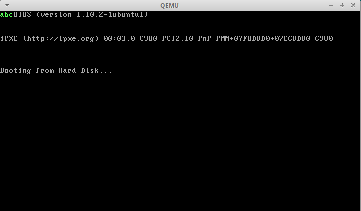

上一篇文章中我们实现了数字各个位的分解并打印在屏幕上。他需要我们知道数字有多少个位，并且提前预留出内存空间保存每个位，这显然不是一个完美的解决方案。现在我们来学习一下堆栈，并使用堆栈来保存分解出的每个位，实现可以分解任意位的数字。

先解释一下`堆栈`。实际上这个`堆栈`和`堆(heap)`并没有关系，只是一个纯粹的`栈(stack)`，可能是`堆栈`这样叫起来更上口一点吧。

`堆栈段`和其他段一样，只是一段普通的内存空间，只是我们限制了对这部分内存空间操作的行为。我们只允许通过`push（压栈）`和`pop（出栈）`这两个指令来操作堆栈段的内存空间，以此来实现一些算法。使用`堆栈段`之前需要先初始化`段基址(ss)`和`栈顶指针(sp)`，例如将`ss`初始化为`0x0000`，`sp`初始化为`0x7c00`。此时堆栈段的逻辑地址为`0x0000:0x0000`到`0x0000:0x7c00`，对应的物理地址为`0x00000`到`0x07c00`。

`push`指令用于将操作数压入栈中。在`16`位的处理器上，`push`指令的操作数可以是`16`位的寄存器或者内存单元。对于`8086`处理器来说，压栈的数据长度必须是一个字。处理器在执行`push`指令时，首先将堆栈指针寄存器`sp`的内容减去操作数的字长（以字节为单位的长度，在`16`位处理器上是`2`），然后，把要压入堆栈的数据存放到逻辑地址`ss:sp`所指向的内存位置。当`ss`和`sp`初始化为上述状态时，第一次执行`push`指令，`sp`先减去`2`，得到`0x7bfe`，然后将数据压入`0x0000:0x7bfe`对应的物理地址处。

`pop`指令用于将操作数从栈中弹出。在`16`位的处理器上，`pop`指令的操作数可以是`16`位的寄存器或者内存单元。`pop`指令执行时，处理器先取得`ss:sp`对应的物理地址处的数据。然后，将`sp`的内容加上操作数的字长，以指向下一个堆栈位置。

下面我们通过一小段代码来熟悉一下`堆栈段`的操作。

## 代码

```asm
.code16

movw $0xb800, %ax
movw %ax, %ds

xorw %ax, %ax
movw %ax, %ss

movw $0x7c00, %sp

pushw $'c' | 0x0a00
pushw $'b' | 0x0a00
pushw $'a' | 0x0a00

popw 0
popw 2
popw 4

jmp .

.org 510
.word 0xAA55
```

## 解释

第`3、4`行我们让`ds`指向显存缓冲区，这样我们在后续将数据弹出到显存缓冲区时就不需要加段前缀了。

第`6、7`行将`ss`设置为`0x0000`，实际上这不是必须的，因为`ss`在启动时就会被初始化为`0x0000`。

第`9`行将堆栈指针寄存器`sp`设置为`0x7c00`。

第`11~13`行将字符`c、b、a`及其显示属性`0x0a`一起压入栈中。因为`栈`是`后进先出`的，所以出栈的顺序是`a、b、c`。

第`15~17`行将`a、b、c`依次出栈。因为我们直接指定了偏移地址`0、2、4`，这默认会使用数据段寄存器`ds`作为基地址，所以实际上表示将三个字符及其显示属性依次弹出到内存`0xb800:0x0000`、`0xb800:0x0002`、`0xb800:0x0004`处，实现字符的打印。

## 运行

```bash
$ as --32 stack_op.s -o stack_op.o
$ objcopy -O binary -j .text stack_op.o stack_op.bin
$ qemu-system-i386 stack_op.bin
```


## 调试

启动虚拟机：

```bash
$ qemu-system-i386 stack_op.bin -S -s
```

调试过程中有一些经常需要输入的指令，为了避免每次调试都要重复输入这些指令，老李已经将他们写到了[.gdbinit](https://github.com/kviccn/asm-boooom/blob/master/gdb/.gdbinit)中了，大家直接使用就可以了。

```bash
$ gdb -q
warning: No executable has been specified and target does not support
determining executable automatically.  Try using the "file" command.
0x0000fff0 in ?? ()
The target architecture is assumed to be i8086
warning: A handler for the OS ABI "GNU/Linux" is not built into this configuration
of GDB.  Attempting to continue with the default i8086 settings.

warning: A handler for the OS ABI "GNU/Linux" is not built into this configuration
of GDB.  Attempting to continue with the default i8086 settings.

Breakpoint 1 at 0x7c00

Breakpoint 1, 0x00007c00 in ?? ()
1: x/i $cs*16+$pc
=> 0x7c00:      mov    $0xb800,%ax
(gdb)
```

第`12`行提示我们已经在`0x7c00`处打好了断点，让我们看一下此时寄存器的状态。

```bash
(gdb) info registers
eax            0xaa55   43605
ecx            0x0      0
edx            0x80     128
ebx            0x0      0
esp            0x6f04   0x6f04
ebp            0x0      0x0
esi            0x0      0
edi            0x0      0
eip            0x7c00   0x7c00
eflags         0x202    [ IF ]
cs             0x0      0
ss             0x0      0
ds             0x0      0
es             0x0      0
fs             0x0      0
gs             0x0      0
```

`ds`是`0`，`ss`是`0`，`sp`是`0x6f04`。向后执行`5`条指令再次查看寄存器内容。

```bash
(gdb) si 5
0x00007c0c in ?? ()
1: x/i $cs*16+$pc
=> 0x7c0c:      push   $0xa63
(gdb) info registers
eax            0x0      0
ecx            0x0      0
edx            0x80     128
ebx            0x0      0
esp            0x7c00   0x7c00
ebp            0x0      0x0
esi            0x0      0
edi            0x0      0
eip            0x7c0c   0x7c0c
eflags         0x246    [ PF ZF IF ]
cs             0x0      0
ss             0x0      0
ds             0xb800   47104
es             0x0      0
fs             0x0      0
gs             0x0      0
```

此时`ds`是`0xb800`，`ss`是`0`，`sp`是`0x7c00`。再向后执行`3`条指令并查看寄存器内容。

```bash
(gdb) si 3
0x00007c15 in ?? ()
1: x/i $cs*16+$pc
=> 0x7c15:      popw   0x0
(gdb) info registers
eax            0x0      0
ecx            0x0      0
edx            0x80     128
ebx            0x0      0
esp            0x7bfa   0x7bfa
ebp            0x0      0x0
esi            0x0      0
edi            0x0      0
eip            0x7c15   0x7c15
eflags         0x246    [ PF ZF IF ]
cs             0x0      0
ss             0x0      0
ds             0xb800   47104
es             0x0      0
fs             0x0      0
gs             0x0      0
```

此时因为执行了`3`次`push`指令，所以`sp`的值已经从`0x7c00`减到了`0x7bfa`，正好`3`个字，`6`个字节。我们来查看一下从`0x7bfa`开始的三个字的内容。

```bash
(gdb) x/3xh 0x7bfa
0x7bfa: 0x0a61  0x0a62  0x0a63
```

其中高字节是显示属性`0x0a`，低字节依次是`0x61、0x62、0x63`，对应字符`a、b、c`。

下面给出分解并打印数字各位程序基于栈的实现。

```asm
.code16

.set DIVIDEND, 9527         # 被除数
.set DIVISOR, 10            # 除数

movw $0x07c0, %ax
movw %ax, %ds

movw $0xb800, %ax
movw %ax, %es

xorw %ax, %ax
movw %ax, %ss

movw $0x7c00, %sp

# 设置 32位 被除数
# 高 16位 在 %dx 中, 低 16位 在 %ax 中
# 因为 %ax 足够保存 9527, 所以将高 16位(%dx) 清空
xorw %dx, %dx
movw $DIVIDEND, %ax
movw $DIVISOR, %bx

# 分解位数的同时统计一共有多少位
# 显示的时候需要用位数控制循环次数
xorw %cx, %cx
split:
  incw %cx
  divw %bx
  orw $0xa30, %dx
  pushw %dx
  xorw %dx, %dx
  cmpw $0, %ax      # 商为零则分解完毕, 不为零则继续分解
  jne split

xorw %si, %si
putc:
  popw %es:(%si)
  addw $2, %si
  loop putc

jmp .

.org 510
.word 0xAA55
```

与上一篇中的方法不同的是，我们现在不需要预先知道数字有多少位并为每一位预留存储空间。取而代之，我们使用了`栈`，每计算出一位便将其与显示属性一同压入栈中，当计算完毕时，依次出栈即可。

第`26`行，因为我们不知道数字的位数，所以需要在分解数字的时候做一下统计，每分解一位便将`cx`加一。使用`cx`保存统计数字的原因是稍后显示的时候需要用到循环，此时就将统计数字放在`cx`中的话到时就不需要再做一次数据转移操作。

另一个不同之处是这次我们判断分解结束的依据为`ax`等于`0`，即商为`0`时分解完成。使用`jne`条件转移指令配合比较指令`cmp`实现对程序的控制。`cmp`指令的功能类似减法指令，但不会将计算结果写入目的操作数，只是将比较结果反应在标志寄存器的标志位上。条件转移指令`jne`当结果不为`0`时转移。
