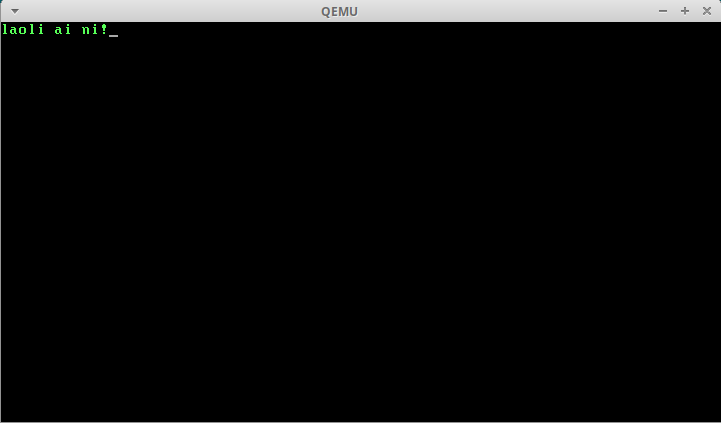

通常我们封装过程是为了方便调用，避免写重复的代码。过程调用时通常需要通过传递参数来控制过程的执行，今天我们来讲一讲参数传递时的一些规范和需要注意的地方。

先来看一个例子：

## 示例一

```asm
.code16

movw $0x7c00, %sp

callw set_cursor

jmp .

# 目的: 设置光标位置为 0
#
# 输入: 无
#
# 输出: 无
set_cursor:
  movw $0x3d4, %dx
  movb $0xe, %al
  outb %al, %dx

  movw $0x3d5, %dx
  movb $0, %al
  outb %al, %dx

  movw $0x3d4, %dx
  movb $0xf, %al
  outb %al, %dx

  movw $0x3d5, %dx
  movb $0, %al
  outb %al, %dx

  retw

.org 510
.word 0xAA55
```

这个例子中的过程`set_cursor`，或者称为函数，没有输入，也没有输出。这个函数实际上是没有什么实际用处的，因为它只能将光标位置设置为`0`，即屏幕左上角。想要这个函数有实际的用处的话就需要给它传递参数，将想要设置的位置作为参数传递给它。传递参数的方式大体上来说有三种：

1. 通过寄存器传递。即将参数预先放入寄存器中，被调用的函数执行时去这个寄存器中获取参数。
2. 通过堆栈传递。即调用函数前，先将参数压入栈中，被调函数通过`bp`寄存器间接寻址，获取堆栈上放置的参数。
3. 通过寄存器和堆栈传递。即一部分参数放在寄存器中，一部分放在堆栈上。

通过寄存器传递参数很简单，所以我们主要讲解一下通过堆栈传递参数时需要注意的地方。下面看一下改造后的可以接收参数的`set_cursor`：

## 示例二

### 代码

```asm
.code16

movw $0x7c00, %sp

pushw $79
callw set_cursor
addw $2, %sp

jmp .

# 目的: 设置光标位置
#
# 输入:
#   参数1 光标所在位置
#
# 输出: 无
set_cursor:
  movw %sp, %bp

  movw $0x3d4, %dx
  movb $0xe, %al
  outb %al, %dx

  movw $0x3d5, %dx
  movb 3(%bp), %al
  outb %al, %dx

  movw $0x3d4, %dx
  movb $0xf, %al
  outb %al, %dx

  movw $0x3d5, %dx
  movb 2(%bp), %al
  outb %al, %dx

  retw

.org 510
.word 0xAA55
```

### 解释

第`5`行将参数`79`压入栈中，因为一行是`80`列，从`0`开始计数，`79`是第一行的最后一列。

第`6`行调用`set_cursor`，注意这里有一个隐含的将`ip`压栈的操作。

第`7`行用于恢复栈顶指针。

第`18`行将当前栈顶指针复制给`bp`，因为要通过`bp`间接访问堆栈中的参数。

第`25、33`行分别通过`3(%bp)、2(%bp)`访问参数的高`8`位和低`8`位。此时`bp`指向栈顶，从栈顶向上的两个字节保存的是`ip`，即偏移量为`0, 1`的两个内存单元，`2, 3`这两个单元保存的是我们压入栈中的参数。

第`36`行通过`ret`从函数返回，同时将`ip`出栈，此时堆栈中只剩调用函数之前压入的参数了。

### 调试

```bash
$ as --32 bootb.s -o bootb.o
$ objcopy -O binary -j .text bootb.o bootb.bin
$ qemu-system-i386 bootb.bin -S -s
```

```bash
$ gdb -q
Breakpoint 1, 0x00007c00 in ?? ()
1: x/i $cs*16+$pc
=> 0x7c00:      mov    $0x7c00,%sp
(gdb)
```

设置`sp`并查看寄存器内容：

```bash
(gdb) si
0x00007c03 in ?? ()
1: x/i $cs*16+$pc
=> 0x7c03:      push   $0x4f
(gdb) info registers
eax            0xaa55   43605
ecx            0x0      0
edx            0x80     128
ebx            0x0      0
esp            0x7c00   0x7c00
ebp            0x0      0x0
esi            0x0      0
edi            0x0      0
eip            0x7c03   0x7c03
eflags         0x202    [ IF ]
cs             0x0      0
ss             0x0      0
ds             0x0      0
es             0x0      0
fs             0x0      0
gs             0x0      0
```

此时`sp`指向`0x7c00`，将参数压栈并查看寄存器和堆栈内容：

```bash
(gdb) si
0x00007c05 in ?? ()
1: x/i $cs*16+$pc
=> 0x7c05:      call   0x7c0d
(gdb) info registers
eax            0xaa55   43605
ecx            0x0      0
edx            0x80     128
ebx            0x0      0
esp            0x7bfe   0x7bfe
ebp            0x0      0x0
esi            0x0      0
edi            0x0      0
eip            0x7c05   0x7c05
eflags         0x202    [ IF ]
cs             0x0      0
ss             0x0      0
ds             0x0      0
es             0x0      0
fs             0x0      0
gs             0x0      0
(gdb) x/1dh 0x7bfe
0x7bfe: 79
(gdb)
```

此时栈中压入一个参数，`sp`减`2`，指向`0x7bfe`。调用函数并查看寄存器中的值：

```bash
(gdb) si
0x00007c0d in ?? ()
1: x/i $cs*16+$pc
=> 0x7c0d:      mov    %sp,%bp
(gdb) info registers
eax            0xaa55   43605
ecx            0x0      0
edx            0x80     128
ebx            0x0      0
esp            0x7bfc   0x7bfc
ebp            0x0      0x0
esi            0x0      0
edi            0x0      0
eip            0x7c0d   0x7c0d
eflags         0x202    [ IF ]
cs             0x0      0
ss             0x0      0
ds             0x0      0
es             0x0      0
fs             0x0      0
gs             0x0      0
(gdb) x/2xh 0x7bfc
0x7bfc: 0x7c08  0x004f
(gdb)
```

`call`指令隐式的将`ip`压栈，`sp`减`2`，指向`0x7bfc`。执行到函数返回，查看寄存器内容：

```bash
(gdb) si 14
0x00007c08 in ?? ()
1: x/i $cs*16+$pc
=> 0x7c08:      add    $0x2,%sp
(gdb) info registers
eax            0xaa4f   43599
ecx            0x0      0
edx            0x3d5    981
ebx            0x0      0
esp            0x7bfe   0x7bfe
ebp            0x7bfc   0x7bfc
esi            0x0      0
edi            0x0      0
eip            0x7c08   0x7c08
eflags         0x202    [ IF ]
cs             0x0      0
ss             0x0      0
ds             0x0      0
es             0x0      0
fs             0x0      0
gs             0x0      0
```

此时函数已通过`ret`指令返回，`ip`被弹出，`sp`加`2`，恢复到压入参数后的状态。继续执行，将`sp`恢复到参数压栈前：

```bash
(gdb) si
0x00007c0b in ?? ()
1: x/i $cs*16+$pc
=> 0x7c0b:      jmp    0x7c0b
(gdb) info registers
eax            0xaa4f   43599
ecx            0x0      0
edx            0x3d5    981
ebx            0x0      0
esp            0x7c00   0x7c00
ebp            0x7bfc   0x7bfc
esi            0x0      0
edi            0x0      0
eip            0x7c0b   0x7c0b
eflags         0x216    [ PF AF IF ]
cs             0x0      0
ss             0x0      0
ds             0x0      0
es             0x0      0
fs             0x0      0
gs             0x0      0
```

虽然我们初步实现了功能，但是可以看到有些寄存器的内容也被我们的函数更改了，例如`bp`。想想一下，如果我们有多个函数需要嵌套调用，每一个函数都需要通过`bp`访问堆栈中的参数，每一个函数执行完成之后都会修改`bp`，那么调用函数的过程就无法再使用`bp`访问自己的参数了。为了解决这个问题，我们需要将函数中被修改的寄存器先保存在堆栈中，函数返回时再恢复被修改过的寄存器。

来看看完整的示例：

## 示例三

### 代码

```asm
.code16

movw $0x7c00, %sp

pushw $79
callw set_cursor
addw $2, %sp

jmp .

# 目的: 设置光标位置
#
# 输入:
#   参数1 光标所在位置
#
# 输出: 无
set_cursor:
  pushw %bp
  movw %sp, %bp

  movw $0x3d4, %dx
  movb $0xe, %al
  outb %al, %dx

  movw $0x3d5, %dx
  movb 5(%bp), %al
  outb %al, %dx

  movw $0x3d4, %dx
  movb $0xf, %al
  outb %al, %dx

  movw $0x3d5, %dx
  movb 4(%bp), %al
  outb %al, %dx

  movw %bp, %sp
  popw %bp

  retw

.org 510
.word 0xAA55
```

### 解释

第`18、19`行先将`bp`保存在栈中，然后将当前栈顶指针复制到`bp`。

第`26、34`行的偏移量分别比上一个示例中增加了`2`，因为多压了`bp`在栈中。

第`37、38`行恢复`bp`。

通常在进入函数和离开函数时都需要保存和恢复`bp`，即执行下面的指令：

```asm
pushw %bp
movw %sp, %bp

movw %bp, %sp
popw %bp
```

所以处理器也为我们提供了简化的指令分别对应上面的两组指令：

```asm
enterw

leavew
```

完整的示例戳[这里](https://github.com/kviccn/asm-boooom/blob/master/0x08/bootb2.s)。

关于函数调用之后的`sp`的恢复除了在调用函数中通过`add`指令恢复外还可以在被调函数中通过`ret`指令的操作数来恢复。戳[这里](https://github.com/kviccn/asm-boooom/blob/master/0x08/bootc.s)。

最后再给大家一个功能多一点的[例子](https://github.com/kviccn/asm-boooom/blob/master/0x08/boote.s)。实现了清屏，设置光标位置，获取光标位置，打印字符，打印字符串等功能。比较完整的演示了函数调用中的参数传递，返回值，嵌套调用等情况。示例的输出如下，有兴趣的小朋友可以自己研究研究。


