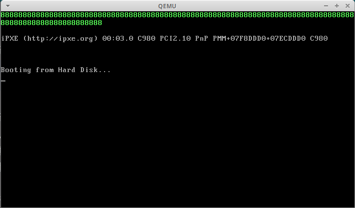

## 中断

中断就是打断`CPU`当前的执行流程，让`CPU`去处理一下别的事情。当然，`CPU`也可以选择拒绝。

### 中断的分类

中断按中断源可以分为`内部中断`和`外部中断`。

#### 内部中断

内部中断可以由中断指令`int`来触发，也可以是因为指令执行中出现了错误而触发，例如运算结果溢出会触发溢出中断；除法指令的除数为`0`会触发除法出错中断。

#### 外部中断

外部中断通过`NMI`和`INTR`这两条中断信号线接入`CPU`。

- 由`NMI`接入的是非屏蔽中断`(Non Maskable Interrupt)`，来自这个引脚的中断请求信号是不受中断允许标志`IF`限制的，`CPU`接收到非屏蔽中断请求后，无论当前正在做什么事情，都必须在执行完当前指令后响应中断。因此非屏蔽中断常用于系统掉电处理，紧急停机等重大故障时。`NMI`统一被赋予中断号`2`。

- 由`INTR`接入的是可屏蔽中断。在`IBM PC/AT`机中，这个信号由两片`8259A`级联组成，接入`CPU`的中断控制逻辑电路，可管理`15`级中断。

### 中断向量表

`8086`的中断系统可以识别`256`个不同类型的中断，每个中断对应一个`0~255`的编号，这个编号即中断类型码。每个中断类型码对应一个中断服务程序的入口地址，`256`个中断，理论上就需要`256`段中断处理程序。在实模式下，处理器要求将它们的入口点集中存放到内存中从物理地址 `0x00000`开始，到`0x003ff`结束，共`1KB`的空间内，这就是所谓的中断向量表`(Interrupt Vector Table, IVT)`。

每个中断在中断向量表中占`2`个字，分别是中断处理程序的偏移地址和段地址。中断`0`的入口点位于物理地址`0x00000`处，也就是逻辑地址`0x0000:0x0000`；中断`1`的入口点位于物理地址`0x00004`处，即逻辑地址`0x0000:0x0004`，其他中断依次类推。

### 中断处理过程

1. 保护断点的现场。先将标志寄存器`FLAGS`压栈，然后清除`IF`位和`TF`位。将当前的代码段寄存器`cs`和指令指针寄存器`ip`压栈。

2. 执行中断处理程序。将中断类型码乘以`4`（每个中断在中断向量表中占`4`个字节），得到了该中断入口点在中断向量表中的偏移地址。从中断向量表中依次取出中断程序的偏移地址和段地址，分别替换`ip`和`cs`以转入中断处理程序执行。

3. 返回到断点接着执行。中断处理程序的最后一条指令必须是中断返回指令`iret`。`iret`执行时处理器依次从堆栈中弹出`ip、cs、flags`，于是处理器转到主程序继续执行。

下面我们通过几个例子感受一下。

## 实战

### 示例一

该示例演示内部中断。

#### 代码

```asm
.code16

.set INT_TYPE_CODE, 0x70
.set INT_HANDLER_BASE, 0x07c0

movw $0xb800, %ax
movw %ax, %es

movw $0x7c00, %sp

# 安装中断向量表
call install_ivt

# 触发中断
int $INT_TYPE_CODE

jmp .

install_ivt:
  movw $INT_TYPE_CODE, %bx
  shlw $2, %bx

  movw $handler, (%bx)
  movw $INT_HANDLER_BASE, 2(%bx)

  ret

# 中断处理程序
handler:
  movw $'8' | 0x0a00, %es:0
  iret

.org 510
.word 0xAA55
```

#### 解释

第`3、4`行设置了两个符号常量，类似于`c`语言中的`#define`。`INT_TYPE_CODE`表示我们要使用的中断类型码，这个示例中我们打算手动触发`0x70`号中断。`INT_HANDLER_BASE`表示中断处理程序所在的段地址。

第`12`行调用安装中断向量表的例程。

第`15`行手动触发中断。

第`20、21`行根据中断号计算中断向量在中断向量表中的偏移地址。计算方法是左移`2`位，即乘`4`。

第`23`行将中断处理程序的段内偏移写入中断向量对应的偏移地址的前两个字节。

第`24`行将中断处理程序所在的段地址写入中断向量对应的偏移地址的后两个字节。

第`30、31`行是我们的中断处理程序。只打印了一个字符，然后通过`iret`返回。

#### 运行

```bash
$ as --32 boot.s -o boot.o
$ objcopy -O binary -j .text boot.o boot.bin
$ qemu-system-i386 boot.bin
```


### 示例二

该示例演示外部中断。

#### 代码

```asm
.code16

.set INT_TYPE_CODE, 0x08
.set INT_HANDLER_BASE, 0x07c0
.set _8259A_MASTER, 0x20

movw $0xb800, %ax
movw %ax, %es

movw $0x7c00, %sp

xorw %si, %si

# 安装中断向量表
call install_ivt

# 初始化 8259a
# 使用默认配置

sleep:
  hlt
  jmp sleep

install_ivt:
  movw $INT_TYPE_CODE, %bx
  shlw $2, %bx

  movw $handler, (%bx)
  movw $INT_HANDLER_BASE, 2(%bx)

  ret

handler:
  movw $'8' | 0x0a00, %es:(%si)
  addw $2, %si

  # send eoi
  movb $0x20, %al
  outb %al, $_8259A_MASTER

  iret

.org 510
.word 0xAA55
```

#### 解释

第`3`行我们将中断类型码改成了`0x08`。这个中断号在`BIOS`对`8259a`做过初始化之后是分配给主片的`0`级中断的，这个引脚用于连接`8254`可编程定时/计数器。`8254`在被`BIOS`初始化后会每隔`54.925 ms`向这个引脚输出`1`个信号。

第`5`行`_8259A_MASTER`是`8259a`的主片`0x20`端口。分配给`8259a`主片的端口是`0x20、0x21`，从片的端口是`0xa0, 0xa1`。这个示例中我们不对`8259a`进行编程，但是在中断处理完成之后需要通过`0x20`告诉主片这个中断已经处理完了。如果中断来自从片的话那就需要同时向主片，从片发送处理完成的信号。

第`12`行将`si`置`0`，我们打算每触发一次中断就在屏幕上打印一个字符，通过`si`控制打印位置。

第`20~22`行通过`hlt`指令使处理器停止执行指令，并处于停机状态。停机状态可以被中断唤醒，继续执行。

第`35`行将索引移动到下一个位置。

第`38、39`行向`8259a`主片发送中断结束命令`0x20`，使`8259a`可以继续接收中断信号。

#### 运行

```bash
$ as --32 boota.s -o boota.o
$ objcopy -O binary -j .text boota.o boota.bin
$ qemu-system-i386 boota.bin
```



中断每隔`54.925 ms`触发一次，屏幕上也会每隔`54.925 ms`打印一次字符。这个示例程序中我们没有控制`si`的大小，在运行的时候要注意这一点。

### 示例三

该示例演示外部中断，并且重新设置了`8259a`。

#### 代码

```asm
.code16

.set INT_TYPE_CODE, 0x20
.set INT_HANDLER_BASE, 0x07c0
.set _8259A_MASTER, 0x20
.set _8259A_SLAVE, 0xa0

movw $0xb800, %ax
movw %ax, %es

movw $0x7c00, %sp

xorw %si, %si

# 安装中断向量表
call install_ivt

# 初始化 8259a
call init_8259a

sleep:
  hlt
  jmp sleep

install_ivt:
  movw $INT_TYPE_CODE, %bx
  shlw $2, %bx

  movw $handler, (%bx)
  movw $INT_HANDLER_BASE, 2(%bx)

  ret

init_8259a:
  movb 0x11, %al
  outb %al, $_8259A_MASTER
  outb %al, $_8259A_SLAVE

  movb $0x20, %al
  outb %al, $_8259A_MASTER + 1
  movb $0x28, %al
  outb %al, $_8259A_SLAVE + 1

  movb $0x04, %al
  outb %al, $_8259A_MASTER + 1
  movb $0x02, %al
  outb %al, $_8259A_SLAVE + 1

  movb $0x01, %al
  outb %al, $_8259A_MASTER + 1
  outb %al, $_8259A_SLAVE + 1

  movb $0x0, %al
  outb %al, $_8259A_MASTER + 1
  outb %al, $_8259A_SLAVE + 1

  ret

handler:
  movw $'8' | 0x0a00, %es:(%si)
  addw $2, %si

  # send eoi
  movb $0x20, %al
  outb %al, $_8259A_MASTER

  iret

.org 510
.word 0xAA55
```

#### 解释

第`3`行我们将`INT_TYPE_CODE`修改成了`0x20`。这次我们会重新设置`8259a`，将他的主片中断号设置为从`0x20`开始。

第`34`行开始的子例程用于初始化`8259a`。`8259a`的初始化方式是依次写入初始化命令字`ICW1-4`，这个顺序是固定的。其中`ICW1`通过`0x20`端口写入（从片通过`0xa0`），`ICW2-4`通过`0x21`端口写入（从片通过`0xa1`）。

第`35~37`行通过向主片、从片写入`0x11`来开始初始化的过程。基本上在`IBM PC/AT`机中是固定写入`0x11`的，表示中断请求是边沿触发、多片`8259a`级联并且需要发送 `ICW4`。

第`39、40`行设置主片中断号从`0x20(32)`开始。

第`41、42`行设置从片中断号从`0x28(40)`开始。

第`44、45`行设置主片`IR2`引脚连接从片。

第`46、47`行告诉从片输出引脚和主片`IR2`号相连。

第`49~51`行设置主片和从片按照`8086`的方式工作。

第`53~55`行设置主从片允许中断。

#### 运行

运行结果和上一个示例一样，就不贴图了。

文中涉及了`8259a`，但是并没有详细介绍相关的知识。因为网上的资料太丰富了，大家打开搜索引擎直接搜索就可以了。另外，现代的处理器一般使用`APIC`来处理中断，即`高级可编程中断控制器`。
