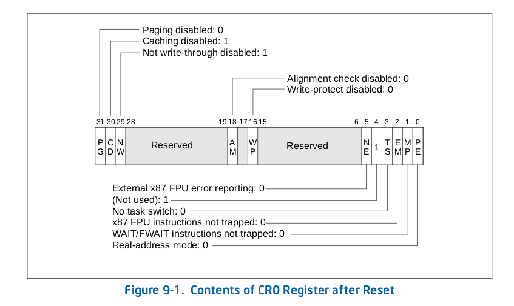

保护模式实际上很简单，只是概念比较多。今天老李就带领大家进入保护模式，然后在实操中逐一攻克每个概念。

## 进入保护模式

进入保护模式总共分三步。

- 第一步，打开`A20`地址线。
- 第二步，加载`GDT`。
- 第三步，将处理器切换到`保护模式`。

下面我们就来详细讲解一下这三个步骤。

### A20 地址线

众所周知，`8086`处理器有`20`根地址线，可访问的最大内存地址是`0xfffff`，即`1MB`。`32`位处理器具有`32`根地址线，可访问的最大内存地址是`0xffffffff`，即`4GB`。在`32`位处理器刚面世的时候并没有太多针对`32`位处理器开发的软件，更多的是为`8086`开发的软件，计算机制造商为了能够兼容这些软件，便想出了一个办法，在计算机启动后将第`21`根地址线，即`A20`，置为`0`。这样，当地址超过`0xfffff`后，由于第`21`根地址线为`0`，所以地址又会绕回到`0x00000`开始。从外表上看就好像是一个`16`位的处理器。

现在，我们要做的就是打开`A20`，让处理器可以使用全部的`32`根地址线。打开`A20`的方法有很[多种](https://wiki.osdev.org/A20_Line)，这里我们介绍一种被称为`Fast A20 Gate`的方法，通过读写`0x92`端口控制`A20`的开关。代码如下：

```asm
inb $0x92, %al    # 读出原数据
orb $0x2, %al     # 将第`2`位置为`1`
outb %al, $0x92   # 写入数据
```

这样就打开了`A20`。

### GDT (Global Descriptor Table)

`GDT`即全局描述符表，`GDT`中的项被称为**段描述符 (Segment Descriptor)**。段描述符用于描述内存段，描述符中包含内存段的基地址、段界限和用于访问检测、数据保护的信息，每一个段描述符占据`8`个字节，每一个字节的图解如下：


可以看到 **基地址(base)** 和 **段界限(limit)** 是分散存放的，这是由历史原因造成的。其中基地址共占据`32`位，即基地址可以起始于`4GB`内存空间的任何位置，但更好的做法还是选取那些`16`字节对齐的地址，这样寻址效率更高；段界限共有`20`位，取值范围为`0~0xfffff`，用于限制段的扩展范围，这需要和图中所示的`G`位，即**粒度位**结合起来使用。`G`位为`0`时，段界限以字节为单位，段的扩展范围为`1B~1MB`。`G`位为`1`时，段界限以`4KB`为单位的，段的扩展范围为`4KB~4GB`。下面解释一下其余位的含义：

- `D/B` 位表示默认的操作数大小或默认的堆栈指针大小。为`0`时表示指令中的偏移地址或者操作数是`16`位的，相应的指令指针寄存器取`ip`，堆栈指针寄存器取`sp`；为`1`时表示指令中的偏移地址或者操作数是`32`位的，相应的指令指针寄存器取`eip`，堆栈指针寄存器取`esp`。

- `L` 位是`64`位代码段标志，我们目前用不到，置`0`即可。

- `AVL` 位是留给开发者使用的，置位还是清除就看你的兴趣了。

- `P` 位即存在位，用于指示描述符所对应的段是否在内存中。当访问不存在的内存段时会触发中断，我们可以在中断处理程序中将不存在的内存段从磁盘中置换到内存中。

- `DPL (Descriptor Privilege Level)` 用于表示描述符的特权级，占两位，可以表示`0，1，2，3`四种特权级。`0`级最高，`3`级最低。

- `S` 位表示描述符类型。为`1`时表示代码段或数据段，为`0`时表示系统段。

- `TYPE` 占据四位。其含义根据`S`位的不同可以分为如下两大类：

当`S`位置位时，即`S`位为`1`时，描述符表示代码段或数据段，`TYPE`的具体含义如下表：


当`S`位清除时，即`S`位为`0`时，描述符表示系统段，`TYPE`的具体含义如下表：


表格内容比较多，但是我们现在需要用到的并不多，以后遇到了再逐一讲解。

至此，每一个描述符的含意我们就清楚了。把所有的描述符放在一起就构成了一个描述符表，如果用一个结构`(struct)`表示一个描述符的话那么很明显，描述符表就是一个结构数组。

每一个描述符需要占据`8`个字节，显然我们不可能把描述符表全部保存在寄存器中，因为没有那么多的寄存器空间。所以全局描述符表是被放在内存中的，处理器中有一个`48`位的，专用于保存全局描述符表信息的寄存器 —— **全局描述符表寄存器(GDTR)**。其中低`16`位`(0~15)`表示`GDT`的边界，其值为表的长度减一，从`0`开始计，高`32`位`(16~47)`存放`GDT`在内存中的基地址。图示如下：


一旦准备好了`GDT`，就可以通过`lgdt`指令将其描述信息加载到`GDTR`中，指令格式如下：

```asm
lgdt gdtdesc  # gdtdesc 是全局描述符表信息在内存中的地址
```

### 将处理器切换到保护模式

将处理器从实模式切换到保护模式非常的简单，只须将控制寄存器`cr0`的`PE`位置位即可。`cr0`寄存器每一位的含义如下：



当处理器刚加电时，`PE`位，即保护模式允许位`(Protection Enable)`默认为`0`，表示处理器运行在实模式下，处理器的寻址，计算都按照实模式来。一旦`PE`位置为`1`，则处理器立刻切换到保护模式执行。这也意味着，我们必须在将处理器运行模式切换到保护模式之前设置好`全局描述符表`并开启`A20`。设置`PE`位的代码如下：

```asm
movl %cr0, %eax
orl $0x1, %eax
movl %eax, %cr0
```

有了上面的理论知识，下面我们开始实战。

## 实战

### 代码

```asm
.set PROT_MODE_CSEG, 0x08        # code segment selector
.set PROT_MODE_DSEG, 0x10        # data segment selector

.globl start
start:
  .code16
  cli

  # Enable A20
  inb $0x92, %al
  orb $0x2, %al
  outb %al, $0x92

  # Load GDT
  lgdt gdtdesc

  # Switch from real to protected mode
  movl %cr0, %eax
  orl $0x1, %eax
  movl %eax, %cr0

  # Jump into 32-bit protected mode
  ljmp $PROT_MODE_CSEG, $protcseg

  .code32
protcseg:
  movw $PROT_MODE_DSEG, %ax
  movw %ax, %ds

  movb $'L', 0
  movb $0x0a,1

  movb $'a', 2
  movb $0x0a,3

  movb $'o', 4
  movb $0x0a,5

  movb $'l', 6
  movb $0x0a,7

  movb $'i', 8
  movb $0x0a,9

hlt

.p2align 2
gdt:
  .quad 0x0
  .quad 0x00cf98000000ffff
  .quad 0x0040920b8000ffff

gdtdesc:
  .word gdtdesc - gdt - 1
  .long gdt

.org 510
.word 0xAA55
```

### 解释

前两行分别定义了两个符号，值分别为`0x08`，`0x10`。这个很好理解，但是注释里的话是什么意思？什么是段选择子`(segment selector)`？这个我们稍后解释。

第`4`行定义了一个全局可见的符号`start`，`start`做为一个标号定义在第`5`行，这是代码的起始位置。

第`6`行用伪指令`.code16`告诉汇编器下面的代码按照`16`位的格式汇编。

第`7`行`cli`指令用于关闭中断，因为我们还没有设置如何处理保护模式下的中断。

第`10~12`行 开启`A20`。

第`15`行 加载`GDT`。看到第`53~55`行，`gdtdesc`定义在这里，其中低`16`位是`GDT`的长度减一，高`32`位是`GDT`的基地址。

第`18~20`行 从实模式切换到保护模式。

第`23`行 使用`ljmp`长跳转指令跳转到保护模式代码段中，偏移量为`protcseg`的位置，即跳转到第`26`行处继续执行。这是`intel`的要求，因为`ljmp`指令可以使处理器清空流水线和指令预读取队列。这里我们碰到了第一行定义的符号`PROT_MODE_CSEG`，其值为`0x08`。现在我们来解释一下它的含义。

实模式下，段寄存器`cs、ds、es、ss`中保存的是`16`位的段基地址。保护模式下，段寄存器中保存的就不是段基地址了，而是**段选择子**，并且每个段寄存器还包含了一个`64`位的不可见部分，被称为**描述符高速缓存器**，如下图：


**描述符高速缓存器**中保存的就是我们在描述符表中定义的段的信息，而**段选择子**就是用于在描述符表中定位描述符的。段选择子也是`16`位的，其格式如下：


这`16`位的信息分为三部分，第`0、1`位是`RPL（请求特权级）`，表示给出当前选择子的程序的特权级别，用于处理器固件校验权限。第`2`位是`TI`位，用于标识所需要的段描述符在`GDT`还是`LDT`中，`GDT`我们之前介绍过，`LDT`是**局部描述符表**，和`GDT`类似。当`TI`位为`0`时表示在`GDT`中取描述符，为`1`时表示在`LDT`中取描述符。第`3~15`位时**索引**，如果把描述符表看作一个数组的话，这里的索引就相当于数组的下标。因为每个描述符占`8`个字节，所以处理器拿到索引后先将其乘以`8`，在以得到的结果为偏移量到描述符表中获取相应的描述符。

以`PROT_MODE_CSEG`为例，其值为`0x08`，对应二进制`0000000000001_0_00`，根据上面的知识就很好理解了。`RPL`为`0`，表示最高特权级；`TI`为`0`，表示请求的描述符在`GDT`中；`Index`为`1`，`1 * 8 = 8`，表示该描述符相对于描述符表的基地址偏移量为`8`，即描述符表中的第二个描述符。为什么不用第一个描述符呢？这是因为`Intel`规定，全局描述符表中的第一个描述符必须为**空描述符**，即`8`个字节全为`0`，所以我们能使用的描述符只能从第二个开始了。我们将段选择子`0x08`指向的描述符表示的段做为代码段，其定义在第`50`行，如下：

```asm
.quad 0x00cf98000000ffff
```

为了简单，在这里我们直接写入了`64`位的数据。将这`64`位的数据按照段描述符的格式拆解可得：

- `Base 31_24: 00`
- `G: 1`
- `D/B: 1`
- `L: 0`
- `AVL: 0`
- `Limit 19_16: f`
- `P: 1`
- `DPL: 0`
- `S: 1`
- `TYPE: 8`
- `Base 23_16: 00`
- `Base 15_00: 0000`
- `Limit 15_00: ffff`

整理可得：

- `Base: 0x00000000`
- `Limit: 0xfffff`
- `G: 1` 段界限粒度为`4KB`
- `D/B: 1` `32`位操作数
- `L: 0`
- `AVL: 0`
- `P: 1` 对应的段在内存中
- `DPL: 0` 特权级为`0`
- `S: 1` 描述符为代码段或数据段
- `TYPE: 8` 只执行代码段

其中段界限为`0xfffff`，粒度为`4KB`，段界限与粒度相乘可得上限为`4GB`。基地址为`0x0`，所以这个描述符表示的范围是全部的`4GB`内存空间。

第`25`行，伪指令`.code32`告诉汇编器，之后的指令都按照`32`位格式编译。

第`27、28`行，我们将数据段设置为选择子`PROT_MODE_DSEG`，值为`0x10`，对应的描述符定义在第`51`行，如下：

```asm
.quad 0x0040920b8000ffff
```

拆解可得：

- `Base: 0x000b8000`
- `Limit: 0x0ffff`
- `G: 0` 段界限粒度为`1B`
- `D/B: 1` `32`位操作数
- `L: 0`
- `AVL: 0`
- `P: 1` 对应的段在内存中
- `DPL: 0` 特权级为`0`
- `S: 1` 描述符为代码段或数据段
- `TYPE: 2` 可读可写数据段

基地址`0xb8000`对应显存的起始地址，段界限`0xffff * 1 = 0xffff`，即`64KB`。

第`30~43`行，向数据段，即显存对应的内存段写入数据以显示字符。

第`45`行，`hlt`使处理器暂停。

第`47`行，伪指令`.p2align 2`强制`4`字节对齐。

第`49`行，处理器规定的空描述符。

### 编译、链接

```bash
$ as --32 boot.s -o boot.o
$ ld -e start -Ttext=0x7c00 -m elf_i386 --oformat binary boot.o -o boot.bin
```

这次我们使用了链接器`ld`而不是`objcopy`制作最终的启动文件。其参数含义如下：

- `-e` 指定程序入口点为`start`，这是我们在代码里导出的符号
- `-T` 指定代码段`(text)`的地址为`0x7c00`
- `-m` 指定生成`i386`格式的指令
- `--oformat binary` 指定生成纯二进制的文件

### 运行

```bash
$ qemu-system-i386 -drive file=boot.bin,format=raw -monitor stdio
QEMU 2.11.1 monitor - type 'help' for more information
(qemu)
```

我们在启动虚拟机的同时将`Qemu`的`monitor`关联到了`stdio`，也就是控制台。此时运行情况如下：


我们在`monitor`中输入`info registers`查看寄存器状态。

```bash
(qemu) info registers
EAX=00000010 EBX=00000000 ECX=00000000 EDX=00000080
ESI=00000000 EDI=00000000 EBP=00000000 ESP=00006f04
EIP=00007c68 EFL=00000006 [-----P-] CPL=0 II=0 A20=1 SMM=0 HLT=1
ES =0000 00000000 0000ffff 00009300 DPL=0 DS16 [-WA]
CS =0008 00000000 ffffffff 00cf9800 DPL=0 CS32 [---]
SS =0000 00000000 0000ffff 00009300 DPL=0 DS16 [-WA]
DS =0010 000b8000 0000ffff 00409300 DPL=0 DS   [-WA]
FS =0000 00000000 0000ffff 00009300 DPL=0 DS16 [-WA]
GS =0000 00000000 0000ffff 00009300 DPL=0 DS16 [-WA]
LDT=0000 00000000 0000ffff 00008200 DPL=0 LDT
TR =0000 00000000 0000ffff 00008b00 DPL=0 TSS32-busy
GDT=     00007c68 00000017
IDT=     00000000 000003ff
CR0=00000011 CR2=00000000 CR3=00000000 CR4=00000000
DR0=00000000 DR1=00000000 DR2=00000000 DR3=00000000
DR6=ffff0ff0 DR7=00000400
...
```

观察第`6`行，`cs`的值为`0x08`，段基址为`0`，上限为`0xffffffff`，属性为`0xcf98`，与我们设置的一致。

第`8`行，`ds`的值为`0x10`，段基址为`0xb8000`，上限为`0xffff`，属性为`0x4093`，与我们设置的有点出入，我们设置的是`0x4092`，其中`2`表示可读可写数据段，查表可知`3`表示已访问过的可读可写数据段。这说明当我们访问这个段时处理器已经将其标记为**已访问**。

一切水到渠成，简单三步进入保护模式。
