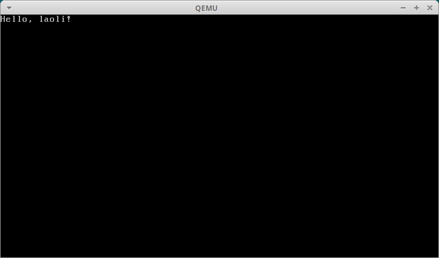

汇编语言的基础已经讲了很多，也带领大家进入了保护模式。想必大家在学习[进入保护模式](./10-%E8%BF%9B%E5%85%A5%E4%BF%9D%E6%8A%A4%E6%A8%A1%E5%BC%8F.md)这一章时就发现我们已经涉及了很多`数据结构`，`全局描述符表`、`段描述符`、`GDTR`等。如果可以使用`C 语言`，将他们和`struct`对应起来那将会减少很多的工作量。今天老李就教大家如何从`汇编语言`过渡到`C 语言`。

## 预处理

先来教大家一个技巧，在`汇编语言`中使用`预处理`。改造上一篇文章中的示例代码。

### 代码

```asm
# filename - boot.S

#include "mmu.h"

.set PROT_MODE_CSEG, 0x08        # code segment selector
.set PROT_MODE_DSEG, 0x10        # data segment selector

.globl start
start:
  .code16
  cli

  # Enable A20
  inb $0x92, %al
  orb $0x2, %al
  outb %al, $0x92

  # Load GDT
  lgdt gdtdesc

  # Switch from real to protected mode
  movl %cr0, %eax
  orl $0x1, %eax
  movl %eax, %cr0

  # Jump into 32-bit protected mode
  ljmp $PROT_MODE_CSEG, $protcseg

  .code32
protcseg:
  movw $PROT_MODE_DSEG, %ax
  movw %ax, %ds

  movb $'L', 0xb8000
  movb $0x0a,0xb8001

  movb $'a', 0xb8002
  movb $0x0a,0xb8003

  movb $'o', 0xb8004
  movb $0x0a,0xb8005

  movb $'l', 0xb8006
  movb $0x0a,0xb8007

  movb $'i', 0xb8008
  movb $0x0a,0xb8009

hlt

.p2align 2
gdt:
  SEG_NULL
  SEG(STA_X | STA_R, 0x0, 0xffffffff)
  SEG(STA_W, 0x0, 0xffffffff)

gdtdesc:
  .word gdtdesc - gdt - 1
  .long gdt

.org 510
.word 0xAA55
```

### 解释

第`1`行是注释，我们将文件保存为`boot.S`，注意，以大写`S`结尾。当`gcc`遇到大写`S`结尾的汇编语言源代码时将进行预处理。

第`3`行我们使用`include`引入外部文件`mmu.h`，我们在这个文件中做了一些宏定义，方面我们构造段描述符。

第`34~47`行有一些变化，内存单元的地址都加上了`0xb8000`，因为我们这次将数据段设置成了整个`4GB`的空间。

第`53~55`行我们使用了宏定义`SEG_NULL`，`SEG`。这两个宏定义在`mmu.h`中。先来看看它们是如何定义的。

### 代码

```c
/* filename - mmu.h */

#ifndef __MMU_H_
#define __MMU_H_

/*
 * Macros to build GDT entries in assembly.
 */
#define SEG_NULL \
  .word 0, 0;    \
  .byte 0, 0, 0, 0
#define SEG(type, base, lim)                      \
  .word(((lim) >> 12) & 0xffff), ((base)&0xffff); \
  .byte(((base) >> 16) & 0xff), (0x90 | (type)),  \
      (0xC0 | (((lim) >> 28) & 0xf)), (((base) >> 24) & 0xff)

// Application segment type bits
#define STA_X 0x8 // Executable segment
#define STA_E 0x4 // Expand down (non-executable segments)
#define STA_C 0x4 // Conforming code segment (executable only)
#define STA_W 0x2 // Writeable (non-executable segments)
#define STA_R 0x2 // Readable (executable segments)
#define STA_A 0x1 // Accessed

#endif
```

### 解释

第`9~11`行用于定义空描述符，可以看到`64`位全为`0`。

第`12~15`行接收段类型`(type)`、段基址`(base)`、段界限`(lim)`，经过位运算计算出段描述符。都是很简单的运算，大家动手写一写，画一画就明白了。

第`18~23`行定义了数据段和代码段段类型中的每一位，通过组合这些位来构造段描述符的`type`位。

下面我们看一下预处理后的代码：

```bash
$ cc -E boot.S
# 1 "boot.S"
# 1 "<built-in>"
# 1 "<command-line>"
# 31 "<command-line>"
# 1 "/usr/include/stdc-predef.h" 1 3 4
# 32 "<command-line>" 2
# 1 "boot.S"
# filename - boot.S

# 1 "mmu.h" 1
# 4 "boot.S" 2

.set PROT_MODE_CSEG, 0x08 # code segment selector
.set PROT_MODE_DSEG, 0x10 # data segment selector

.globl start
start:
  .code16
  cli

  # Enable A20
  inb $0x92, %al
  orb $0x2, %al
  outb %al, $0x92

  # Load GDT
  lgdt gdtdesc

  # Switch from real to protected mode
  movl %cr0, %eax
  orl $0x1, %eax
  movl %eax, %cr0

  # Jump into 32-bit protected mode
  ljmp $PROT_MODE_CSEG, $protcseg

  .code32
protcseg:
  movw $PROT_MODE_DSEG, %ax
  movw %ax, %ds

  movb $'L', 0xb8000
  movb $0x0a,0xb8001

  movb $'a', 0xb8002
  movb $0x0a,0xb8003

  movb $'o', 0xb8004
  movb $0x0a,0xb8005

  movb $'l', 0xb8006
  movb $0x0a,0xb8007

  movb $'i', 0xb8008
  movb $0x0a,0xb8009

hlt

.p2align 2
gdt:
  .word 0, 0; .byte 0, 0, 0, 0
  .word(((0xffffffff) >> 12) & 0xffff), ((0x0)&0xffff); .byte(((0x0) >> 16) & 0xff), (0x90 | (0x8 | 0x2)), (0xC0 | (((0xffffffff) >> 28) & 0xf)), (((0x0) >> 24) & 0xff)
  .word(((0xffffffff) >> 12) & 0xffff), ((0x0)&0xffff); .byte(((0x0) >> 16) & 0xff), (0x90 | (0x2)), (0xC0 | (((0xffffffff) >> 28) & 0xf)), (((0x0) >> 24) & 0xff)

gdtdesc:
  .word gdtdesc - gdt - 1
  .long gdt

.org 510
.word 0xAA55
```

观察第`62~64`行，宏定义已经被展开。

编译运行：

```bash
$ cc -m32 -c -o boot.o boot.S
$ ld -e start -Ttext=0x7c00 -m elf_i386 --oformat binary boot.o -o boot.bin
$ qemu-system-i386 -drive file=boot.bin,format=raw -monitor stdio
```

结果与之前相同，就不贴图了。

## 真正的使用 C 语言

继续改造我们的`boot.S`。

### 代码

```asm
# filename - boot.S

#include "mmu.h"

.set PROT_MODE_CSEG, 0x08        # code segment selector
.set PROT_MODE_DSEG, 0x10        # data segment selector

.globl start
start:
  .code16
  cli

  # Enable A20
  inb $0x92, %al
  orb $0x2, %al
  outb %al, $0x92

  # Load GDT
  lgdt gdtdesc

  # Switch from real to protected mode
  movl %cr0, %eax
  orl $0x1, %eax
  movl %eax, %cr0

  # Jump into 32-bit protected mode
  ljmp $PROT_MODE_CSEG, $protcseg

  .code32
protcseg:
  movw $PROT_MODE_DSEG, %ax
  movw %ax, %ds
  movw %ax, %es
  movw %ax, %fs
  movw %ax, %gs
  movw %ax, %ss

  movl $start, %esp
  call bootmain

spin:
  jmp spin

.p2align 2
gdt:
  SEG_NULL
  SEG(STA_X | STA_R, 0x0, 0xffffffff)
  SEG(STA_W, 0x0, 0xffffffff)

gdtdesc:
  .word gdtdesc - gdt - 1
  .long gdt
```

### 解释

第`31~36`行，我们将`ds, es, fs, gs, ss`全部指向了`4GB`的数据段选择子。

第`38`行设置堆栈指针`esp`指向`start`，这个标号在链接完成后对应的地址是`0x7c00`。

第`39`行调用我们定义的`C 语言`代码的入口点。

第`41~42`行，死循环。

还有代码的结尾，没有加可启动标志。这是为了方便链接，可启动标志将在链接完成之后手动加入。

下面给出`C 语言`部分的代码。

### 代码

```c
/* filename - main.c */

void printf(const char *message);

void bootmain(void)
{
  char *message = "Hello, laoli!";
  printf(message);

  while (1)
    ;
}

void printf(const char *message)
{
  unsigned short *video_buffer = (unsigned short *)0xb8000;
  for (int i = 0; i < 80 * 25; i++)
  {
    video_buffer[i] = (video_buffer[i] & 0xff00) | ' ';
  }

  for (int i = 0; message[i] != '\0'; i++)
  {
    video_buffer[i] = (video_buffer[i] & 0xff00) | message[i];
  }
}
```

代码很简单，但是有些地方你可能不明白，我们来讲一讲。

### 解释

第`16`行，我们定义了一个`unsigned short *`类型的指针变量`video_buffer`，指向内存`0xb8000`处，即显存对应的内存处。

第`17~20`行，清屏。因为一屏可以显示`80 * 25`个字符，每个字符占用两个字节。第`19`行，将每一个字符处的显示属性取出`(video_buffer[i] & 0xff00)`，将低字节替换成`' '`，即实现了清屏。

第`22~25`行，实现打印字符串的功能。与清屏大致相同，只不过写入的字符由`' '`变成了参数提供的字符。

### 编译链接

代码本身并没有什么难懂的地方，只是在编译链接的时候需要一些技巧，才能让代码成功的运行起来。下面讲解编译链接的过程。

```bash
$ cc -m32 -c -o boot.o boot.S
$ cc -m32 -fno-builtin -fno-pic -nostdinc -c -o main.o main.c
$ ld -N -e start -Ttext=0x7c00 -m elf_i386 -o boot.elf boot.o main.o
$ objcopy -S -O binary -j .text -j .rodata boot.elf boot.bin
```

第`1`行，编译`boot.S`。这次使用`gcc`编译，因为要用到预处理。

第`2`行，编译`main.c`。注意三个选项即可。

- `-fno-builtin` 不接受不是两个下划线开头的内建函数。
- `-fno-pic` 禁止生成位置无关的代码。
- `-nostdinc` 不要在标准系统目录中寻找头文件。

第`3`行，将汇编语言编译的结果和 C 语言编译的结果链接起来。

- `-N` 不将数据对齐至页边界，不将`text`节只读。
- `-e` 设置起始地址。
- `-Ttext` 设置`.text`节的地址。
- `-m` 设置目标平台。

第`4`行，从`elf`格式的文件中复制出纯二进制的机器码。`elf`格式的文件并不能由处理器直接运行，所以我们要提取出其中的纯二进制机器码。

- `-S` 移除所有符号和重定位信息。
- `-O` 指定输出文件的格式。
- `-j` 指定从源文件中复制的*section*。这里指定了两个*section*`.text`和`.rodata`，因为有一部分数据在编译的时候被放在了`.rodata`中了，具体是哪些数据可以通过反编译查看，这里就不演示了。

此时我们的输出文件`boot.bin`中就包含了全部的汇编语言代码生成的指令和 C 语言代码生成的指令。

最后一步是为`boot.bin`加入可引导标记。

```bash
$ cp boot.bin boot
$ ./sign boot
```

我们将`boot.bin`复制了一份，并且通过之前介绍过的一个小工具[sign](https://github.com/kviccn/asm-boooom/blob/master/0x00/sign.c)为`boot`添加可引导标志。

### 运行

```bash
$ qemu-system-i386 -drive file=boot,format=raw -monitor stdio
```

结果如下：



这是一个里程碑，我们终于从`汇编语言`走向了`C 语言`，通过`C 语言`在裸机上打印出了`Hello, laoli!`。

## 总结

简要总结一下。最开始我们学习了如何在`汇编语言`中使用`预处理`帮助我们简化`GDT`的构造，然后通过`汇编语言`准备好`32位保护模式`的环境，进入`32位保护模式`后我们通过`call`指令，将控制权转移到`C 语言`代码，完成交接。

完整的代码戳[这里](https://github.com/kviccn/asm-boooom/tree/master/0x0C)。

参考[MIT 6.828: Operating System Engineering](https://pdos.csail.mit.edu/6.828/2018/index.html)。
