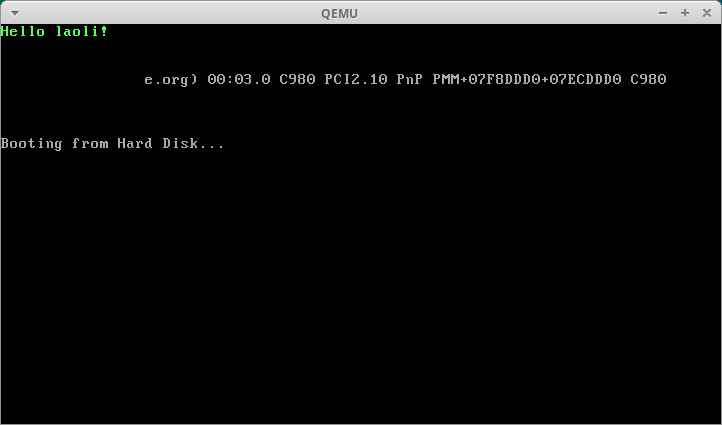
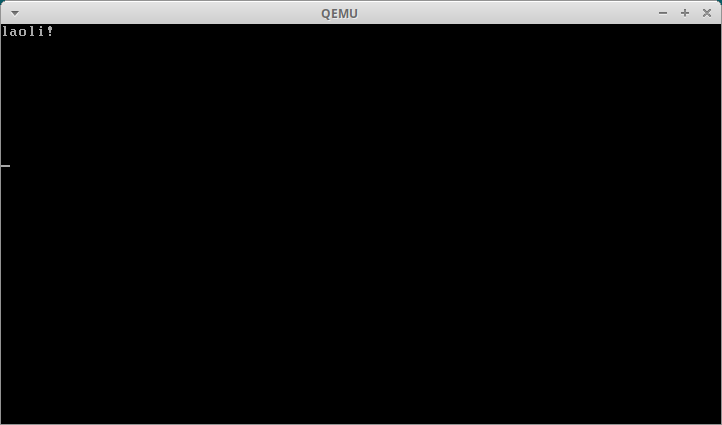

在上一篇文章中，老李已经教大家将控制权从`汇编语言`转移到`C 语言`，但是我们的活动范围依然受限于`512`字节的引导扇区。今天老李就带领大家突破这`512`字节的限制，真正的**解放生产力**。

## 前置知识

如果你一路跟着老李走过来，那么这些前置知识你应该已经掌握了。忘记也没关系，回过头再去看看就 ok 了。

- [I/O 接口技术](./05-IO%E6%8E%A5%E5%8F%A3%E6%8A%80%E6%9C%AF.md)
- [硬盘操作](./06-%E7%A1%AC%E7%9B%98%E6%93%8D%E4%BD%9C.md)
- [内联汇编](../../posts/C%E8%AF%AD%E8%A8%80%E5%86%85%E8%81%94%E6%B1%87%E7%BC%96.md)

单刀直入，直接看第一个示例。

## 读取硬盘数据

### 目标

我们会构造一个`1KB`大小的`磁盘映像文件`，第一个`扇区`，即前`512`字节，保存我们的引导扇区程序，第二个`扇区`，即后`512`字节，保存一个文本文件。通过引导扇区的程序将第二个扇区的文本文件打印在显示器上。

大体上来说完成这个目标需要两个步骤。第一步，将数据从磁盘读取到内存；第二步，将数据打印到显示器上。显然，第一步需要进行磁盘的 I/O 操作，第二步则相对简单。

### 目录结构

```bash
$ tree .
.
├── boot.S
├── main.c
├── Makefile
├── message.data
├── mmu.h
├── types.h
└── x86.h
```

其中`boot.S`、`mmu.h`内容与前一篇文章相同，不再重复介绍。完整的代码戳[这里](https://github.com/kviccn/asm-boooom/tree/master/0x0D)。

先来看`types.h`。

```c
#ifndef __TYPES_H_
#define __TYPES_H_

typedef __signed char int8_t;
typedef unsigned char uint8_t;
typedef short int16_t;
typedef unsigned short uint16_t;
typedef int int32_t;
typedef unsigned int uint32_t;
typedef long long int64_t;
typedef unsigned long long uint64_t;

#endif
```

我们定义了一些`类型`，可以让我们少打几个字。

`x86.h`

```c
#include "types.h"

static inline uint8_t
inb(uint16_t port)
{
  uint8_t data;
  asm volatile("inb %1,%0"
               : "=a"(data)
               : "d"(port));
  return data;
}

static inline void
outb(uint16_t port, uint8_t data)
{
  asm volatile("outb %0,%1"
               :
               : "a"(data), "d"(port));
}

static inline void
insl(int port, void *addr, int cnt)
{
  asm volatile("cld; rep insl"
               : "=D"(addr), "=c"(cnt)
               : "d"(port), "0"(addr), "1"(cnt)
               : "memory", "cc");
}
```

这里我们使用`内联汇编`定义了三个`函数`，这三个函数使用`static`、`inline`修饰。`static`保证函数只在声明它的文件中可见，避免和其他相同名称的函数冲突。`inline`告诉编译器尽可能将函数内联到调用它的地方，这样可以减少函数调用次数，提高效率，但这不是必然。

`inb`函数内联了`inb`指令，用于从指定端口读取`1字节`数据。

`outb`函数内联了`outb`指令，用于向指定端口写入`1字节`数据。

`insl`函数内联了`cld; rep insl`指令，`cld`用于清除方向标志，使`偏移量`向正方向移动，这个`偏移量`其实就是传入的`addr`，会被关联到`edi`，反汇编的结果中可以看到，请大家自己实验。`rep`前缀用于重复执行`insl`，重复的次数由`ecx`决定，即传入的参数`cnt`。最终数据会被连续读取到`addr`指向的内存处。

`main.c`

```c
#include "x86.h"

void readsect(void *dst, uint32_t offset);

void bootmain(void)
{
  readsect((void *)0xb8000, 1);

  while (1)
    ;
}

void waitdisk(void)
{
  while ((inb(0x1F7) & 0xC0) != 0x40)
    ;
}

void readsect(void *dst, uint32_t offset)
{
  waitdisk();

  outb(0x1F2, 1);
  outb(0x1F3, offset);
  outb(0x1F4, offset >> 8);
  outb(0x1F5, offset >> 16);
  outb(0x1F6, (offset >> 24) | 0xE0);
  outb(0x1F7, 0x20);

  waitdisk();

  insl(0x1F0, dst, 512 / 4);
}
```

第`3`行声明函数`readsect`，用于从磁盘读取一个扇区。参数`dst`指定目的内存位置，参数`offset`指定要读取的扇区的偏移量。我们将使用`LBA`模式访问磁盘，该模式从`0`开始编号数据块，第一个区块`LBA=0`，第二个区块`LBA=1`，以此类推。

第`7`行调用`readsect`，将偏移量为`1`的扇区，即第二个扇区的数据读取到内存`0xb8000`处。因为我们将向该扇区写入`ASCII`编码的文本，所以可以直接将数据读取到显存对应的内存处，以直接打印文本。

第`13~17`行定义函数`waitdisk`，采用`忙等`的方式等待磁盘准备好进行数据传输。端口`1F7`既是命令端口，又是状态端口。作为状态端口时，每一位含义如下：

- 第`7`位 控制器忙碌
- 第`6`位 磁盘驱动器已准备好
- 第`5`位 写入错误
- 第`4`位 搜索完成
- 第`3`位 为`1`时扇区缓冲区没有准备好
- 第`2`位 是否正确读取磁盘数据
- 第`1`位 磁盘每转一周将此位设为`1`
- 第`0`位 之前的命令因发生错误而结束

`inb(0x1F7)`从端口`0x1F7`读取出状态，与`0xC0`做`&`运算，只保留`高两位`，即第`7`位和第`6`位，如果不等于`0x40`（控制器不忙且已准备好交互），则继续等待、测试。

第`19~33`行定义函数`readsect`。

第`21`行，函数首先调用`waitdisk`以确保磁盘准备好交互。

第`23`行，向端口`0x1F2`写入`1`，指定读取的扇区数量为`1`。

第`24~27`行，向端口`0x1F3、0x1F4、0x1F5、0x1F6`写入`28`位的逻辑扇区编号，其中端口`0x1F6`的`高四位`写入`0xE`，表示以`LBA`模式访问`主硬盘`。

第`28`行，端口`0x1F7`做为命令端口，向其写入`0x20`表示请求读硬盘。

第`30`行，继续等待硬盘准备好数据。

第`32`行，调用函数`insl`从端口`0x1F0`读取数据到`dst`，`0x1F0`是数据端口。读取的次数是`512 / 4`，因为一个扇区包含`512`个字节，而`insl`指令一次可以读取`4`个字节。

`message.data`

```
H
e
l
l
o

l
a
o
l
i
!
```

每一个字符换一行，因为换行符的`ASCII`码为`0a`，正好等于`浅绿色`的字符显示属性，所以我们可以直接将其与字符一起读入显存对应的内存处，做为字符的显示属性。既可以说是偷懒，也可以说是个小技巧。因为我们的目的是演示如何使用 C 语言读写磁盘。`message.data`的底层内容如下：

```bash
$ xxd -a message.data
00000000: 480a 650a 6c0a 6c0a 6f0a 200a 6c0a 610a  H.e.l.l.o. .l.a.
00000010: 6f0a 6c0a 690a 210a                      o.l.i.!.
```

### 编译链接

```bash
$ cc -m32 -c -o boot.o boot.S
$ cc -m32 -fno-builtin -fno-pic -nostdinc -c -o main.o main.c
$ ld -N -e start -Ttext=0x7c00 -m elf_i386 -o boot.elf boot.o main.o
$ objcopy -S -O binary -j .text boot.elf boot.bin
$ cp boot.bin boot
$ ./sign boot
```

### 制作磁盘映像

```bash
$ dd if=/dev/zero of=boot.img bs=512 count=2
$ dd if=boot of=boot.img conv=notrunc
$ dd if=message.data of=boot.img seek=1 conv=notrunc
```

### 运行

```bash
$ qemu-system-i386 -drive file=boot.img,format=raw -monitor stdio
```

结果如下:



可以看到从`!`到`e`中间的部分是黑掉的。因为我们没有那么多数据，但是`readsect`还是会读取`512`个字节，而剩下的字节都是`0`。

## 加载“内核”

其实我们上一个栗子的代码已经相当于一个`操作系统`的`bootloader`了。我们从磁盘读取了一段数据并显示在屏幕上，如果我们读取一段程序并执行它呢？这可不就是一个`bootloader`加载`内核`的过程吗。你品，你细品。

接下来老李就带大家撸一个`Hello world 内核`加载到内存并运行起来。

### 目录结构

```bash
$ tree .
.
├── boot.S
├── kernel.c
├── main.c
├── Makefile
├── mmu.h
├── types.h
└── x86.h
```

还是挑有变化的来讲，除了`main.c`和`kernel.c`，其他内容都与之前相同。完整的代码戳[这里](https://github.com/kviccn/asm-boooom/tree/master/0x0E)。

`main.c`

```c
#include "x86.h"

void readsect(void *dst, uint32_t offset);

void bootmain(void)
{
  readsect((void *)0x10000, 1);

  ((void (*)(void))(0x10000))();

  while (1)
    ;
}

void waitdisk(void)
{
  while ((inb(0x1F7) & 0xC0) != 0x40)
    ;
}

void readsect(void *dst, uint32_t offset)
{
  waitdisk();

  outb(0x1F2, 1);
  outb(0x1F3, offset);
  outb(0x1F4, offset >> 8);
  outb(0x1F5, offset >> 16);
  outb(0x1F6, (offset >> 24) | 0xE0);
  outb(0x1F7, 0x20);

  waitdisk();

  insl(0x1F0, dst, 512 / 4);
}
```

不同处在第`7、9`行。

第`7`行，这次我们将数据读取到了内存`0x10000`处。

第`9`行，通过强制类型转换，将`0x10000`处开始的内容转换成了一个函数并调用，函数的类型是`void (*)(void)`。如果像下面这样写可能会好理解一点：

```c
void (*entry)(void);
entry = (void (*)(void))(0x10000);
entry();
```

`kernel.c`

```c
#include "types.h"

void entry(void)
{
  uint16_t *video_buffer = (uint16_t *)0xb8000;

  for (int i = 0; i < 80 * 25; i++)
  {
    video_buffer[i] = (video_buffer[i] & 0xff00) | ' ';
  }

  video_buffer[0] = 0x0700 | 'l';
  video_buffer[1] = 0x0700 | 'a';
  video_buffer[2] = 0x0700 | 'o';
  video_buffer[3] = 0x0700 | 'l';
  video_buffer[4] = 0x0700 | 'i';
  video_buffer[5] = 0x0700 | '!';
}
```

常规操作，清屏，打印字符，大家应该已经轻车熟路了。

### 编译链接

#### 制作 bootloader

```bash
$ cc -m32 -c -o boot.o boot.S
$ cc -m32 -fno-builtin -fno-pic -nostdinc -c -o main.o main.c
$ ld -N -e start -Ttext=0x7c00 -m elf_i386 -o boot.elf boot.o main.o
$ objcopy -S -O binary -j .text boot.elf boot.bin
$ cp boot.bin boot
$ ./sign boot
```

#### 制作 kernel

```bash
$ cc -m32 -fno-builtin -fno-pic -nostdinc -c -o kernel.o kernel.c
$ objcopy -S -O binary -j .text kernel.o kernel
```

### 制作磁盘映像

```bash
$ dd if=/dev/zero of=boot.img bs=512 count=2
$ dd if=boot of=boot.img conv=notrunc
$ dd if=kernel of=boot.img seek=1 conv=notrunc
```

### 运行

```bash
$ qemu-system-i386 -drive file=boot.img,format=raw -monitor stdio
```

结果如下:



## 总结

先来说一下上面所谓的“内核”潜在的一些问题。我们只是简单的从磁盘读取了`512`字节的数据，事实上真正的“内核”的大小是变化的，可能小于`512`字节，但更多的可能是大于`512`字节。所以我们需要将“内核”的大小写在某个地方，让`bootloader`知道应该读取多少扇区。

再来说一下写`汇编语言`这个系列的初衷，是为了开发操作系统做一些准备工作。如果只是学习操作系统的理论知识那完全可以不学习汇编语言，但如果想开发一个操作系统，那汇编语言的知识就是必不可少的。因为不可避免的要和硬件打交道，不论是`x86`、`arm`还是其它的体系结构。

到目前为止，`汇编语言`的基础知识已经讲的差不多了，`保护模式`的概念也介绍了一些，还有很多没有介绍，剩下的部分我打算结合`操作系统`讲解，想继续学习的小伙伴们请移步到[这里](../%E8%80%81%E6%9D%8E%E6%95%99%E4%BD%A0%E5%86%99%E6%93%8D%E4%BD%9C%E7%B3%BB%E7%BB%9F/)。

参考[MIT 6.828: Operating System Engineering](https://pdos.csail.mit.edu/6.828/2018/index.html)。

（完）
