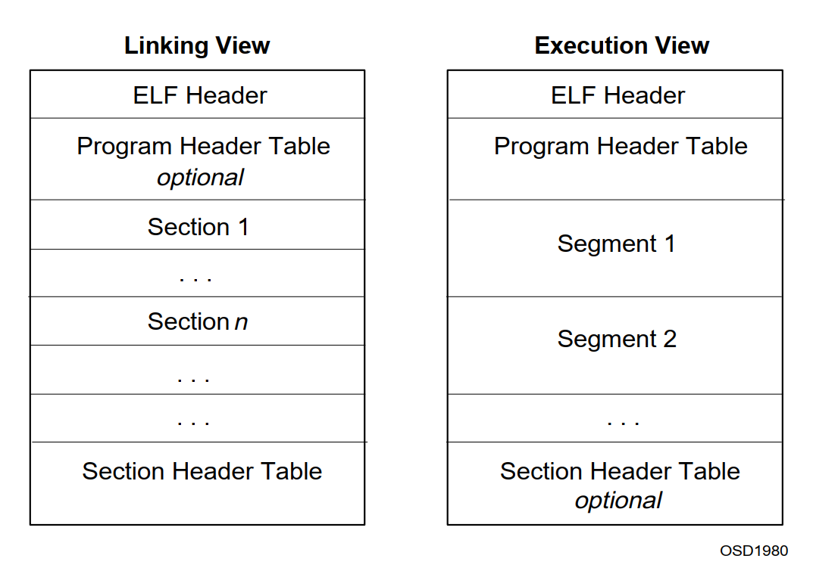
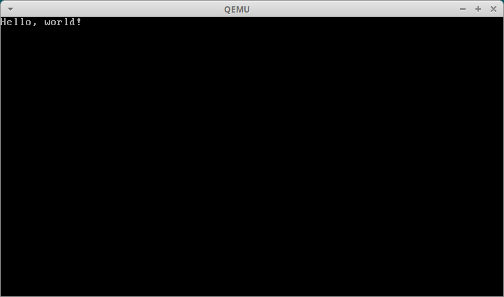

今天开始，我们来学习操作系统的开发。

## 前置知识

你需要一点汇编语言的知识，老李为此专门写了一个[系列文章](../%E6%B1%87%E7%BC%96%E8%AF%AD%E8%A8%80%E4%B8%80%E5%8F%91%E5%85%A5%E9%AD%82/)，算是要用到的基础知识。按逻辑上来讲，本文是接着汇编语言系列的[最后一篇文章](../%E6%B1%87%E7%BC%96%E8%AF%AD%E8%A8%80%E4%B8%80%E5%8F%91%E5%85%A5%E9%AD%82/13-%E8%A7%A3%E6%94%BE%E7%94%9F%E4%BA%A7%E5%8A%9B.md#加载-内核)来写的，那篇文章已经实现了一个操作系统的`bootloader`，本文只是对其做了`规范化`。

何为`规范化`？那篇文章中我们的`内核`最终是纯`二进制`的指令，我们并不知道内核的大小，只是假设它小于`512`字节，所以我们只从硬盘读取了一个扇区，加载到内存并执行。规范的做法是将内核组装成约定的格式，最终的内核映像符合这种格式。它有一个`header`，用于保存内核的`元信息`，内核的起始地址、加载到何处、由多少段组成等等。我们选择一种通用的格式`ELF`，下面我们简要介绍一下这种格式。

## ELF

先贴一些资料，这些资料都介绍的非常详细，大家可以仔细研究。

- [https://wiki.osdev.org/ELF](https://wiki.osdev.org/ELF)
- [https://en.wikipedia.org/wiki/Executable_and_Linkable_Format](https://en.wikipedia.org/wiki/Executable_and_Linkable_Format)
- [https://refspecs.linuxbase.org/elf/elf.pdf](https://refspecs.linuxbase.org/elf/elf.pdf)

这里只介绍我们要用到的一些基础知识。

`ELF`格式的文件看上去就像这样。



左边的`Linking View`对应`目标文件`，通常来讲就是`编译`生成的`.o`文件；右边的`Execution View`对应`可执行文件`，通常来讲就是`链接`生成的文件格式。文件由`ELF Header`开始，后跟`Program Header Table`、`Sections`或`Segments`，最后是`Section Header Table`。下面我们看一下`ELF Header`和`Program Header`的结构。

### ELF Header

```c
#define EI_NIDENT 16

typedef struct elf32_hdr
{
  unsigned char e_ident[EI_NIDENT]; /* 魔数和相关信息 */
  Elf32_Half e_type;                /* 目标文件类型 */
  Elf32_Half e_machine;             /* 硬件体系 */
  Elf32_Word e_version;             /* 目标文件版本 */
  Elf32_Addr e_entry;               /* 程序进入点 */
  Elf32_Off e_phoff;                /* 程序头部偏移量 */
  Elf32_Off e_shoff;                /* 节头部偏移量 */
  Elf32_Word e_flags;               /* 处理器特定标志 */
  Elf32_Half e_ehsize;              /* ELF头部长度 */
  Elf32_Half e_phentsize;           /* 程序头部中一个条目的长度 */
  Elf32_Half e_phnum;               /* 程序头部条目个数  */
  Elf32_Half e_shentsize;           /* 节头部中一个条目的长度 */
  Elf32_Half e_shnum;               /* 节头部条目个数 */
  Elf32_Half e_shstrndx;            /* 节头部字符表索引 */
} Elf32_Ehdr;
```

其中各项数据的类型如下：

| Name          | Size | Alignment | Purpose                  |
| ------------- | :--: | :-------: | ------------------------ |
| Elf32_Addr    |  4   |     4     | Unsigned program address |
| Elf32_Half    |  2   |     2     | Unsigned medium integer  |
| Elf32_Off     |  4   |     4     | Unsigned file offset     |
| Elf32_Sword   |  4   |     4     | Signed large integer     |
| Elf32_Word    |  4   |     4     | Unsigned large integer   |
| unsigned char |  1   |     1     | Unsigned small integer   |

### Program Header

```c
typedef struct elf32_phdr
{
  Elf32_Word p_type;   /* 段类型 */
  Elf32_Off p_offset;  /* 段位置相对于文件开始处的偏移量 */
  Elf32_Addr p_vaddr;  /* 段在内存中的地址 */
  Elf32_Addr p_paddr;  /* 段的物理地址 */
  Elf32_Word p_filesz; /* 段在文件中的长度 */
  Elf32_Word p_memsz;  /* 段在内存中的长度 */
  Elf32_Word p_flags;  /* 段的标记 */
  Elf32_Word p_align;  /* 段在内存中对齐标记 */
} Elf32_Phdr;
```

有了这两个结构我们就可以很方便的操作`ELF`格式的`内核`了。

## 实战

### 准备内核

我们的内核代码如下：

```c
asm(".long 0x1badb002, 0, (-(0x1badb002 + 0))");

unsigned short *video_buffer = (unsigned short *)0xb8000;

char *message = "Hello, world!";

void kernel_main(void)
{
  for (int i = 0; i < 80 * 25; i++)
  {
    video_buffer[i] = (video_buffer[i] & 0xff00) | ' ';
  }

  for (int i = 0; message[i] != '\0'; i++)
  {
    video_buffer[i] = (video_buffer[i] & 0xff00) | message[i];
  }

  while (1)
    ;
}
```

内核代码在[下一篇文章](/posts/2020/02/老李教你写操作系统-0x01-hello-world/)中有详细解释。

#### 编译链接

```bash
$ cc -g -c -m32 -fno-pic -ffreestanding kernel.c -o kernel.o
$ ld -m elf_i386 -e kernel_main -Ttext=0x100000 kernel.o -o kernel
```

接下来看看内核文件的信息。

查看`file header`。

```bash
$ readelf -h kernel
ELF 头：
  Magic：   7f 45 4c 46 01 01 01 00 00 00 00 00 00 00 00 00
  类别:                              ELF32
  数据:                              2 补码，小端序 (little endian)
  版本:                              1 (current)
  OS/ABI:                            UNIX - System V
  ABI 版本:                          0
  类型:                              EXEC (可执行文件)
  系统架构:                          Intel 80386
  版本:                              0x1
  入口点地址：               0x10000c
  程序头起点：          52 (bytes into file)
  Start of section headers:          9348 (bytes into file)
  标志：             0x0
  本头的大小：       52 (字节)
  程序头大小：       32 (字节)
  Number of program headers:         3
  节头大小：         40 (字节)
  节头数量：         14
  字符串表索引节头： 13
```

程序入口点地址为：`0x10000c`，程序头起点为`52`。

查看`program header`。

```bash
$ readelf -l kernel

Elf 文件类型为 EXEC (可执行文件)
Entry point 0x10000c
There are 3 program headers, starting at offset 52

程序头：
  Type           Offset   VirtAddr   PhysAddr   FileSiz MemSiz  Flg Align
  LOAD           0x001000 0x00100000 0x00100000 0x000e8 0x000e8 R E 0x1000
  LOAD           0x002000 0x00102000 0x00102000 0x00008 0x00008 RW  0x1000
  GNU_STACK      0x000000 0x00000000 0x00000000 0x00000 0x00000 RW  0x10

 Section to Segment mapping:
  段节...
   00     .text .rodata .eh_frame
   01     .data
   02
```

其中可加载的段有两个，如第`9`行所示，该段相对于文件起始的偏移量为`0x1000`，虚拟地址为`0x100000`，物理地址为`0x100000`，在文件中的大小为`0xe8`，在内存中的大小为`0xe8`。这意味着如果我们知道内核文件在硬盘中的起始位置，那么用它加上`offset 0x1000`就可以得到该段在硬盘中的起始位置，然后从该位置开始，读取`FileSiz 0xe8`字节的数据到物理地址`PhysAddr 0x100000`，最后将`FileSiz`和`MemSiz`相差的地方填充成`0`即可。

下面给出`bootloader`的代码。

### bootloader

`bootloader`由准备`保护模式`环境的汇编语言源文件`bootasm.S`和读取硬盘加载内核的`bootmain.c`组成。

`bootasm.S`

```asm
#include "asm.h"

.set PROT_MODE_CSEG, 0x08        # code segment selector
.set PROT_MODE_DSEG, 0x10        # data segment selector

.code16
.globl start
start:
  cli

  # Enable A20
  inb $0x92, %al
  orb $0x2, %al
  outb %al, $0x92

  # Load GDT
  lgdt gdtdesc

  # Switch from real to protected mode
  movl %cr0, %eax
  orl $0x1, %eax
  movl %eax, %cr0

  # Jump into 32-bit protected mode
  ljmp $PROT_MODE_CSEG, $start32

.code32
start32:
  movw $PROT_MODE_DSEG, %ax
  movw %ax, %ds
  movw %ax, %es
  movw %ax, %fs
  movw %ax, %gs
  movw %ax, %ss

  movl $start, %esp
  call bootmain

spin:
  jmp spin

.p2align 2
gdt:
  SEG_NULLASM
  SEG_ASM(STA_X | STA_R, 0x0, 0xffffffff)
  SEG_ASM(STA_W, 0x0, 0xffffffff)

gdtdesc:
  .word gdtdesc - gdt - 1
  .long gdt
```

`bootmain.c`

```c
#include "elf.h"
#include "x86.h"

#define SECTSIZE 512

void readseg(uint8_t *pa, uint32_t count, uint32_t offset);

void bootmain(void)
{
  struct elfhdr *elf;
  struct proghdr *ph, *eph;
  void (*entry)(void);
  uint8_t *pa;

  elf = (struct elfhdr *)0x10000;

  readseg((uint8_t *)elf, 4096, 0);

  if (elf->magic != ELF_MAGIC)
    return;

  ph = (struct proghdr *)((uint8_t *)elf + elf->phoff);
  eph = ph + elf->phnum;
  for (; ph < eph; ph++)
  {
    pa = (uint8_t *)ph->paddr;
    readseg(pa, ph->filesz, ph->off);
    for (int i = 0; i < ph->memsz - ph->filesz; i++)
    {
      *((char *)ph->paddr + ph->filesz + i) = 0;
    }
  }

  entry = (void (*)(void))(elf->entry);
  entry();
}

void waitdisk(void)
{
  while ((inb(0x1F7) & 0xC0) != 0x40)
    ;
}

void readsect(void *dst, uint32_t offset)
{
  waitdisk();
  outb(0x1F2, 1);
  outb(0x1F3, offset);
  outb(0x1F4, offset >> 8);
  outb(0x1F5, offset >> 16);
  outb(0x1F6, (offset >> 24) | 0xE0);
  outb(0x1F7, 0x20);

  waitdisk();
  insl(0x1F0, dst, SECTSIZE / 4);
}

void readseg(uint8_t *pa, uint32_t count, uint32_t offset)
{
  uint8_t *epa;
  epa = pa + count;

  pa -= offset % SECTSIZE;
  offset = (offset / SECTSIZE) + 1;

  for (; pa < epa; pa += SECTSIZE, offset++)
    readsect(pa, offset);
}
```

代码与[之前的例子](/posts/2020/05/汇编语言一发入魂-0x0c-解放生产力/#加载内核)基本相同，只是多了对`ELF`格式文件的处理。

#### 解释

第`1`行包含了`elf.h`，其中包含`ELF Header`和`Program Header`的定义。

第`2`行包含了`x86.h`，其中包含了一些基础数据类型的定义。

第`4`行定义了`SECTSIZE`，表示一个扇区包含的字节数。

第`6`行声明了方法`readseg`，用于加载一个`段`到内存中，参数`pa`给出要加载的物理内存地址，参数`count`给出加载的字节大小，参数`offset`给出段相对于内核文件起始位置的偏移量，即从`offset`处加载`count`字节到内存`pa`处。实际读取的字节数可能多于需要读取的字节数，因为硬盘读取的最小单位是扇区，即一次至少读取`512`字节。

第`10`行声明了`struct elfhdr *`类型的变量`elf`，用于指向内核文件的`ELF Header`。

第`11`行声明了`struct proghdr *`类型的变量`ph`、`eph`，分别用于指向第一个程序头的起始和最后一个程序头的结尾。因为我们要遍历多个`Program Header`，需要用`eph`控制结束条件。

第`12`行声明了`void (*)(void)`类型的函数指针`entry`，用于指向内核的起始地址。

第`13`行声明了`uint8_t *`类型的变量`pa`，用于指向每一个段将要加载到的物理地址。

第`15`行，将`elf`指向内存`0x10000`处，我们的内核`ELF Header`将加载到这里。

第`17`行，调用`readseg`从内核映像起始处读取`4096`个字节到内存`0x10000`处。`4096`个字节对于我们的内核文件头来说时足够的，所以我们可以确保已经将`ELF Header`完整的读入了内存。

第`19`行，判断文件头的魔数是否正确，错误的话直接返回到`bootasm.S`中，陷入死循环。

第`22`行，将`ph`指向第一个`Program Header`。

第`23`行，将`eph`指向最后一个`Program Header`的结尾处。

第`24`行开始遍历所有的`Program Header`，并将对应的段加载到内存中。

第`28~31`行用于将段在内存中多于在文件中大小的位置填充为`0`。因为段在内存中实际占用的空间可能大于在文件中占用的空间。

第`34~35`行，将`entry`指向内核入口点并执行。

第`38~42`行，函数`waitdisk`用于等待磁盘准备好和处理器交互。

第`44~56`行，函数`readsect`用于从磁盘读取一个扇区到内存`dst`处。

第`58~68`行，定义函数`readseg`。参数依次为物理地址，要读取的字节数，段距离文件起始处的偏移量。

第`60、61`行声明读取的结束位置`epa`，读取`count`字节到`pa`，那么`pa + count`就应当是结束条件。

第`63`行用于将`pa`按一个扇区，即`512`字节向下对齐。可能不是很好理解，老李待会儿做个实验给诸位品品。

第`64`行用于`将偏移量从字节转换成扇区`。比如一个段相对于内核文件起始处的偏移量是`1024`，那么在磁盘上就相当于偏移两个扇区`(1024 / 512)`，因为内核文件从偏移量为`1`的扇区开始，即第二个扇区（我们制作镜像的时候会将内核文件放在从第二个扇区开始的地方），所以该段相对于整个磁盘的起始地址还要`+1`。

第`66~68`行，循环调用`readsect`，将段所在的扇区一个接一个读入内存。

#### 编译链接

```bash
$ cc -m32 -g -c -o bootasm.o bootasm.S
$ cc -m32 -g -fno-builtin -fno-pic -fno-stack-protector -nostdinc -Os -c -o bootmain.o bootmain.c
$ ld -N -e start -Ttext=0x7c00 -m elf_i386 -o bootblock.o bootasm.o bootmain.o
$ objcopy -S -O binary -j .text bootblock.o bootblock
$ ./sign bootblock
```

#### 制作镜像

```bash
$ dd if=/dev/zero of=kernel.img count=10000
$ dd if=bootblock of=kernel.img conv=notrunc
$ dd if=kernel of=kernel.img seek=1 conv=notrunc
```

#### 运行

```bash
$ qemu-system-i386 -drive file=kernel.img,format=raw -monitor stdio
```



完整的代码戳[这里](https://github.com/kviccn/lowbos/tree/master/src/0x00)。

最后在解释一个刚才遗留问题，`pa -= offset % SECTSIZE`的作用是什么？

先来看看将`text`段起始地址设置成`0x100000`时的每个段的对应的情况。

```bash
$ ld -m elf_i386 -e kernel_main -Ttext=0x100000 kernel.o -o kernel
$ readelf -l kernel

Elf 文件类型为 EXEC (可执行文件)
Entry point 0x10000c
There are 3 program headers, starting at offset 52

程序头：
  Type           Offset   VirtAddr   PhysAddr   FileSiz MemSiz  Flg Align
  LOAD           0x001000 0x00100000 0x00100000 0x000e8 0x000e8 R E 0x1000
  LOAD           0x002000 0x00102000 0x00102000 0x00008 0x00008 RW  0x1000
  GNU_STACK      0x000000 0x00000000 0x00000000 0x00000 0x00000 RW  0x10

 Section to Segment mapping:
  段节...
   00     .text .rodata .eh_frame
   01     .data
   02
```

注意第`10`行，这是我们的`text`段。`pa=0x100000`，`offset=0x1000`，`pa -= offset % SECTSIZE`之后`pa`还是等于`0x100000`。

如果将`text`段起始地址设置成`0x100001`，情况如下：

```bash
$ ld -m elf_i386 -e kernel_main -Ttext=0x100001 kernel.o -o kernel
$ readelf -l kernel

Elf 文件类型为 EXEC (可执行文件)
Entry point 0x10000d
There are 3 program headers, starting at offset 52

程序头：
  Type           Offset   VirtAddr   PhysAddr   FileSiz MemSiz  Flg Align
  LOAD           0x001001 0x00100001 0x00100001 0x000eb 0x000eb R E 0x1000
  LOAD           0x002000 0x00102000 0x00102000 0x00008 0x00008 RW  0x1000
  GNU_STACK      0x000000 0x00000000 0x00000000 0x00000 0x00000 RW  0x10

 Section to Segment mapping:
  段节...
   00     .text .rodata .eh_frame
   01     .data
   02
```

此时`text`段`pa=0x100001`，`offset=0x1001`，`pa -= offset % SECTSIZE`之后`pa`向下取整到`0x100000`，和一个扇区大小对齐。

参考[MIT 6.828: Operating System Engineering](https://pdos.csail.mit.edu/6.828/2018/index.html)。
