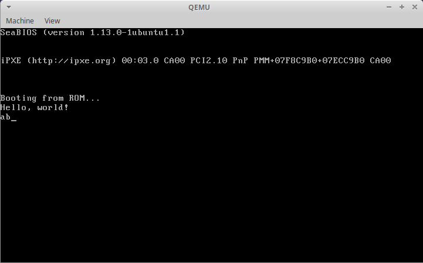
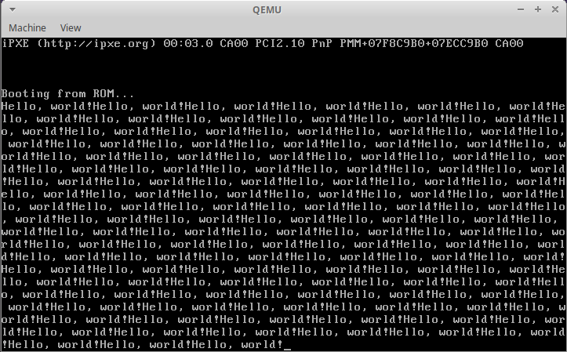

今天的目标：写个“显卡驱动”，实际上就是实现一个`printf`函数。在平时的开发中，我们可以使用标准库给我们提供的`printf`进行打印输出，不得不说，这个函数应该是最简洁有力的调试工具。但是我们现在要开发操作系统，完全从零开始，这就意味着，我们必须自己实现一个`printf`函数，方便我们查看各种信息和状态。

在上一篇文章中我们已经抽取出了一个`cprintf`函数用于打印输出，但这还是太简陋了，今天我们给它加点功能，以满足我们的需求。

要实现的功能有两点：

1. 显示字符
2. 控制光标

关于这两个主题我在之前的[汇编语言系列](../%E6%B1%87%E7%BC%96%E8%AF%AD%E8%A8%80%E4%B8%80%E5%8F%91%E5%85%A5%E9%AD%82/)中分别有过介绍，不熟悉的朋友可以参考：

- [显存操作](../%E6%B1%87%E7%BC%96%E8%AF%AD%E8%A8%80%E4%B8%80%E5%8F%91%E5%85%A5%E9%AD%82/01-hello-world.md)
- [端口操作](../%E6%B1%87%E7%BC%96%E8%AF%AD%E8%A8%80%E4%B8%80%E5%8F%91%E5%85%A5%E9%AD%82/05-IO%E6%8E%A5%E5%8F%A3%E6%8A%80%E6%9C%AF.md)

显示字符之前我们已经讲过了，简单说就是向显存映射的内存输出`ASCII`码及字符显示属性就行了，所以今天我们先从控制光标开始讲起。

## 控制光标

原理：`标准 VGA 文本模式`下光标位置保存在显卡内部的两个光标寄存器中，每个寄存器都是 `8` 位的，合起来形成一个 `16` 位的数值。这两个寄存器在显卡内部的索引值分别是 `14(0x0e)`和 `15(0x0f)`，分别用于提供光标位置的高 `8` 位和低 `8` 位。在读写这两个寄存器之前需要先通过索引寄存器指定它们的索引，索引寄存器的端口号是 `0x3d4`。指定了寄存器之后，就可以通过数据端口 `0x3d5` 来进行读写了。

由于 C 语言无法操作端口，所以我们先使用[内联汇编](../../posts/C%E8%AF%AD%E8%A8%80%E5%86%85%E8%81%94%E6%B1%87%E7%BC%96.md)写两个用于操作端口的函数，如下：

```c
static inline uint8_t
inb(uint16_t port)
{
  uint8_t data;
  asm volatile("inb %1,%0"
               : "=a"(data)
               : "d"(port));
  return data;
}

static inline void
outb(uint16_t port, uint8_t data)
{
  asm volatile("outb %0,%1"
               :
               : "a"(data), "d"(port));
}
```

获取当前光标位置的步骤如下：

```c
#define CRTPORT 0x3d4

int pos;

outb(CRTPORT, 14);
pos = inb(CRTPORT + 1) << 8;
outb(CRTPORT, 15);
pos |= inb(CRTPORT + 1);
```

先向索引端口`0x3d4`写入索引值`14`，通过数据端口`0x3d5`读取出光标位置的高`8`位，再向索引端口`0x3d4`写入索引值`15`，通过数据端口`0x3d5`读取出光标位置的低`8`位。

写入光标位置的步骤如下：

```c
outb(CRTPORT, 14);
outb(CRTPORT + 1, pos >> 8);
outb(CRTPORT, 15);
outb(CRTPORT + 1, pos);
```

依次写入光标位置的高`8`位和低`8`位。

完整的输出一个字符并移动光标位置的过程如下：

```c
#define CRTPORT 0x3d4
static uint16_t *crt = (uint16_t *)0xb8000;

void cgaputc(int c)
{
  int pos;

  outb(CRTPORT, 14);
  pos = inb(CRTPORT + 1) << 8;
  outb(CRTPORT, 15);
  pos |= inb(CRTPORT + 1);

  crt[pos++] = (c & 0xff) | 0x0700;

  outb(CRTPORT, 14);
  outb(CRTPORT + 1, pos >> 8);
  outb(CRTPORT, 15);
  outb(CRTPORT + 1, pos);
  crt[pos] = ' ' | 0x0700;
}
```

第`13`行用于将字符显示属性设置为黑底白字`(0x07)`。

测试一下效果：

```c
char *message = "Hello, world!";

void kernel_main(void)
{

  for (int i = 0; message[i] != '\0'; i++)
  {
    cgaputc(message[i]);
  }

  while (1)
    ;
}
```

运行结果：


可以看到光标位置已经在字符串最后了。

完整代码戳[这里](https://github.com/kviccn/lowbos/tree/master/src/0x01/a)。

接下来我们给字符的显示添加上更强大的功能。

## 显示字符

### 增加对回车，退格的支持

在`ASCII`码中，`\b`表示退格，`\n`表示换行，`\r`表示回车，即回到行首，但具体这些字符的含义还是需要我们去赋予它。例如，在`Unix`中，每行以`\n`结尾；在`Windows`中，每行以`\r\n`结尾；在`Mac`中，每行以`\r`结尾。

这里我们以`\n`表示每行的结尾来进行编码。

对应的代码也很简单，当遇到`\n`时，将光标位置移动到下一行开头处；当遇到`\b`时，将光标向后移动一格。

```c
if (c == '\n')
  pos += 80 - pos % 80;
else if (c == '\b')
{
  if (pos > 0)
    --pos;
}
```

完整函数如下：

```c
void cgaputc(int c)
{
  int pos;

  outb(CRTPORT, 14);
  pos = inb(CRTPORT + 1) << 8;
  outb(CRTPORT, 15);
  pos |= inb(CRTPORT + 1);

  if (c == '\n')
    pos += 80 - pos % 80;
  else if (c == '\b')
  {
    if (pos > 0)
      --pos;
  }
  else
    crt[pos++] = (c & 0xff) | 0x0700;

  outb(CRTPORT, 14);
  outb(CRTPORT + 1, pos >> 8);
  outb(CRTPORT, 15);
  outb(CRTPORT + 1, pos);
  crt[pos] = ' ' | 0x0700;
}
```

测试用字符串：

```c
char *message = "Hello, world!\nabc\b";
```

运行结果：



可以看到`ab`输出到了下一行，`c`被退格清除了。

完整代码戳[这里](https://github.com/kviccn/lowbos/tree/master/src/0x01/b)。

### 屏幕滚动

到目前为止`cgaputc`函数还有一个比较大的缺陷，就是当输出字符的位置超出`2000`之后，即超出屏幕之后的情况我们还没有处理。

现在我们就来处理这个情况，处理方法很简单，即当光标位置超过`2000`之后，将所有的字符整体向上移动一行。

主要代码如下：

```c
if (pos >= 80 * 25)
{
  for (int i = 0; i < 80 * 24; i++)
    crt[i] = crt[i + 80];
  for (int i = 80 * 24; i < 80 * 25; i++)
    crt[i] = 0x0700 | ' ';
  pos -= 80;
}
```

完整函数如下：

```c
void cgaputc(int c)
{
  int pos;

  outb(CRTPORT, 14);
  pos = inb(CRTPORT + 1) << 8;
  outb(CRTPORT, 15);
  pos |= inb(CRTPORT + 1);

  if (c == '\n')
    pos += 80 - pos % 80;
  else if (c == '\b')
  {
    if (pos > 0)
      --pos;
  }
  else
    crt[pos++] = (c & 0xff) | 0x0700;

  if (pos >= 80 * 25)
  {
    for (int i = 0; i < 80 * 24; i++)
      crt[i] = crt[i + 80];
    for (int i = 80 * 24; i < 80 * 25; i++)
      crt[i] = 0x0700 | ' ';
    pos -= 80;
  }

  outb(CRTPORT, 14);
  outb(CRTPORT + 1, pos >> 8);
  outb(CRTPORT, 15);
  outb(CRTPORT + 1, pos);
  crt[pos] = ' ' | 0x0700;
}
```

测试用字符串：

```c
char *message = "Hello, world!Hello, world!Hello, world!Hello, world!Hello, world!"
                "Hello, world!Hello, world!Hello, world!Hello, world!Hello, world!"
                "Hello, world!Hello, world!Hello, world!Hello, world!Hello, world!"
                "Hello, world!Hello, world!Hello, world!Hello, world!Hello, world!"
                "Hello, world!Hello, world!Hello, world!Hello, world!Hello, world!"
                "Hello, world!Hello, world!Hello, world!Hello, world!Hello, world!"
                "Hello, world!Hello, world!Hello, world!Hello, world!Hello, world!"
                "Hello, world!Hello, world!Hello, world!Hello, world!Hello, world!"
                "Hello, world!Hello, world!Hello, world!Hello, world!Hello, world!"
                "Hello, world!Hello, world!Hello, world!Hello, world!Hello, world!"
                "Hello, world!Hello, world!Hello, world!Hello, world!Hello, world!"
                "Hello, world!Hello, world!Hello, world!Hello, world!Hello, world!"
                "Hello, world!Hello, world!Hello, world!Hello, world!Hello, world!"
                "Hello, world!Hello, world!Hello, world!Hello, world!Hello, world!"
                "Hello, world!Hello, world!Hello, world!Hello, world!Hello, world!"
                "Hello, world!Hello, world!Hello, world!Hello, world!Hello, world!"
                "Hello, world!Hello, world!Hello, world!Hello, world!Hello, world!"
                "Hello, world!Hello, world!Hello, world!Hello, world!Hello, world!"
                "Hello, world!Hello, world!Hello, world!Hello, world!Hello, world!"
                "Hello, world!Hello, world!Hello, world!Hello, world!Hello, world!"
                "Hello, world!Hello, world!Hello, world!Hello, world!Hello, world!"
                "Hello, world!Hello, world!Hello, world!Hello, world!Hello, world!"
                "Hello, world!Hello, world!Hello, world!Hello, world!Hello, world!"
                "Hello, world!Hello, world!Hello, world!Hello, world!Hello, world!";
```

运行结果：



完整代码戳[这里](https://github.com/kviccn/lowbos/tree/master/src/0x01/c)。

### 打印数字

打印数字的函数我是直接从 xv6[源码](https://github.com/mit-pdos/xv6-public/blob/master/console.c#L28)里抄来的，如下：

```c
void printint(int xx, int base, int sign)
{
  static char digits[] = "0123456789abcdef";
  char buf[16];
  int i;
  unsigned int x;

  if (sign && (sign = xx < 0))
    x = -xx;
  else
    x = xx;

  i = 0;
  do
  {
    buf[i++] = digits[x % base];
  } while ((x /= base) != 0);

  if (sign)
    buf[i++] = '-';

  while (--i >= 0)
    consputc(buf[i]);
}
```

这个函数巧妙的地方有两处：

1. 利用了分解数字时余数与数组索引之间的关系

2. 使用栈来保存分解的各个位

`do ... while ...`循环根据基数`base`依次分解各位，并根据余数和数组索引的关系找到数字对应的字符并入栈。随后判断是否是负数，如果是，则将`'-'`号入栈。最后，将栈中字符依次出栈即可。

测试代码如下：

```c
printint(9527, 10, 0);
printint(-9527, 10, 1);
printint(255, 16, 0);
```

运行结果：


完整代码戳[这里](https://github.com/kviccn/lowbos/tree/master/src/0x01/d)。

### 格式化输出

有了上面这些基础函数就可以很方便的构造格式化输出函数了。

直接看代码：

```c
void cprintf(const char *fmt, ...)
{
  uint32_t *argp;
  char *s;
  int c;

  argp = (uint32_t *)(&fmt + 1);

  for (int i = 0; (c = fmt[i] & 0xff) != 0; i++)
  {
    if (c != '%')
    {
      consputc(c);
      continue;
    }

    c = fmt[++i] & 0xff;

    if (c == 0)
      break;

    switch (c)
    {
    case 'd':
      printint(*argp++, 10, 1);
      break;
    case 'x':
    case 'p':
      printint(*argp++, 16, 0);
      break;
    case 's':
      if ((s = (char *)*argp++) == 0)
        s = "(null)";
      for (; *s; s++)
        consputc(*s);
      break;
    case '%':
      consputc('%');
      break;
    default:
      consputc('%');
      consputc(c);
      break;
    }
  }
}
```

也是我直接[抄过来](https://github.com/mit-pdos/xv6-public/blob/master/console.c#L55)的。

这个函数略长但是不复杂，主要就是可变参数和对格式化字符串的解析。关于可变参数我之前写过一篇文章，戳[这里](/posts/2021/09/c-语言可变参数/)。

函数主体是一个`for`循环套了一个`switch`，依次解析`fmt`字符串中的每个字符，决定以何种方式（`printint`还是`consputc`）输出占位符所代表的数据。

`consputc`是对`cgaputc`的包装：

```c
void consputc(int c)
{
  cgaputc(c);
}
```

`xv6`中同时将字符输出到了`cga`和`串口`，所以将`cgaputc`和用于串口输出的`uartputc`进行了包装，原函数大概是下面这个样子：

```c
void consputc(int c)
{
  if(c == BACKSPACE){
    uartputc('\b'); uartputc(' '); uartputc('\b');
  } else
    uartputc(c);
  cgaputc(c);
}
```

测试用例：

```c
cprintf("LowbOS @%d\n", 2020);
cprintf("%s\n", 0);
cprintf("Hello, %s\n", "world!");
```

运行结果：


完整代码戳[这里](https://github.com/kviccn/lowbos/tree/master/src/0x01/e)。

（完）
